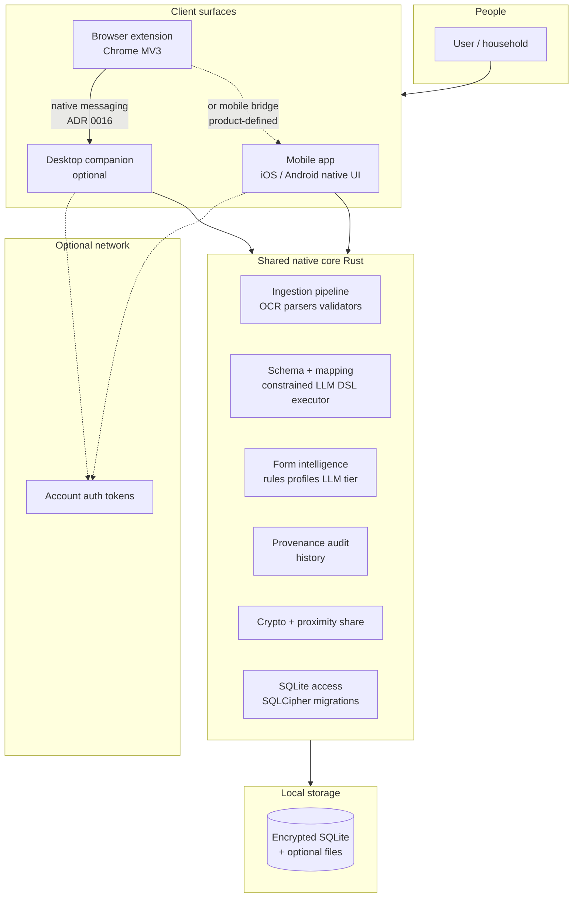
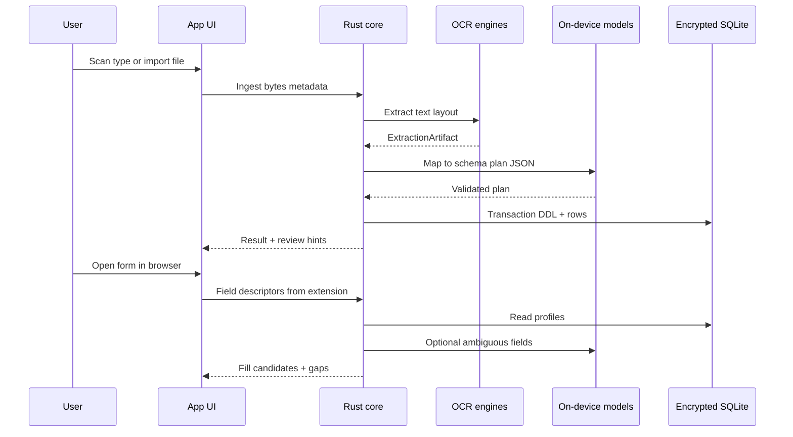
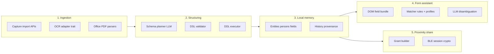
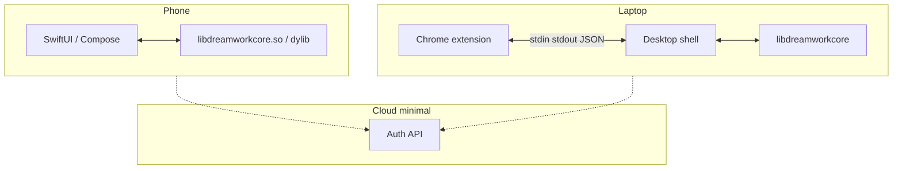

# Platform architecture: diagrams and module guide

This document gives a **high-level** view of the Dream Work Reality platform, **per-module** structure, and for each area both a **technical deep-dive** and a **layman** explanation. It aligns with the ADRs in [`docs/adr/`](adr/README.md).

---

## 1. High-level system view

Users interact with **apps and a browser extension**. Sensitive data stays on the **device**; a **shared Rust core** implements security-sensitive logic once. Optional **internet** services are minimal (account, not family PII).

**How to read this:** Everything inside **Shared native core** and **Local storage** is where household data lives. The **extension** does not hold the database; it talks to a **host app** that loads the core (see ADR 0007, 0016).

---

## 2. End-to-end data flow (conceptual)

---

## 3. Module-level architecture

The diagram below is **logical**—physical crates may split differently, but responsibilities stay stable.

---

## 4. Module reference: technical vs layman

### 4.1 Ingestion (documents, scans, files)

| | |
|--|--|
| **Technical** | Entry points accept **images, PDFs, Office files**, and **folder batches**. A pluggable **`OcrEngine`** (ADR 0004) returns normalized **text, layout, geometry, confidence**. Parsers run **on-device**; output is an **`ExtractionArtifact`** with immutable **run id** for provenance. No document bytes are sent to your backend by default (ADR 0001). |
| **Layman** | You point the camera or pick a file; the app **reads the document on your phone or computer** and turns it into **text the system can work with**, without uploading your papers to our servers. |

---

### 4.2 Schema inference & dynamic SQLite

| | |
|--|--|
| **Technical** | A **generative** session (ADR 0017) proposes a **JSON plan** constrained by schema (ADR 0005). Trusted code maps that plan to a **small DSL**—create/alter table, insert/upsert—not arbitrary SQL. Execution runs in a **single SQLite transaction** with rollback on validation failure. **`schema_change_log`** records mutations. |
| **Layman** | The app **figures out where each piece of information belongs**—like “this line is a date of birth”—and can **create new labeled boxes** in your local filing system if needed, **safely** and in one go, or **undo** if something is wrong. |

---

### 4.3 Manual entry (no documents)

| | |
|--|--|
| **Technical** | CRUD APIs write the **same relational model** as ingest; provenance **`source = manual`** (ADR 0012). No `document_id` unless the user later attaches one. Feature parity for form fill, history, and sharing scopes. |
| **Layman** | If you **never want to scan anything**, you can still **type your information once** and reuse it on forms—the app treats that as **first-class**, not a second-rate option. |

---

### 4.4 Form intelligence (browser + in-app)

| | |
|--|--|
| **Technical** | **Tier 1**: deterministic matching—saved **`FormProfile`** fingerprints, synonyms, regex, small **ONNX** classifiers. **Tier 2**: on-device **LLM** only for ambiguous fields (ADR 0006), returning **references** into SQLite, not secrets in logs. Extension receives candidates via **native messaging** JSON-RPC envelope (ADR 0016); **sessionId** gates sensitive methods after biometric/PIN unlock. |
| **Layman** | The helper **prefers patterns it already learned** about a website so it is **fast and predictable**; only tricky fields get **smarter guessing**. You stay in control of **when** values are applied. |

---

### 4.5 Workflow: autocomplete, gaps, review

| | |
|--|--|
| **Technical** | State machine: draft → autofilled → review → apply. **Gap detection** compares required DOM fields to scoped SQLite rows (including **role-aware** household resolution per product rules). **Write-first ingest** (ADR 0011) applies to imports; form sessions may **INSERT/UPDATE** local rows on user consent. |
| **Layman** | The app tries to **fill what it can**, **clearly lists what is missing**, and lets you **fix or add** information before anything sensitive is applied—like a **checklist**, not a black box. |

---

### 4.6 Provenance, history, audit

| | |
|--|--|
| **Technical** | **`field_value_current`** + append **`field_value_history`** (ADR 0008). Links to **`document_id`**, **`extraction_run_id`**, model id/hash where applicable. **Audit log** for share/revoke/key events. |
| **Layman** | You can see **where a value came from** (you typed it, it came from a scan, or you saved it from a form) and **what changed over time**—useful for mistakes, renewals, and peace of mind. |

---

### 4.7 Mobile app (native UI + Rust core)

| | |
|--|--|
| **Technical** | **SwiftUI** / **Jetpack Compose** (ADR 0015) call **FFI** into the Rust library (ADR 0013). **SQLCipher-class** encryption (ADR 0014). **ONNX Runtime** + **llama.cpp-class** backends (ADR 0017) ship per ABI and device tier. |
| **Layman** | The phone app uses **the same secure engine** as other versions, with a **native** look and access to **camera, Bluetooth, and storage** the way users expect. |

---

### 4.8 Desktop companion & browser extension

| | |
|--|--|
| **Technical** | **MV3** service worker + content scripts detect **form contexts**; **native messaging** uses **length-prefixed JSON** to a host binary that loads the Rust core (ADR 0007, 0016). Host validates **extension id** and **session** tokens. |
| **Layman** | A small **browser add-on** finds forms; the **real vault** lives in an **app on your computer** that the add-on talks to **locally**—not over the internet. |

---

### 4.9 Proximity sharing (household / time-bound)

| | |
|--|--|
| **Technical** | **BLE** discovery, **Noise/PAKE-class** session establishment, **scoped encrypted payload** (ADR 0009). **Ed25519** or libsodium patterns for device keys; **TTL** and **revocation** in policy. No payload relay through your API as the default data path. |
| **Layman** | You can **hand a slice of saved information to someone nearby** (like a partner’s phone) **for a limited time**, without **emailing** it through our cloud. |

---

### 4.10 Optional backend

| | |
|--|--|
| **Technical** | **Account**, **device registry**, **opaque job handles**—no OCR text or SQLite dumps (ADR 0010). |
| **Layman** | Logging in might exist for **your account**, but **your family’s forms and documents are not stored on our servers** as the normal design. |

---

## 5. Deployment view (simplified)

---

## 6. Related documents

- ADR index: [`docs/adr/README.md`](adr/README.md)
- Product features: [`../features-list.md`](../features-list.md)
- Brainstorm: [`../idea-brainstorming.md`](../idea-brainstorming.md)

---

## 7. Diagram maintenance

When ADRs **supersede** choices (e.g. UI stack, inference stack), update the diagrams and tables in this file in the **same PR** as the ADR change so newcomers see one consistent story.
