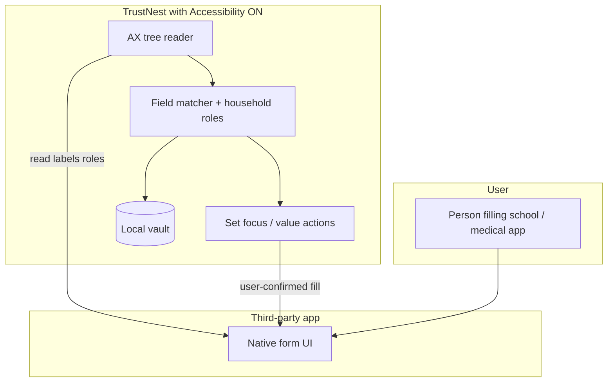
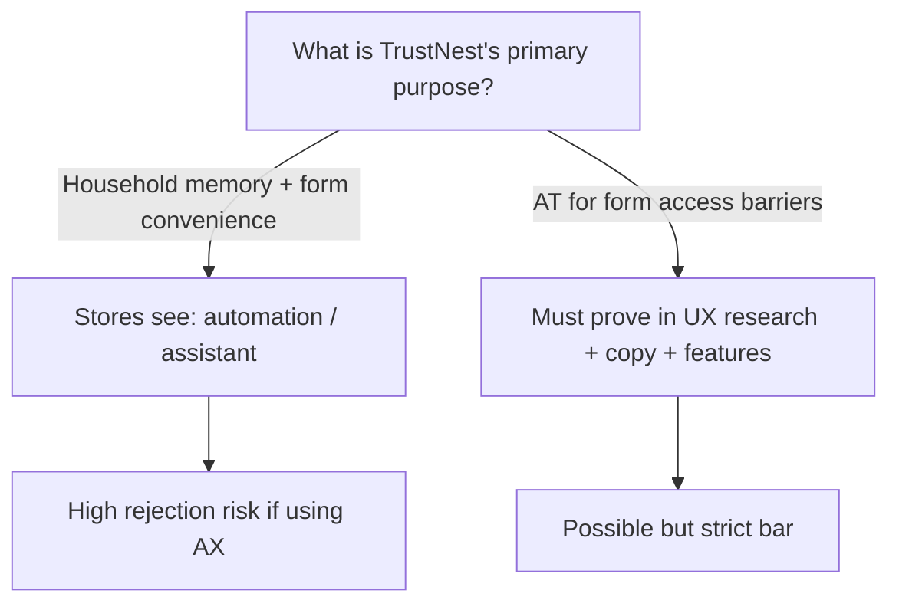
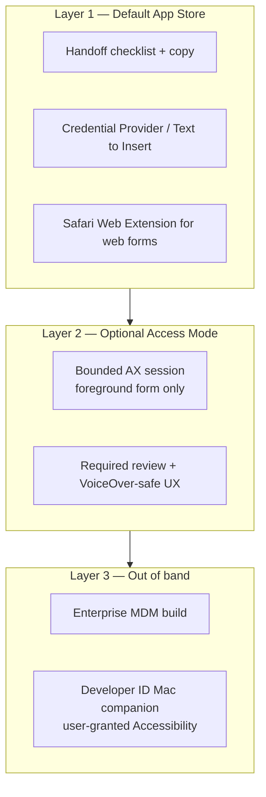
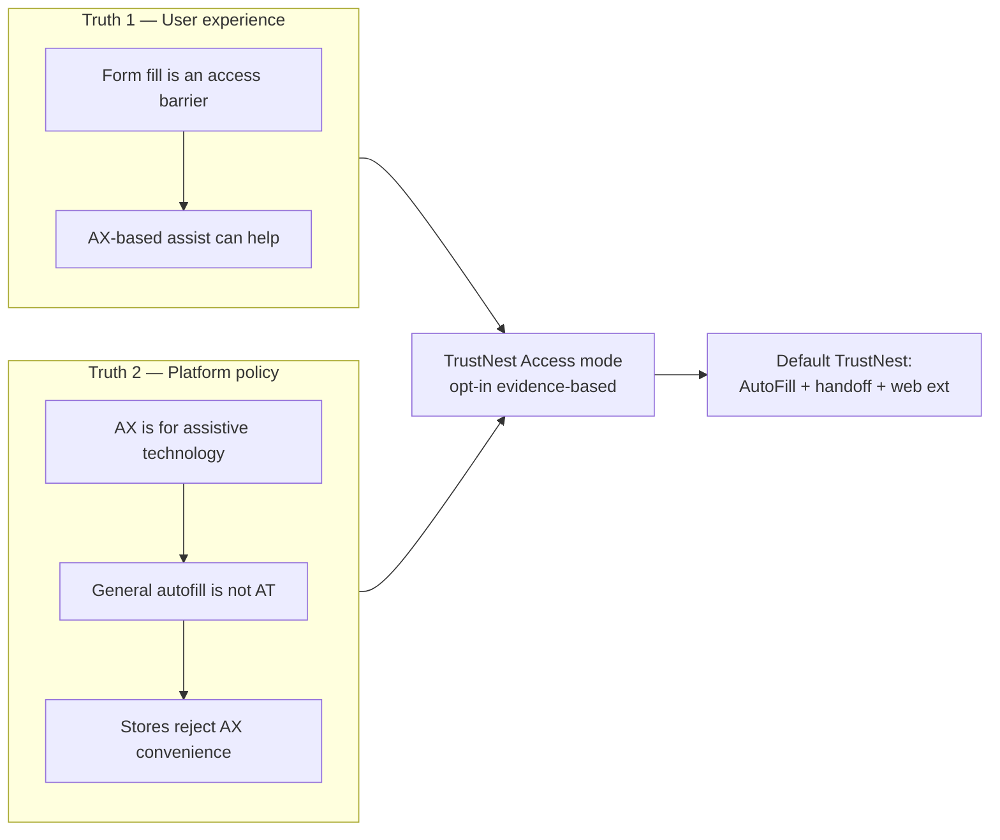

# Devil’s advocate: TrustNest as an iOS Accessibility “full plugin” for form filling

**Status:** Analysis — not a legal opinion or App Store guarantee  
**Related:** [`brainstorming-topic-filling-form-in-another-app.md`](../brainstorming-topic-filling-form-in-another-app.md), [`trustnest-cross-platform-form-automation.md`](trustnest-cross-platform-form-automation.md), [`devils-advocate.md`](../devils-advocate.md), [`how-secure-is-the-data-locally.md`](../how-secure-is-the-data-locally.md)

---

## 1. The question

**Thesis (pro):** TrustNest should be categorized as an **assistive technology** use of iOS Accessibility APIs—a “full plugin” that reads form fields in **other apps** and fills them from local household memory—because it **improves accessibility** for users who struggle with repetitive form entry (motor, cognitive, vision-related, or situational barriers).

**Devil’s advocate (con):** That framing is **partly true as user benefit** but **misaligned with platform intent**: Apple and Google reserve Accessibility APIs primarily for **disability access to the device**, not for **convenience autofill**. Labeling TrustNest as accessibility tooling risks **App Store rejection**, **user distrust** (“spyware optics”), and **brand contradiction** with a privacy-first vault—unless scope, disclosure, and primary-purpose narrative are exceptionally disciplined.

This document stress-tests both sides and ends with a **decision framework**, not a single “yes/no.”

---

## 2. What “full plugin” means technically

| Browser extension (Chrome) | iOS “full plugin” via Accessibility |
|----------------------------|-----------------------------------|
| Content script scans **entire DOM** | AX client walks **other app’s UI tree** (labels, roles, values, focus) |
| Maps fields → household | Same matching problem, noisier native UI |
| Injects values after user confirm | `UIAccessibility` / perform actions on elements (where allowed) |
| Vault in local host | Vault in TrustNest app; AX runs in **main app** (no separate “AX extension” product on iOS) |

On iOS, **Accessibility is not an App Extension type** like Share or Credential Provider. The **main TrustNest app** (or a contained helper) holds the permission **Settings → Accessibility → TrustNest**. That permission is **among the broadest** on the platform.

---

## 3. The case FOR — accessibility is a credible frame

### 3.1 Real access barriers forms create

Forms are not neutral UI. They impose:

| Barrier type | How forms hurt | How TrustNest could help |
|--------------|----------------|---------------------------|
| **Motor** | Many small fields, precise tapping, switching apps to copy from notes | Reduce taps: discover fields, offer values above keyboard or guided “next field” |
| **Cognitive / learning** | Long forms, ambiguous labels (“Parent/guardian”), working memory load | Checklist, role-aware labels (“this is Father’s phone”), gap list, plain language |
| **Vision** (partial) | Small text, poor contrast in third-party apps | Spoken field names + values before apply (if designed as AT), large-type review in TrustNest |
| **Situational** | Stress, time pressure (ER intake, benefits deadline) | Same motor/cognitive relief—not a diagnosis, still legitimate stress |
| **Language / literacy** | Complex legal/medical wording | Structured preview in familiar app before paste/apply |

These align with **why** accessibility APIs exist: **equitable access to information and control** on the device.

### 3.2 Accessibility APIs are the *correct* semantic layer for native forms

Unlike scraping pixels, AX trees expose **labels and roles**—the same information assistive technologies use. TrustNest’s `features-list.md` already prefers **“accessibility-aligned automation”** (stable hooks) as more **robust and ethical** than blind coordinate tapping.

For users who already rely on VoiceOver, a form-fill assistant that **respects** AX semantics (and does not fight screen reader focus) is **architecturally consistent** with assistive design.

### 3.3 Underserved users match TrustNest’s household story

Caregivers (parents, adult children helping aging parents) often:

- Fill **the same** child/parent data across **many** apps and paper portals.
- Lack enterprise accessibility procurement—**consumer App Store** is their channel.
- Need **local** data (privacy) **and** reduced physical effort.

Positioning as **only** “productivity autofill” undersells harm reduction for people who **cannot** sustainably complete 40-field intakes.

### 3.4 WCAG-adjacent product principles (not certification claim)

TrustNest can adopt practices that mirror accessibility goals **without** claiming WCAG certification of third-party apps:

- **Perceivable:** show values in large type in TrustNest before apply.
- **Operable:** minimize precise targeting; support Switch-like “next field” flows where feasible.
- **Understandable:** explain *which person* each value belongs to; no silent wrong-child fill.
- **Robust:** prefer AX labels over OCR of screen bitmaps.

### 3.5 Honest user consent matches AT norms

Assistive tech often requires **deep permissions** with **clear purpose**. TrustNest’s model (explicit unlock, no cloud vault, user-initiated fill) can mirror **AT transparency** better than covert automation startups.

**Summary (pro):** The *user outcome*—access to services that require forms—is plausibly **accessibility**. The *mechanism*—AX APIs—is how Apple expects AT to work. TrustNest is not faking AX for ads; it would use it for **field semantics and controlled entry**.

---

## 4. The case AGAINST — devil’s advocate

### 4.1 Platform policy: “accessibility features” ≠ “autofill convenience”

**Apple (Guideline 2.4.5, paraphrased from review practice):** Apps must not use accessibility features for **non-accessibility purposes**. Reviewers and forum reports describe rejections when apps use AX for **automation, AI agents, or developer tooling** rather than assistive technology—even with public APIs.

**Google Play (AccessibilityService policy, 2024+):**

- `isAccessibilityTool=true` only if the app’s **primary purpose** is helping people with disabilities—and examples **exclude** “automation tools, assistants, password managers.”
- Apps **not** declaring as accessibility tools must use AX for **narrow, clearly understood** automation; **autonomous** plan-and-execute agents are **prohibited**.
- Password managers and **general assistants** explicitly **do not qualify** as accessibility tools.

TrustNest sits uncomfortably close to categories Google **names as excluded**, unless the **entire product narrative** is reframed around disability access—not “save time on taxes.”

### 4.2 “Accessibility washing”

**Risk:** Using AT categorization primarily to unlock **cross-app control** while marketing to **general** users as “fill any form faster.”

| Signal of good faith | Signal of washing |
|---------------------|-------------------|
| User research with disabled users; features they requested | AX added because AutoFill is “too limited” |
| Store listing leads with disability use cases | Store listing leads with “autofill any app” |
| Works with VoiceOver on, doesn’t break focus | Ignores screen reader conflicts |
| Narrow actions: fill, next field, read label | Background scrape of all apps |
| No network exfil of AX tree | Analytics on field labels sent to server |

Regulators and press are sensitive to **permission laundering**. One article title captures reviewer mood: *“Why Apple’s App Store Kills AI Dev Tools That Use Accessibility APIs.”* TrustNest would be bucketed with **agentic automation** unless differentiated sharply.

### 4.3 User trust vs “full plugin” power

TrustNest’s brand: **your data stays on device, you control what leaves.**

Accessibility permission implies:

- Ability to **see UI content** in other apps (labels, sometimes values).
- Potential to **act** on other apps’ controls.

Even if TrustNest never abuses this, **users equate Accessibility with spyware** (keyboard loggers, parental surveillance, scam “security” apps). Asking for it **raises support burden** and **churn** among privacy-conscious buyers—the core audience.

**Devil’s advocate:** The users who most need AX-based fill may be **willing** to grant it; the users who most want **privacy marketing** may **refuse**—splitting the market unless you ship two modes.

### 4.4 Wrong fills are *worse* for vulnerable users

From `devils-advocate.md`: wrong child on a medical form is **higher stakes** than no autofill.

If AX misreads a label cluster, or TrustNest borrows Mom’s phone for “Father’s phone,” harm falls disproportionately on users who relied on AT because they **cannot easily verify** every field. **Accessibility users are not safer users—they may have less error-correction bandwidth.**

AX automation **increases speed of error** unless review UX is mandatory and accessible.

### 4.5 Technical fragility undermines “accessibility” promise

| Issue | Effect |
|-------|--------|
| Host app missing `accessibilityLabel` | Fields invisible or mislabeled |
| Custom WebViews | Broken or partial trees |
| Secure fields | System blocks AX or injection |
| OS updates | Layout changes break heuristics |
| Games / non-form UIs | False positives if scanning broadly |

An AT product that **frequently fails silently** is **more disabling** than copy/paste. VoiceOver users already suffer **app developer negligence** on labels; TrustNest cannot fix that—only surfacing gaps honestly.

### 4.6 Precedent: who gets approved?

| Category | Typical AX use | Store outcome |
|----------|----------------|---------------|
| VoiceOver, Switch Control | System AT | N/A |
| Screen readers (third party) | Read UI | Usually approved as AT |
| Password managers | AutoFill extension, **not** AX scrape | Approved on AutoFill path |
| Macro / automation utilities | AX control | Often **outside** App Store or rejected |
| AI “use my phone” agents | AX + planning | Increasingly **rejected** on iOS |

TrustNest’s **closest honest cousin** is **assistive form completion**, not 1Password. Few mainstream consumer apps win on “we read every app’s UI” in App Store review.

### 4.7 Legal and ethical (non-lawyer framing)

- **Not legal advice:** Marketing as “medical accessibility” could trigger **health** scrutiny; as “disability app,” **FDA/HIPAA** questions stay consumer-side but support load rises.
- **Ethics:** AX for **caregivers** filling forms **about** a person with disabilities is compelling; AX for **able-bodied convenience** is the same code path—**policy must separate modes** or you accept conflation.

---

## 5. Is TrustNest *really* accessibility? — Scoring rubric

Use this internally; score each 0–2 (0 = no, 1 = partial, 2 = strong).

| Criterion | Question | Notes |
|-----------|----------|-------|
| **Primary purpose** | Is the *main* reason for AX to overcome disability-related barriers to completing forms? | General autofill scores 0–1 |
| **Beneficiary** | Who is the AT for—the user, a dependent, or “everyone”? | Caregiver-for-dependent can still be AT |
| **Alternative APIs exhausted** | AutoFill extension + copy + Shortcuts before AX? | Required for good faith |
| **AT compatibility** | Tested with VoiceOver / larger text / Reduce Motion? | Weak AT = weak claim |
| **Data minimization** | AX tree processed on-device, not uploaded? | TrustNest default aligns |
| **User control** | No silent full-form dump; per-field or explicit “fill visible form”? | Mandatory |
| **Store narrative** | Play/App descriptions lead with disability access? | Marketing tension |
| **Evidence** | User research, advisory input, accessibility statement? | Absent = weak |

**Rough interpretation:**

- **12+:** Credible to pursue **Accessibility Tool** positioning (Android `isAccessibilityTool`) and strong iOS narrative—with counsel.
- **6–11:** **Hybrid**—AX as optional “Advanced access mode,” not default SKU.
- **≤5:** **Do not** claim accessibility; use Credential Provider + handoff only.

**Honest self-score today (product as specced):** Likely **6–8**—strong *benefit* story, weak *primary-purpose* and *review* story unless product is repositioned.

---

## 6. Apple vs Google — asymmetric strategy

| Platform | Official “autofill” path | AX “full plugin” |
|----------|--------------------------|------------------|
| **Android** | `AutofillService` — **preferred** | `AccessibilityService`; `isAccessibilityTool` only if true AT; else disclosure + no autonomous agents |
| **iOS** | `ASCredentialProvider` + `ProvidesTextToInsert` | Main app Accessibility permission; **high review risk** |

**Devil’s advocate conclusion:** Android can deliver **80% of value** without claiming to be an accessibility tool. iOS **cannot** rely on AX for App Store v1; AX is **optional / sideload / enterprise** at best.

---

## 7. When the accessibility argument *wins*

The frame is **strongest** when **all** apply:

1. **Target segment** includes users with motor, cognitive, or vision-related barriers to form completion (including aging).
2. **Feature design** prioritizes AT workflows: VoiceOver labels on TrustNest UI, readable review, **no** background monitoring of non-form apps.
3. **AX scope is minimal:** e.g. “Fill mode” only when user opens TrustNest → Start session → switches to target app → TrustNest reads **foreground app** form-like controls—not always-on keylogging.
4. **Evidence:** accessibility statement, tested personas, possibly **VoiceOver certification** goals.
5. **Distribution:** willing to ship **TrustNest Access** SKU separately from **TrustNest** mainstream if review requires clearer positioning.

**Example narrative (defensible):**  
*“TrustNest Access helps people who cannot repeatedly type long medical and school forms across apps. With your permission, it uses the same system interfaces as assistive technologies to read field labels and place your saved answers—only when you start a fill session, only on device.”*

---

## 8. When the accessibility argument *loses*

The frame **fails** review and ethics sniff tests when:

- Primary marketing is **“autofill any app like a browser extension.”**
- AX is enabled **by default** on first launch.
- AX tree content is **logged**, used for **ML training upload**, or **site fingerprinting** analytics.
- **Silent** multi-field fill without review.
- **No** compatibility testing with VoiceOver.
- Competes with **password-manager AutoFill** but uses **broader** permissions without justification.
- **Agentic** behavior: “TrustNest, complete this benefits application” with planning across screens (Google explicitly restricts this for non-AT apps).

---

## 9. Recommended product architecture (split the moral question from the tech)

Do **not** collapse to one binary. Ship **three layers**:

| Layer | Accessibility claim | AX use |
|-------|---------------------|--------|
| **1** | “Reduces effort” (universal design, not AT label) | None |
| **2** | “Access mode for form barriers” | Yes, opt-in, session-scoped |
| **3** | Contractual / power-user | Yes, broader, not consumer App Store |

**Rust core** stays shared; only the **surface adapter** differs (clipboard vs AutoFill vs AX).

---

## 10. If pursuing Layer 2 — “legitimate AT” requirements checklist

### Product

- [ ] Rename mode: **“Access Fill”** or **“Assistive Form Fill”** — not “God mode.”
- [ ] **Opt-in** after plain-language disclosure + video for Play declaration.
- [ ] **Session timer**; AX hooks active only during session.
- [ ] **Foreground app only**; ignore non-form windows.
- [ ] **Per-field or per-section confirm** default; optional trusted fast path after explicit setting.
- [ ] **VoiceOver** doesn’t lose focus unexpectedly; announce “filled Father phone with …”.
- [ ] **Kill switch** in Settings; audit log on-device.

### Engineering

- [ ] Parse AX → `FieldDescriptor` (same contract as browser).
- [ ] Deny-list OTP, CVV, password fields unless credential flow.
- [ ] Never upload AX snapshots; debug export **user-initiated** only.
- [ ] Fingerprint **apps**, not pages, for `FormProfile`—no cross-app browsing profile.

### Go-to-market

- [ ] Accessibility statement on `trustnest.app`.
- [ ] App Store screenshots show **disclosure + large type review**.
- [ ] Separate **support** runbook for AT users.

### Legal / review

- [ ] Counsel review of App Store / Play declarations.
- [ ] Prepare **appeal packet** with AT rationale if rejected.

---

## 11. Direct answer to “is TrustNest accessibility?”

| Lens | Answer |
|------|--------|
| **User impact** | **Often yes** — form filling is a real access barrier for motor, cognitive, vision, and caregiver contexts. |
| **API intent (Apple/Google)** | **Not automatically yes** — platforms distinguish AT from automation and general assistants. |
| **App Store category** | **Risky** to depend on AX as primary iOS strategy without AT-first positioning and evidence. |
| **“Full plugin”** | **Technically** achievable via AX; **commercially** should be **optional Access mode**, not default TrustNest. |
| **Ethics** | **Defensible** if scoped, transparent, and user-controlled; **indefensible** if used to bypass AutoFill limits while marketing mass-market spyware permissions. |

**Devil’s advocate bottom line:**  
TrustNest **can** be argued as accessibility **for form access**—that argument is **substantively true for many users** but **insufficient alone** for platform approval. Treat accessibility as a **mode and mission subset**, not a **permission hack**. Lead App Store with **Credential Provider + handoff**; earn the right to AX with **Access SKU + evidence**, or ship AX **only** outside consumer iOS.

---

## 12. Comparison table — TrustNest vs true AT vs automation

| | VoiceOver | TrustNest (Access mode) | TrustNest (default) | Macro automation app |
|--|-----------|-------------------------|---------------------|----------------------|
| **Purpose** | Perceive + navigate UI | Complete forms from memory | Structured copy + AutoFill | Automate arbitrary UI |
| **Permission** | Built-in / system | Accessibility (user) | Normal + AutoFill ext | Accessibility |
| **Reads other apps** | Yes | Yes (session) | No | Yes (often always) |
| **Writes other apps** | Indirect (user) | Yes (values) | Paste only | Yes |
| **Store category** | System | AT-like claim | Productivity/Utilities | Often rejected |
| **Fits TrustNest privacy** | N/A | If on-device + bounded | **Best fit** | Poor fit |

---

## 13. Open questions for leadership

1. Will we accept a **split brand** (TrustNest vs TrustNest Access) if Apple requires it?
2. Is **caregiver** filling forms **for** a person with disabilities sufficient for `isAccessibilityTool` on Android, or must the **primary user** have the disability?
3. Do we fund **formal accessibility audit** before claiming AT?
4. If iOS rejects AX mode, is **TestFlight-only** or **enterprise** acceptable, or is project dead on native iOS full fill?
5. Can **EU / ADA** marketing create **obligation** to ship Access mode even if stores resist?

---

## 14. Related documents to update if decision changes

- [`trustnest-cross-platform-form-automation.md`](trustnest-cross-platform-form-automation.md) — §5.3 iOS paths  
- [`features-list.md`](../features-list.md) — Scenario B/C mechanisms  
- [`deploy/privacy-policy-s3/`](../deploy/privacy-policy-s3/) — disclose Accessibility data access if Layer 2 ships  
- New ADR (recommended): **0019-ios-access-fill-mode-threat-model**

---

## 15. Summary diagram — two valid truths

**Neither truth cancels the other.** Product strategy must **satisfy both** or **choose distribution** (App Store vs enterprise) explicitly.
