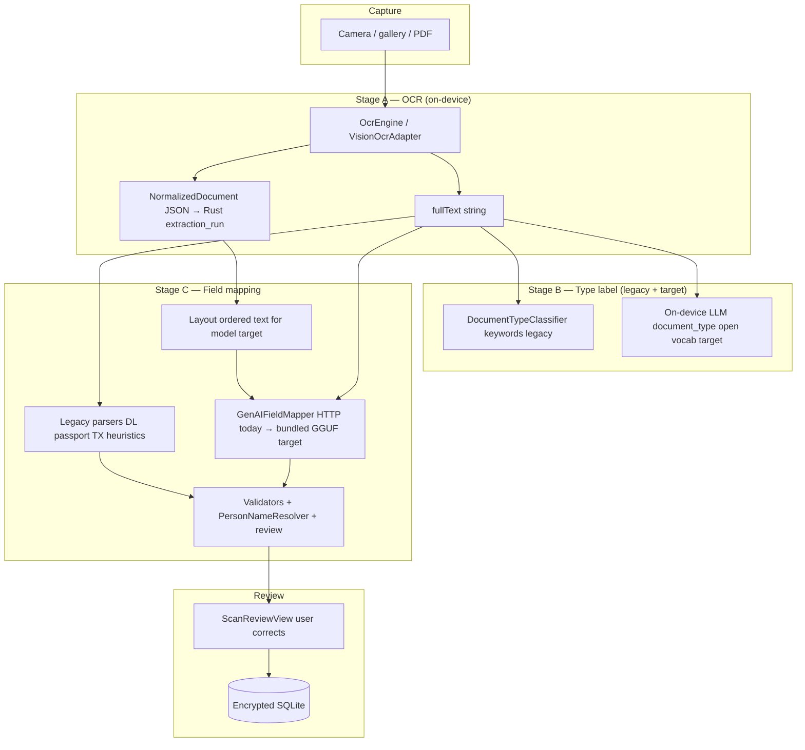
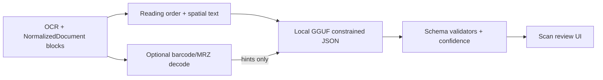

# Document intelligence deep dive: classification, field mapping, and accuracy roadmap

**Product:** TrustNest (DreamWork iOS + shared Rust core)  
**Constraint:** [trustnest-zero-egress-design-constraint.md](trustnest-zero-egress-design-constraint.md) — all improvements must run **on-device**  
**Status:** Engineering reference (May 2026)  
**Related:** [ADR 0004](adr/0004-on-device-ocr-with-pluggable-engines.md), [ADR 0005](adr/0005-schema-inference-constrained-llm-and-transactional-ddl.md), [ADR 0017](adr/0017-on-device-inference-runtimes-per-platform.md), [device-matrix.md](device-matrix.md)

---

## 0. Design principle: general-purpose ingest (no templates)

TrustNest scans and uploads can be **any** document — not a closed set of IDs or tax forms. Product direction:

| Do **not** use (bias / does not scale) | Do use (unlimited document types) |
|----------------------------------------|-----------------------------------|
| Per-format parsers (Texas DL rows, W-2 box layout, carrier-specific insurance tables) | **On-device generative extraction** with a **fixed canonical schema** + optional extension keys ([ADR 0005](adr/0005-schema-inference-constrained-llm-and-transactional-ddl.md)) |
| Routing ingest through `ScannedDocumentType` → dedicated Swift parser | **One pipeline** for all uploads: OCR + layout → local LLM → validators → review |
| Growing keyword lists (“if TEXAS + 4d → driver license”) as the primary classifier | **Model-inferred** `document_type` string (open vocabulary) for UX labels only — not to select a code path |
| Expanding state/country template libraries | **Layout geometry** (block bounds, reading order) fed into the model so label–value structure is recovered **without** hard-coding a card layout |

**Templates** in this doc means *product logic that assumes a particular printed layout or issuer* — not the LLM’s chat template, not SQL schema, not validator regexes for “is this a plausible date.”

**Legacy note:** The iOS app still contains format-specific code (`TexasDriverLicenseParser`, `IndianPassportParser`, keyword `DocumentTypeClassifier`, etc.) from earlier iterations. That code is **not** the strategic direction; it should be **retired or demoted** to optional opportunistic helpers (see §5.5), not extended.

---

## 1. Executive summary

| Layer | Current state | Accuracy (practical) | Main limitation |
|-------|---------------|----------------------|-----------------|
| **OCR** | Apple Vision, ID-tuned preprocessing, multi-pass crops | **Strong** for English text | Flat text stream; layout exists in `NormalizedDocument` but downstream mostly ignores geometry |
| **Document type** | Legacy keyword `DocumentTypeClassifier` + closed `ScannedDocumentType` enum | Works only for enumerated boilerplate | **Bias:** unlimited real documents do not fit the enum; type **routes** legacy parsers |
| **Field mapping** | Legacy format parsers + regex + optional HTTP LLM | Uneven — good only when a template matches | **No default** on-device general mapper; cloud/dev LLM not production-shaped |

**User-reported symptom:** OCR looks correct in review UI, but **wrong document type** or **wrong/missing fields** — consistent with **template routing** and **missing general-purpose on-device extraction**, not OCR failure.

**Recommended direction (§0):** **OCR + layout blocks** → **bundled on-device LLM** (schema-constrained JSON) → **validators** → review. **Do not** add per-format templates. Retire legacy parsers; optional barcode/MRZ decode only as non-routing hints.

---

## 2. End-to-end pipeline (as implemented on iOS)



### 2.1 Entry points

- **General import / scan:** `AppState` runs OCR → `DocumentTypeClassifier.classify` → `OcrFieldSuggester.suggest` → `CoreBridgeService.enrichScanReview`.
- **Driver license–biased scan (legacy):** `DriverLicenseScannerPipeline` — special-cased path; **target architecture** uses the same general pipeline as any other upload (§0).

### 2.2 Enrichment merge order (`CoreBridgeService.enrichScanReview`)

1. **Legacy trusted base:** `DriverLicenseFieldMapper` / heuristics when DL path or keyword type matches (biased — §0).
2. **If `GenAISettings.activeLLMConfig`:** `GenAIFieldMapper.mapFields` over HTTP (OpenAI or Ollama URL) — **target:** same schema via **bundled on-device** session.
3. **Else if OpenAI API key:** `CoreIngestHTTPClient.understandDocument` → `core-api` (dev/cloud).
4. **Merge** supplemental heuristics; finalize + `PersonNameResolver`.
5. **Rust FFI:** person resolution + storage plan (extension fields).

**Implication:** Today, when GenAI is off, ingest is **legacy heuristics-only** — bad for arbitrary documents. **Target:** GenAI-off still runs **local GGUF** with layout-aware input; heuristics are not the primary mapper.

---

## 3. Stage A — OCR (working well)

### 3.1 Implementation

- **`OcrEngine`** (`apps/ios/DreamWorkApp/Sources/Core/OcrEngine.swift`): Vision `VNRecognizeTextRequest`, ID-oriented `customWords`, contrast/scale preprocessing, optional address-region crops.
- **`VisionOcrAdapter`**: Produces `NormalizedDocument` (pages → blocks with bounds + confidence) persisted via Rust `dreamwork_ocr_apply_normalized_json`.

### 3.2 Strengths

- Multi-pass recognition improves small text on dense documents (legacy tuning used ID-oriented `customWords`; general pipeline should not depend on a fixed vocabulary list long term).
- English-first tuning matches [ADR 0018](adr/0018-mobile-device-tier-and-english-only-ocr-v1.md).
- Fully on-device; aligns with [zero-egress](trustnest-zero-egress-design-constraint.md).

### 3.3 Unused opportunity

Blocks carry **geometry** (`bounds`, confidence per line), but legacy classifiers/parsers consume **only** `fullText`. The **target** pipeline serializes blocks in **reading order** (sort by `y`, then `x`) and optionally emits compact “label | value” pairs using spatial proximity — **without** hard-coding a particular card’s field numbers (§0).

---

## 4. Stage B — Document type label (not a routing gate)

### 4.0 Target behavior

- **`document_type`** is a **descriptive label** returned by the on-device model (e.g. `utility_bill`, `school_enrollment_form`, `medical_invoice`) — **open vocabulary**, stored for UX and provenance.
- It must **not** select which Swift parser runs. Unlimited document types ⇒ **one mapper**.
- UI may still show friendly categories; mapping from free-text type → icon is cosmetic.

### 4.1 Current model (legacy): heuristic keyword bags

`DocumentTypeClassifier` (`apps/ios/DreamWorkApp/Sources/Core/DocumentTypeClassifier.swift`):

- Uppercases OCR text; runs **ordered** detectors: DL → passport → state ID → insurance → utility → bank → tax → employment → SSN.
- Each detector accumulates **signals** (substring/regex hits); confidence is a **hand-tuned function** of signal count (often 0.88–1.0).
- `refine()` boosts DL to 100% if AAMVA barcode, Texas layout, or structured DL fields present — **template bias**.

**Fixed enum today** (`ScannedDocumentType` in `ProfileSchema.swift`): a **closed list** that cannot represent unlimited document types and **forces** wrong buckets (e.g. green card → `other`). **Target:** treat enum as deprecated for ingest; prefer model-produced `document_type` string + `other` only when the model abstains.

### 4.2 Limitations (why misclassification happens)

| Issue | Example failure mode |
|-------|---------------------|
| **First-match wins** | Passport page with “IDENTIFICATION” + state wording misclassified as state ID or DL |
| **Weak insurance signals** | Any doc with “MEMBER” or “GROUP #” → insurance card |
| **No negative scoring** | Bank letter mentioning “DEPOSIT” + tax-like digits → wrong type |
| **US-centric** | Limited state list for DL; Indian passport needs extra signals (partially handled in passport path only) |
| **No layout** | Card front/back mixed in one image → jumbled text breaks keywords |
| **Confidence inflation** | 0.88–1.0 heuristic scores do not calibrate to real error rates |
| **Hint routes parsers** | Wrong type at Stage B runs wrong branch in `OcrFieldSuggester` — **anti-pattern** under §0 |

### 4.3 Why keyword classifiers are a dead end

They are inexpensive but **inherently biased** toward documents whose boilerplate we enumerated. They do not generalize to unlimited uploads and should not be extended (no new detectors for green card, visa, etc.). Replace with **model-inferred type** on the same path as field extraction.

---

## 5. Stage C — Field mapping

### 5.1 Target: single general-purpose mapper

**Input to on-device LLM (production):**

1. **Layout-aware text** — blocks sorted by geometry; optional neighbor pairing by distance thresholds (generic, not Texas-field-number rules).
2. **Canonical schema** — allow-list of `ProfileFieldKey` values + permission to propose **extension** snake_case keys ([ADR 0005](adr/0005-schema-inference-constrained-llm-and-transactional-ddl.md)).
3. **Grammar-constrained JSON** — same shape as today’s `GenAIFieldMapper` response (`document_type`, `issuer_region`, `country`, `fields` with `value` + `label`).

**Output handling:** validators (dates, SSN pattern, plausible names) → merge into review UI → transactional storage. **No** `switch documentType` parser fan-out.

### 5.2 Legacy code (do not extend)

| Mechanism | File(s) | Status |
|-----------|---------|--------|
| Texas DL numbered rows | `TexasDriverLicenseParser` | **Retire** — format template |
| AAMVA PDF417 | `DriverLicenseParser.parseAAMVAPDF417` | Optional **payload decode** only (see §5.5) |
| Passport / Indian passport parsers | `PassportParser`, `IndianPassportParser` | **Retire** — country/layout templates |
| Keyword type + regex suggester | `DocumentTypeClassifier`, `OcrFieldSuggester` | **Retire** for mapping; type label superseded by LLM |

### 5.3 Legacy regex heuristics (interim only)

`OcrFieldSuggester` + `UniversalDocumentParser`:

- Generic email, phone, date, ZIP.
- Per-type light patterns (e.g. insurance member ID, tax year).
- **Problem:** Routing by `ScannedDocumentType` guarantees wrong behavior for documents outside the enum — which is most real-world uploads over time.

### 5.4 Generative mapping (required for production; currently miswired)

`GenAIFieldMapper`:

- Sends up to **24k chars** of OCR to an OpenAI-compatible **`/chat/completions`** endpoint.
- Returns JSON: `document_type`, `issuer_region`, `country`, `fields` map with labels.
- **Default settings** (`GenAISettings`): provider can be **OpenAI cloud**; Ollama is `127.0.0.1` (dev machine, not on-phone for typical users).

`core-api` `document_understand.rs` duplicates cloud understanding for dev.

**Gap vs [ADR 0017](adr/0017-on-device-inference-runtimes-per-platform.md):** Planned **Qwen2.5 GGUF** (`llm.schema.*.v1` in [device-matrix.md](device-matrix.md)) is **not wired** into iOS `enrichScanReview` yet — this is the **primary** accuracy investment under §0.

### 5.5 Optional: embedded machine-readable payloads (not templates)

Some scans embed **standardized machine data** (PDF417 barcode, ICAO MRZ) regardless of how we classify the document. Decoding these strings is **not** the same as a Texas DL layout template: it is **payload parsing** applied when detection succeeds, with results merged as **high-confidence hints** into the same JSON the LLM produces — without maintaining issuer-specific print layouts.

If product wants **zero** format-specific logic, even barcode/MRZ decoders can be dropped in favor of pure OCR+LLM; cost is slightly lower field accuracy on IDs that encode barcodes. Decision belongs in a short ADR amendment.

### 5.6 Post-processing

- **`ScanFieldValidator`**: drops implausible phones/names on certain types.
- **`PersonNameResolver`**: fixes LAST/FIRST order using OCR context.
- **`DocumentFieldLabels`**: issuer-aware display strings — prefer **model-provided `label`** from extraction JSON; static maps only when the model omits a label.

---

## 6. Coverage: legacy vs target

| Approach | Arbitrary document upload | Known ID / tax form |
|----------|---------------------------|---------------------|
| **Legacy** (type enum + parsers) | Poor — wrong branch or `.other` | Good only when template matches |
| **Target** (layout + on-device LLM) | **Designed for** | Good when model + validators tuned |

Do not maintain a growing matrix of per-type engineering. QA uses a **diverse corpus** (IDs, bills, letters, forms, school/medical paperwork) to score **field F1** and **hallucination rate**, not “did we add a parser for type X.”

---

## 7. Root-cause analysis: “OCR good, fields wrong”

1. **Parser routing by type** → wrong branch for anything outside legacy templates (§0).
2. **Flat text to mapper** → spatial label–value structure lost.
3. **Cloud LLM off / not bundled** → only legacy heuristics run.
4. **Closed `ScannedDocumentType` enum** → mislabels and false confidence for unlimited document types.
5. **Over-trust in heuristic confidence** → UI shows high scores while fields are empty/wrong.

---

## 8. Roadmap to improve accuracy (on-device, no templates)

### 8.1 Target architecture (one pipeline)



**Phase 1 — Production path (P0)**

1. **Bundle on-device LLM** — wire `GenerativeLlmSession` / Qwen2.5 GGUF into `enrichScanReview`; **remove cloud default** ([zero-egress](trustnest-zero-egress-design-constraint.md)).
2. **Layout serialization** — feed the model sorted blocks + simple neighbor pairing; stop using `fullText` alone.
3. **Stop routing on `ScannedDocumentType`** — one code path; enum/display derived from model `document_type` string.
4. **Calibrated confidence** — per-field scores from model + validator pass/fail; no fake 100% from keywords.

**Phase 2 — Quality and cost (P1)**

| Investment | Role under §0 |
|------------|----------------|
| **Prompt + schema tuning** | Map arbitrary OCR → `ProfileSchema` + extensions |
| **Grammar / JSON schema decoding** | Reduce hallucinated keys ([ADR 0005](adr/0005-schema-inference-constrained-llm-and-transactional-ddl.md)) |
| **Validator library** | Type-specific *validation* (SSN shape, date) — **not** type-specific *extraction* |
| **RAM tiers** | 3B vs 7B GGUF per [device-matrix.md](device-matrix.md) |

**Phase 3 — Optional accelerators (only if they do not imply templates)**

| Approach | Acceptable? | Notes |
|----------|-------------|-------|
| **Compact layout ONNX** (reading order, table cells) | Yes | Geometry helper, not “Texas DL template” |
| **Embedding similarity** to canonical field *names* | Yes | Synonyms for `legal_first_name`, not carrier layouts |
| **Closed ONNX doc-type classifier** (fixed N classes) | **Discouraged** | Biases product toward enumerated types; prefer open-vocab string from LLM |
| **Per-state / per-carrier / per-form parsers** | **No** | Violates §0 |
| **ID scanning SDKs** built on template libraries | **No** unless SDK is used as opaque black box — still conflicts with unlimited-document positioning |

**Retire:** `TexasDriverLicenseParser`, country-specific passport parsers, keyword `DocumentTypeClassifier` extensions, `OcrFieldSuggester` type branches — on a defined migration timeline.

### 8.2 Commercial on-device options

Prefer **general instruct models** (Qwen2.5-class) you control. **ID-only SDKs** optimize a closed set of documents — misaligned with §0 unless the product scope narrows.

### 8.3 Approaches we should **not** rely on

- Cloud document APIs (zero-egress violation)
- **Template / issuer / form-box parser libraries** (§0)
- Enumerating document types in code and adding a parser per type

---

## 9. Proposed target: `DocumentIntelligenceService` (conceptual API)

Single Rust-first service (Swift/Kotlin shims) to replace scattered logic:

```text
input:  NormalizedDocument (+ optional raw barcode/MRZ string if detected)
output: {
  document_type,       // open vocabulary string
  type_confidence,
  fields: [{ key, value, label, confidence, source: llm|payload|validator, block_ids[] }],
  warnings: []
}
```

**Rules:**

1. **Single mapper:** on-device LLM is the default extraction engine for all uploads.
2. **Optional payload hints** (barcode/MRZ) may override specific keys when decode succeeds — never required, never routed by document type.
3. **Network:** none in production path.
4. **Provenance:** every field stores `source` + `extraction_run_id` for audit UI.
5. **No template registry** in this service.

---

## 10. Evaluation and QA

### 10.1 Golden corpus (English, v1)

Maintain a **diverse** labeled corpus (minimum **50** scans per *cluster* for regression, not per parser):

- IDs (mixed states/countries), insurance cards, tax forms, utilities, bank pages, letters, school/medical/admin forms, unstructured receipts.

Metrics:

- **Type accuracy** (exact match)
- **Field F1** per `ProfileFieldKey` (normalized dates, digits)
- **Critical field recall** (DL#, passport#, SSN — must not hallucinate)

### 10.2 Regression tests

Existing tests: `DocumentTypeClassifierTests`, `DriverLicenseParserTests`, `PassportParserTests`, `IndianPassportParserTests`, `GenAIFieldMapperTests`.

Add: **arbitrary document** fixtures, layout-serialization golden files, on-device LLM JSON golden tests (CPU deterministic tier), hallucination negatives.

### 10.3 Device matrix

Run full corpus on [ADR 0018](adr/0018-mobile-device-tier-and-english-only-ocr-v1.md) reference devices + `ram_min` tier for LLM latency and thermal throttling ([device-matrix.md](device-matrix.md)).

---

## 11. Implementation priority (aligned with §0)

| Priority | Item | Egress-safe | Notes |
|----------|------|-------------|-------|
| P0 | Bundle **local GGUF**; remove cloud default from production ingest | Yes | Primary mapper for **all** documents |
| P0 | **Layout-aware** LLM input from `NormalizedDocument` blocks | Yes | Fixes flat-text loss without templates |
| P0 | **Remove parser routing** by `ScannedDocumentType` in `enrichScanReview` | Yes | One pipeline |
| P1 | Open-vocab `document_type` from model; deprecate fixed enum for ingest | Yes | Unlimited types |
| P1 | Retire **Texas / Indian / passport** layout parsers | Yes | Reduces bias |
| P2 | Optional barcode/MRZ as **payload hints** only (product decision) | Yes | Not a template strategy |
| P2 | Validator hardening + review UX for low-confidence fields | Yes | Safety without per-form parsers |
| **Won't do** | State DL templates, carrier packs, W-2 box parser, new keyword detectors | — | Violates §0 |

---

## 12. Code reference index

| Concern | Primary files |
|---------|----------------|
| OCR | `OcrEngine.swift`, `VisionOcrAdapter` |
| Document type | `DocumentTypeClassifier.swift`, `ProfileSchema.swift` (`ScannedDocumentType`) |
| Field suggest | `OcrFieldSuggester.swift`, `UniversalDocumentParser.swift` |
| DL / barcode | `DriverLicenseScanner.swift`, `DriverLicenseParser`, `TexasDriverLicenseParser.swift` |
| Passport | `PassportParser.swift`, `IndianPassportParser.swift` |
| Cloud LLM | `GenAIFieldMapper.swift`, `GenAISettings.swift`, `core/core_api/src/document_understand.rs` |
| Enrichment orchestration | `CoreBridgeService.swift` (`enrichScanReview`) |
| Review UI | `ScanReviewView.swift`, `ScanReviewPayload.swift` |
| Planned models | `docs/device-matrix.md`, ADR 0017 |

---

## 13. Summary

OCR is production-grade on iOS. **Document intelligence** lags because ingest still relies on **biased, format-specific legacy parsers and a closed document-type enum**, while the **general-purpose on-device LLM** path is not the production default. TrustNest’s strategic fix is **not** more templates (Texas DL, carriers, W-2 boxes, etc.) — it is **one layout-aware, schema-constrained, on-device extraction pipeline** for unlimited document types, plus validators and review. Legacy parsers should shrink, not grow. See §0 and [zero-egress](trustnest-zero-egress-design-constraint.md).
