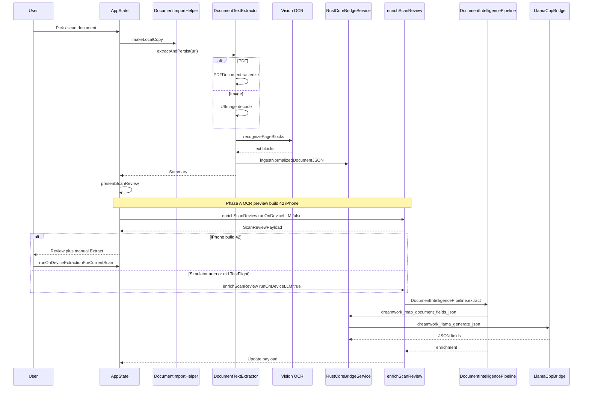

# Document scan crash — simulator investigation & post-upload flow

**Date:** 2026-05-30  
**Simulator:** iPhone 17 Pro (iOS 26.5)  
**Test target:** `DocumentImportCrashSimulationTests`  
**Related:** [testflight-scan-crash-problem-summary.md](./testflight-scan-crash-problem-summary.md)

---

## Executive finding

| Environment | What happens on scan/upload |
|-------------|----------------------------|
| **iPhone (TestFlight)** | OCR completes → app tries to load **~380 MB Qwen GGUF** → **iOS jetsam** (process kill) or native llama crash → user sees instant quit |
| **Simulator (default)** | Same pipeline but **much more RAM** (~6 GB reported available) → LLM often **does not crash** → **hides the device bug** |
| **Simulator + device policy flags** | Reproduces **build 42 behavior** (no auto-LLM) and **memory guard skip** without loading GGUF |

**Root cause:** Peak memory from **Vision OCR + on-device LLM (llama.cpp + Qwen 0.5B)** exceeds the iPhone app memory limit. This is a **resource timing** problem, not a missing-model or Swift logic error.

---

## Why the simulator misleads

1. **`os_proc_available_memory()`** on Simulator often reports **~6144 MB** and does **not** drop when tests allocate hundreds of MB — Mac host RAM backs the process.
2. **`OnDeviceMLPolicy`** (default) sets **`allowsAutomaticInferenceOnScan = true`** on Simulator — reproduces **old TestFlight auto-LLM** behavior, not build 42 iPhone behavior.
3. **GGUF path:** Host models live in `~/Library/Application Support/DreamWork/models/` but the **Simulator app container** is separate — unit tests may not see host models unless copied into the container.

To simulate iPhone on Simulator, tests set:

- `OnDeviceMLPolicy.testSimulatePhysicalIPhone = true`
- `OnDeviceMemoryGuard.testTreatSimulatorLikeDevice = true`
- `OnDeviceMemoryGuard.testForceLowMemory = true` (when testing guard skip)

---

## Post-upload / post-scan execution flow

### Entry points

| User action | Code path |
|-------------|-----------|
| Scan with camera | `HomeView` → scanner sheet → `AppState.importDocument(from:)` |
| File picker | `HomeView` `.fileImporter` → `importDocument(from:)` |
| Simulator laptop import | `SimulatorLaptopImportView` → `importDocument(fromRemoteURL:)` |

All paths converge on **`AppState.importDocument`**.

### Step-by-step pipeline



### Phase detail table

| Step | Component | Memory / CPU impact | Crash risk |
|------|-----------|---------------------|------------|
| 1 | `DocumentImportHelper.makeLocalCopy` | Temp file on disk | Low |
| 2 | PDF rasterization | Large bitmaps (up to 4096pt edge) | Medium |
| 3 | Vision OCR | Image buffers + recognizer | Medium |
| 4 | Rust SQLite ingest | Small JSON | Low |
| 5 | OCR-only enrichment | Layout string | Low |
| 6 | **Load Qwen GGUF** | **~380 MB mmap + context** | **High jetsam** |
| 7 | llama decode + generate | KV cache | **High native** |
| 8 | Person resolve / graph | Small | Low |

---

## Root cause (why it occurs)

### 1. Jetsam (primary on device)

After OCR, iPhone often has **under ~400 MB headroom**. Loading Qwen + llama context exceeds the limit → iOS terminates the app (`EXC_RESOURCE` / `memorystatus`).

### 2. Native llama (secondary; mitigated build 41+)

Long prompts with `n_batch = 32` caused native crashes. Build 41+ uses **chunked decode**.

### 3. Historical amplifiers (builds ≤ 40)

Two LLM passes, storage planner on scan, 3B model, grammar sampler.

---

## Simulator reproduction

### Run timeline test (iPhone 17 Pro Sim)

```bash
cd apps/ios && xcodegen generate
xcodebuild test \
  -project DreamWorkApp.xcodeproj \
  -scheme DreamWorkApp \
  -destination 'platform=iOS Simulator,name=iPhone 17 Pro,OS=26.5' \
  -only-testing:DreamWorkAppTests/DocumentImportCrashSimulationTests
```

Look for `DOCUMENT IMPORT PIPELINE TIMELINE` in the test log.

### Simulate iPhone policy

Test: `testPhysicalIPhonePolicySkipsAutomaticLLMOnSimulator`  
Expect: `llm:policy:manual_trigger_required`

### Simulate memory guard

Test: `testMemoryPressureBlocksLLMLikePhysicalDevice`  
Uses `testForceLowMemory` because Simulator does not emulate jetsam via allocation.

### Optional: run real LLM in Simulator container

```bash
CONTAINER=$(xcrun simctl get_app_container booted com.dream.nestledger.dev data)
mkdir -p "$CONTAINER/Library/Application Support/DreamWork/models"
cp ~/Library/Application\ Support/DreamWork/models/Qwen2.5-0.5B-Instruct-Q4_K_M.gguf \
   "$CONTAINER/Library/Application Support/DreamWork/models/"
```

---

## Current mitigation (build 42)

| Control | File |
|---------|------|
| No auto-LLM on iPhone | `OnDeviceMLPolicy.swift` |
| Manual Extract | `ScanReviewView.swift` |
| Memory guard | `OnDeviceMemoryGuard.swift` |
| OCR-first review | `AppState.presentScanReview` |
| Chunked llama | `LlamaCppBridge.mm` |

---

## Recommendations

1. Validate **build 42 on device**: scan → review → optional Extract.  
2. Use simulation tests for **policy regression**, not exact jetsam math.  
3. Long-term: smaller model or deferred inference for automatic extraction.
