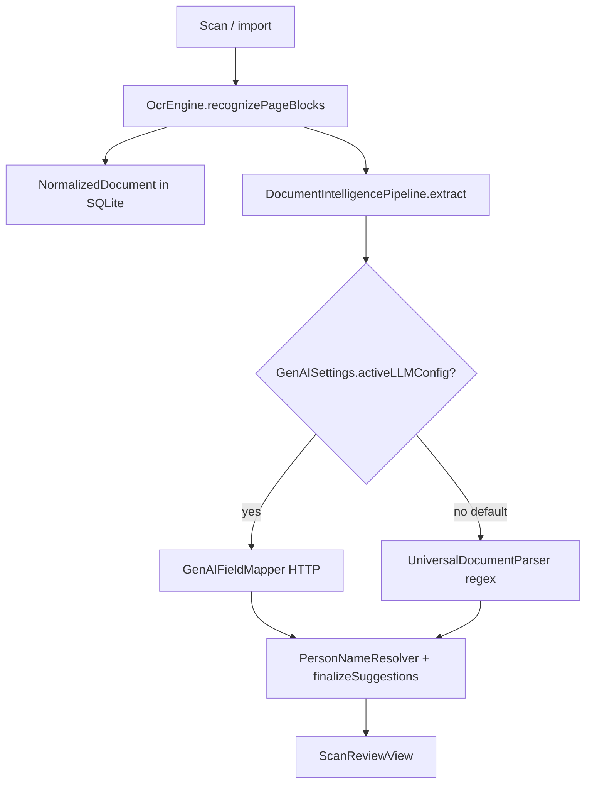

# Field mapping accuracy analysis: why OCR looks right but fields are wrong

**Product:** TrustNest (DreamWork iOS)  
**Symptom:** OCR text in review is readable; **mapped profile fields are wrong, empty, or unrelated** across document types.  
**Related:** [document-intelligence-deep-dive.md](document-intelligence-deep-dive.md), [trustnest-zero-egress-design-constraint.md](trustnest-zero-egress-design-constraint.md)

---

## 1. Executive summary

OCR and field mapping are **two different systems** in the app today. OCR (`OcrEngine` + Vision) is relatively strong. Field mapping fails mainly because:

1. **The real mapper is usually not running** — GenAI defaults to **Off**; fallback is a thin regex parser.
2. **Post-processing overwrites or distorts** good extractions with **Texas DL / passport–specific name logic** on generic documents.
3. **The planned on-device LLM (Qwen GGUF)** is **not integrated**; only optional HTTP LLM (Ollama on Mac / cloud API key) exists.
4. **Layout help is weak** — blocks exist but pairing/sorting does not reliably recover label→value structure.
5. **Silent failures** — LLM errors return `nil` and the UI still shows **High** confidence from heuristics.

Fixing accuracy is not “tune OCR more”; it is **ship a default on-device extraction path**, **stop harmful post-processors on the general pipeline**, and **tighten validation + UX honesty**.

---

## 2. Pipeline today (what actually runs)



**Entry:** `AppState.importDocument` → `DocumentTextExtractor` → `CoreBridgeService.enrichScanReview` → `DocumentIntelligencePipeline.extract`.

There is **no** separate document-type router anymore, but **legacy parsers still run inside** `UniversalDocumentParser` and `PersonNameResolver`.

---

## 3. Root causes (ranked by impact)

### P0 — Default path is not an extractor

| Fact | Effect |
|------|--------|
| `GenAISettings.provider` defaults to **`.off`** | `GenAIFieldMapper.fetchExtraction` returns `nil` immediately |
| Fallback: `UniversalDocumentParser.parse` only | Shallow regex/name guessing — not document understanding |
| **Bundled on-device LLM** (ADR 0017, `llm.schema.*.v1`) | **Not wired** into iOS |

**What users experience:** OCR shows correct lines; fields are whatever regex first matched (wrong name line, random date, wrong SSN-shaped number).

**Evidence in code:**

```45:47:apps/ios/DreamWorkApp/Sources/Core/DocumentIntelligencePipeline.swift
        } else if !plainText.isEmpty {
            suggestions = UniversalDocumentParser.parse(from: plainText)
        }
```

```17:22:apps/ios/DreamWorkApp/Sources/Core/GenAISettings.swift
        get {
            guard let raw = UserDefaults.standard.string(forKey: providerKey),
                  let value = Provider(rawValue: raw)
            else { return .off }
            return value
```

---

### P0 — `PersonNameResolver` rewrites fields after extraction

Even when the LLM returns sensible names, **`PersonNameResolver.apply` runs last** and can replace them using **driver-license and passport heuristics**.

| Trigger | Behavior |
|---------|----------|
| OCR contains `DRIVER LICENSE` (common on many IDs) | Texas LAST/FIRST resolution, consecutive-line guessing |
| `IndianPassportParser.isIndianPassport` | Merges passport-specific fields |
| `PassportParser.isPassport` | Same |

**Problem:** Any document whose OCR text mentions “driver”, “license”, “passport”, etc. gets **ID-specific name logic**, not neutral mapping. Utility bills, letters, and forms can be mangled.

**Evidence:**

```15:37:apps/ios/DreamWorkApp/Sources/Core/PersonNameResolver.swift
    static func apply(
        to suggestions: [OcrFieldSuggestion],
        ocrText: String,
        documentType: ScannedDocumentType = .other
    ) -> [OcrFieldSuggestion] {
        if IndianPassportParser.isIndianPassport(ocrText) { ... }
        if PassportParser.isPassport(ocrText) { ... }
        let resolved = resolve(from: ocrText, documentType: documentType)
```

```78:87:apps/ios/DreamWorkApp/Sources/Core/PersonNameResolver.swift
        let isDL = isTexas
            || documentType == .driversLicense
            || documentType == .stateId
            || joined.uppercased().contains("DRIVER LICENSE")
        if isDL {
            if let texas = resolveTexasNames(from: lines) { return texas }
```

**Address:** For the **general pipeline only**, skip `PersonNameResolver` or gate it behind explicit `document_type` from the model with high confidence. Prefer `NameFieldReconciler` only.

---

### P1 — `UniversalDocumentParser` false positives

When GenAI is off, this is the **only** mapper.

| Heuristic | Failure mode |
|-----------|----------------|
| **Names** — first “plausible” 2-word line | Picks issuer, city, “NEW YORK”, product names |
| **DOB** — first `\d{2}/\d{2}/\d{4}` | Picks issue date, expiry, statement date, tax year |
| **SSN** — `\d{3}-\d{2}-\d{4}` anywhere | Matches account numbers, phone fragments, EIN-like patterns |
| **`shouldIncludeDriverLicenseFields`** | If text contains DRIVER/LICENSE, runs `DriverLicenseParser` on **non-DL** docs |

**Evidence:**

```32:50:apps/ios/DreamWorkApp/Sources/Core/UniversalDocumentParser.swift
        let names = shouldIncludeDriverLicenseFields(in: trimmed) ? ParsedNames() : extractNames(from: trimmed)
        ...
        if shouldIncludeDriverLicenseFields(in: trimmed) {
            let dl = DriverLicenseParser.parse(trimmed)
            suggestions.append(contentsOf: DriverLicenseFieldMapper.suggestions(from: dl))
        }
```

There is **no** label association (“Date of birth:” next to value) — only global regex over flattened text.

---

### P1 — Optional LLM path fails silently on device

When users enable GenAI:

| Provider | On real iPhone | Result |
|----------|----------------|--------|
| **Ollama** `127.0.0.1:11434` | Not reachable (loopback is the phone, not your Mac) | `fetchExtraction` → `nil` → UniversalDocumentParser |
| **Cloud** | Needs API key in Settings; violates zero-egress story | Works only if configured |
| HTTP non-2xx / timeout | Swallowed in `catch` | `nil`, no user-visible error |

**Evidence:**

```152:161:apps/ios/DreamWorkApp/Sources/Core/GenAIFieldMapper.swift
        do {
            let (data, response) = try await URLSession.shared.data(for: request)
            ...
        } catch {
            return nil
        }
```

Scan review copy says “Enable Ollama” but that is **misleading on device** unless Ollama runs on-LAN with a configurable host (not implemented).

---

### P1 — Layout serialization does not fix structure

`OcrLayoutSerializer` improves reading order (line-level blocks from Vision), but:

- Blocks are **lines**, not Vision **tokens** or form cells.
- **Label|value pairing** is a naive same-row heuristic (`rowTolerance = 0.03`); fails on stacked labels, multi-column forms, rotated scans.
- **Coordinate system:** `OcrEngine` stores Vision `boundingBox` without the Y-flip used in `VisionOcrAdapter.normalizedDocument(from:)` — ordering may differ between code paths (import uses `OcrEngine` path).

**Effect:** The LLM (when used) receives numbered lines without reliable “this value belongs to that label” — especially on dense forms.

---

### P2 — Prompt and schema overload

`GenAIFieldMapper` injects **every** `ProfileSchema.allFields` key into the system prompt (40+ fields: insurance, utility, tax, passport, etc.).

**Effects:**

- Small models attend poorly; fill wrong canonical keys.
- Model invents values to satisfy key list pressure (mitigated only by “do not invent” prose, not grammar).
- No **few-shot** or **document-grounded** examples in prompt.

**Missing (ADR 0005):** grammar-constrained decoding / JSON Schema validation on device.

---

### P2 — Key normalization drops or mislabels fields

`GenAIFieldMapper.normalizeKey` maps aliases, but:

- Unknown keys become **extension** snake_case and may not match UI sections users expect.
- `issuer_region` from model can be copied into `drivers_license_state` even for non-DL documents.
- `finalizeSuggestions` + `ScanFieldValidator` filter some garbage but **allow most keys through** (`default: return true`).

---

### P2 — Embedded payloads underused when LLM is off

`EmbeddedPayloadHints` collects PDF417/MRZ text for the **LLM prompt only**.

When GenAI is off:

- Barcode **structured decode** (AAMVA fields) is **not** applied to suggestions.
- MRZ is not parsed into passport fields without LLM.

So high-signal machine data is discarded in the default path.

---

### P3 — Confidence UX misleads

| Source | Score shown |
|--------|-------------|
| UniversalDocumentParser | Hard-coded 0.88–0.92 “High” |
| LLM success | `documentTypeConfidence: 0.92` fixed |
| Understanding banner | “Extracted on this device with generative mapping” only if `usedAI == true` |

Users cannot tell **heuristic guess** vs **model extraction** vs **failed LLM fallback**.

---

## 4. Symptom → likely cause map

| User sees | Likely cause |
|-----------|----------------|
| Wrong person name | `extractNames` or Texas `PersonNameResolver` on non-DL text |
| Wrong DOB | First date regex in `extractDOB` |
| Wrong SSN | SSN regex on non-SSN number |
| Empty fields except 1–2 | GenAI off + regex found little |
| Fields from a different doc type (DL # on utility bill) | `shouldIncludeDriverLicenseFields` or DL keyword in OCR |
| Good OCR, nonsense JSON fields | LLM off OR LLM failed silently → regex; or LLM with overloaded schema |
| Worked on Mac, broken on phone | Ollama URL `127.0.0.1` |
| Used to work with API key | Cloud path removed from `enrichScanReview`; only Settings → GenAI |

---

## 5. What is *not* the primary problem

| Area | Verdict |
|------|---------|
| **Vision OCR quality** | Generally OK for English; user confirms scan text looks fine |
| **SQLite / Rust ingest** | Stores OCR JSON; does not map fields |
| **Scan review UI** | Displays what pipeline returns; not the source of wrong values |
| **Missing templates** (per product direction) | Correct strategic choice; problem is **absence of working general mapper**, not lack of Texas template |

---

## 6. How to address (prioritized)

### Phase A — Stop making it worse (days)

| # | Action | Rationale |
|---|--------|-----------|
| A1 | **Disable `PersonNameResolver` on general ingest** (or only run when barcode/MRZ decode succeeded) | Stops Texas/passport overrides on arbitrary docs |
| A2 | **Disable `shouldIncludeDriverLicenseFields` in `UniversalDocumentParser`** for default fallback | Stops DL parser bleed |
| A3 | **Surface LLM failure** in scan review (“Mapping unavailable — check Settings”) when `activeLLMConfig` set but `fetchExtraction` nil | Stops silent fallback |
| A4 | **Lower default confidence** for regex-only fields; show “Estimated” badge | Honest UX |
| A5 | **Decode PDF417/MRZ to fields** when detected, **without** LLM (payload path) | Free accuracy for IDs |

### Phase B — Default on-device mapper (weeks)

| # | Action | Rationale |
|---|--------|-----------|
| B1 | **Wire bundled Qwen2.5 GGUF** via `GenerativeLlmSession` (ADR 0017) as **default**, not optional HTTP | Matches zero-egress + accuracy needs |
| B2 | **Grammar / JSON Schema constrained output** (ADR 0005) | Cuts hallucinated keys and invalid JSON |
| B3 | **Shrink prompt**: field groups by inferred category, not full `allFields` dump | Better model focus |
| B4 | **Fix block geometry**: single coordinate convention (top-left), optional column detection | Better label–value pairing |
| B5 | **Run layout + plain text**: LLM gets `modelInput` + raw lines; validate with post-rules | Redundancy helps OCR noise |

### Phase C — Quality loop (ongoing)

| # | Action |
|---|--------|
| C1 | Golden corpus: 50+ scans per cluster (bill, form, ID, letter) with expected `ProfileFieldKey` set |
| C2 | Metrics: field precision/recall per key; **hallucination rate** (value not substring of OCR) |
| C3 | On-device regression: CPU tier for deterministic JSON tests |
| C4 | User edit feedback → future prompt/fine-tune (on-device adapter later) |

---

## 7. Recommended target behavior

```text
1. OCR → NormalizedDocument (unchanged)
2. Optional: decode barcode/MRZ → high-confidence field hints (deterministic)
3. On-device LLM (always for ingest):
   - Input: layout-ordered blocks + hints + truncated schema slice
   - Output: JSON validated against schema
4. Validators: value must appear in OCR text (fuzzy match) OR come from barcode/MRZ
5. Review UI: show per-field source (ocr_line | mrz | model) + confidence
6. No PersonNameResolver / Texas / passport parsers on this path
```

---

## 8. Quick diagnostic checklist (engineering)

When investigating a bad scan in QA:

1. **Settings → GenAI provider** — Off vs Ollama vs Cloud?
2. **`usedAI` on payload** — false means regex-only path.
3. **Compare** `payload.fullText` to each suggested value — is value a substring of OCR?
4. **Check** if suggestion keys are `drivers_license_*` on non-DL docs → DL bleed.
5. **Names** — do they match Texas LAST/FIRST pattern? → `PersonNameResolver`.
6. **Device** — Ollama at 127.0.0.1 on iPhone will always fail.

---

## 9. Code hotspots (for fixes)

| File | Role |
|------|------|
| `DocumentIntelligencePipeline.swift` | Chooses LLM vs UniversalDocumentParser |
| `GenAISettings.swift` | Default off; Ollama URL |
| `GenAIFieldMapper.swift` | HTTP LLM; silent errors |
| `UniversalDocumentParser.swift` | Regex fallback |
| `PersonNameResolver.swift` | **High-risk post-process** |
| `OcrLayoutSerializer.swift` | Layout prompt |
| `EmbeddedPayloadHints.swift` | Barcode/MRZ appendix only |
| `ScanReviewView.swift` | Should show source + errors |

---

## 10. Summary

**OCR is not the bottleneck.** Field mapping is inaccurate because production ingest **usually does not run a real document-understanding model**, falls back to **aggressive regex**, then **re-applies ID-specific name logic** that conflicts with arbitrary documents. Optional HTTP LLM **fails on phone without clear errors**, and the **planned on-device model is still absent**.

**Fastest accuracy wins:** (A) stop `PersonNameResolver` + DL bleed on general path, (A) decode barcodes/MRZ to fields, (B) ship default bundled on-device LLM with schema validation and honest review UX.

---

*Last updated: May 2026 — branch `ganga-2026-05-16-3`.*
