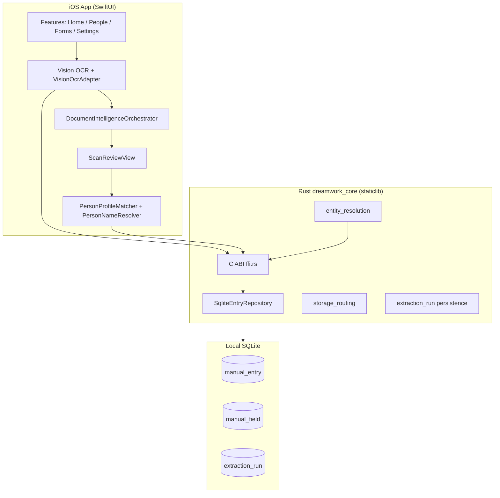
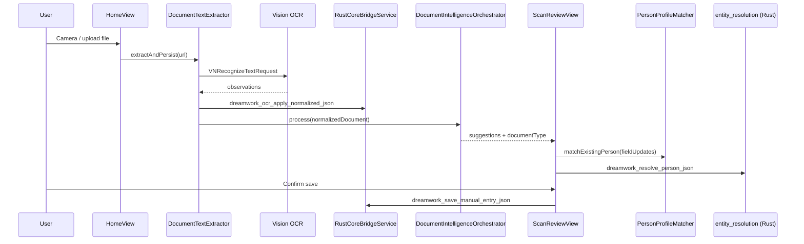

# Fresh-start implementation baseline

**Purpose:** This document captures everything implemented in the current `dream-work-reality` codebase (branch `ganga-2026-05-16-3` era) so a **new, simplified branch** can be rebuilt with a precise scope. It is the single source of truth for **functionality**, **technical architecture**, **components**, **data contracts**, **tests**, and **lessons learned**.

**Product name in repo:** DreamWork / TrustNest — local-first household identity vault with document scan, on-device OCR, profile memory, and form assistance.

**Core constraint:** [Zero egress](trustnest-zero-egress-design-constraint.md) — document bytes and household PII must not leave the device in normal flows.

---

## Table of contents

1. [What the product does today](#1-what-the-product-does-today)
2. [Repository layout](#2-repository-layout)
3. [End-to-end architecture](#3-end-to-end-architecture)
4. [iOS application](#4-ios-application)
5. [Document intelligence pipeline](#5-document-intelligence-pipeline)
6. [Parsers, classifiers, and field mapping](#6-parsers-classifiers-and-field-mapping)
7. [Person profiles and household resolution](#7-person-profiles-and-household-resolution)
8. [Rust core and FFI](#8-rust-core-and-ffi)
9. [SQLite schema and persistence](#9-sqlite-schema-and-persistence)
10. [Profile schema (canonical field keys)](#10-profile-schema-canonical-field-keys)
11. [Supporting surfaces (extension, API, demo)](#11-supporting-surfaces-extension-api-demo)
12. [Test infrastructure and fixtures](#12-test-infrastructure-and-fixtures)
13. [Build, signing, and TestFlight](#13-build-signing-and-testflight)
14. [Document types and lifecycle coverage](#14-document-types-and-lifecycle-coverage)
15. [Known bugs fixed and edge cases](#15-known-bugs-fixed-and-edge-cases)
16. [What grew complex (simplify in rewrite)](#16-what-grew-complex-simplify-in-rewrite)
17. [Recommended minimal architecture for rewrite](#17-recommended-minimal-architecture-for-rewrite)
18. [File index (quick reference)](#18-file-index-quick-reference)

---

## 1. What the product does today

### 1.1 User-facing capabilities (implemented)

| Capability | Status | Notes |
|------------|--------|-------|
| **Scan document (camera)** | ✅ | `DocumentCameraView` → Vision OCR → review screen |
| **Upload image/PDF** | ✅ | `DocumentImportHelper` + `DocumentTextExtractor` (PDF ≤25 pages) |
| **Simulator “browse laptop” import** | ✅ | HTTP server on Mac; app fetches from `127.0.0.1` |
| **OCR text extraction** | ✅ | Apple Vision `VNRecognizeTextRequest` (English) |
| **Document type classification** | ✅ | Keyword/heuristic + NaturalLanguage + optional Create ML |
| **Field extraction / mapping** | ✅ | Specialized parsers + semantic/heuristic fallbacks |
| **Scan review UI** | ✅ | Edit fields, pick profile, save |
| **Household person profiles** | ✅ | CRUD via Rust SQLite (`manual_entry` / `manual_field`) |
| **Profile matching on scan** | ✅ | Swift `PersonProfileMatcher` + Rust `entity_resolution` |
| **Manual profile entry/edit** | ✅ | `PersonEditorView`, `EditPersonProfileView` |
| **Forms tab (in-app)** | ✅ | Copy profile fields; `DriverLicenseScanner` sub-flow |
| **Settings** | ✅ | GenAI provider toggle (optional cloud), audit log |
| **TestFlight distribution** | ✅ | Build 33, bundle `com.dream-team.nestledger.dev` |
| **Chrome extension demo** | ✅ | `apps/extension-demo` + `core_api` HTTP |
| **Proximity share / crypto vault** | 🔶 Rust modules exist; not wired in main iOS UI |
| **Dynamic DDL / LLM schema planner** | 🔶 Designed (ADR 0005); executor not in iOS path |
| **ONNX / GGUF on-device LLM** | ❌ Removed from default iOS path on current branch |

### 1.2 Primary user journey (scan → profile)

```
Home → Scan/Upload
  → Vision OCR (NormalizedDocument JSON)
  → Persist extraction_run (Rust FFI)
  → DocumentIntelligenceOrchestrator (classify → extract → validate → normalize)
  → ScanReviewView (user edits fields)
  → PersonProfileMatcher + CoreIngestFFI.resolvePerson
  → savePerson → dreamwork_save_manual_entry_json
  → People tab shows updated profile
```

### 1.3 Design principles (from ADRs — keep in rewrite)

| ADR | Decision | Rewrite implication |
|-----|----------|---------------------|
| [0001](adr/0001-local-first-no-upload.md) | Local-first; no document upload to backend | Non-negotiable |
| [0002](adr/0002-sqlite-canonical-store.md) | SQLite canonical store | Keep; simplify schema if needed |
| [0003](adr/0003-shared-native-core.md) | Shared Rust core across surfaces | Keep FFI boundary; shrink API surface |
| [0004](adr/0004-on-device-ocr-pluggable.md) | Pluggable OCR; Vision on iOS | Keep Vision adapter only initially |
| [0011](adr/0011-ingest-write-first-review.md) | Write-first ingest + post review | Scan review is the pattern |
| [0012](adr/0012-manual-entry-first-class.md) | Manual entry without documents | People CRUD must remain first-class |
| [0013](adr/0013-rust-shared-core.md) | Rust for security-sensitive logic | Keep person resolution + SQLite in Rust |
| [0016](adr/0016-extension-host-protocol.md) | Extension ↔ native host protocol | Defer or keep minimal |

---

## 2. Repository layout

```
dream-work-reality/
├── apps/
│   ├── ios/                    # Primary product (SwiftUI + Rust staticlib)
│   └── extension-demo/         # Chrome MV3 autofill demo
├── core/                       # Rust workspace
│   ├── dreamwork_core/         # staticlib: SQLite, FFI, entity resolution
│   ├── core_api/               # Axum HTTP server (dev/demo)
│   └── dreamwork_uniffi/       # Optional UniFFI (iOS uses C ABI today)
├── demo/                       # Sample profiles, forms, household fixtures
├── deploy/                     # k8s, privacy policy static site
├── docs/                       # Architecture, ADRs, deep dives
├── integration/                # Extension JSON schema harness
└── scripts/                    # Demo orchestration, fixture generation, simulator prep
```

**Not a JS monorepo.** iOS uses XcodeGen (`project.yml`); Rust uses Cargo workspace.

---

## 3. End-to-end architecture

### 3.1 System diagram



### 3.2 Staged ingest model (intended; partially implemented)

| Stage | Responsibility | Where implemented | Persisted? |
|-------|----------------|-------------------|------------|
| **0 — OCR** | Raster/PDF → text blocks + layout | iOS `OcrEngine`, `VisionOcrAdapter` | `extraction_run.document_json` |
| **1 — Understand** | Classify doc type + extract field map | iOS `DocumentIntelligenceOrchestrator` | In-memory until save |
| **2 — Plan storage** | Canonical vs extension field routing | Rust `storage_routing` + iOS `AppleStoragePlanner` | Plan only (not executed server-side) |
| **3 — Resolve person** | Match scan to existing household member | Rust `entity_resolution` + iOS `PersonProfileMatcher` | On save via `manual_entry` |
| **4 — Commit** | Upsert profile fields | Rust `dreamwork_save_manual_entry_json` | `manual_entry` + `manual_field` |

### 3.3 Sequence: scan to saved profile



---

## 4. iOS application

### 4.1 Entry and navigation

| File | Type | Role |
|------|------|------|
| `DreamWorkApp/Sources/App/DreamWorkAppApp.swift` | `@main` | Boot `AppState(coreService: RustCoreBridgeService())` |
| `DreamWorkApp/Sources/App/RootTabView.swift` | View | Tab shell |
| `DreamWorkApp/Sources/Core/AppState.swift` | `AppState`, `AppTab` | Global state, import, scan modal, people CRUD |

**Tabs (`AppTab`):**

| Tab | Key views | Path |
|-----|-----------|------|
| Home | `HomeView` | `Features/Home/` |
| People | `PeopleView`, `PersonDetailView`, `PersonEditorView` | `Features/People/` |
| Forms | `FormsView`, `DriverLicenseScanner` | `Features/Forms/` |
| Settings | `SettingsView` | `Features/Settings/` |

**Scan flow (modal):**

| View | Path | Role |
|------|------|------|
| `ScanReviewView` | `Features/Scan/ScanReviewView.swift` | Field review, profile picker, save |
| `DocumentCameraView` | `Features/Scan/DocumentCameraView.swift` | Live camera capture |
| `SimulatorLaptopImportView` | `Features/Scan/SimulatorLaptopImportView.swift` | Dev: fetch docs from Mac HTTP server |

### 4.2 Source tree (~104 Swift files)

| Directory | Responsibility |
|-----------|----------------|
| `Sources/App/` | Entry, tabs |
| `Sources/Core/` | OCR, parsers, Rust bridge, schema, scan review models |
| `Sources/Intelligence/` | Orchestrator, agents, validation, routing, embeddings |
| `Sources/AppleNative/` | NL classifier, semantic extractor, Create ML registry |
| `Sources/Native/` | `OnDeviceMLPolicy`, `OnDeviceMemoryGuard` |
| `Sources/Features/` | SwiftUI screens |

### 4.3 Key Swift types

```text
AppTab, AppState
ScannedDocumentType, ProfileFieldKey, ProfileSection, HouseholdRelationship
PersonRecord, OcrFieldSuggestion, FieldMappingSource
VisionOcrAdapter.NormalizedDocument / Page / TextBlock / NormRect
ScanReviewPayload, ScanReviewEnrichment, PersonResolutionKind
DocumentIntelligenceOrchestrator.Result
ClassificationAgent.Result, ExtractionDocumentStructure
SchemaMappingEngine.StandardizedDocumentOutput
CoreBridgeService / RustCoreBridgeService / MockCoreBridgeService
GenAISettings.Provider (appleNative, ollama, openAI)
```

---

## 5. Document intelligence pipeline

**Coordinator:** `DocumentIntelligenceOrchestrator` (`Intelligence/Agents/DocumentIntelligenceOrchestrator.swift`)

**Thin wrapper:** `DocumentIntelligencePipeline` (`Core/DocumentIntelligencePipeline.swift`)

**Documented stages:** `DocumentUnderstandingService` (`Intelligence/DocumentUnderstandingService.swift`)

### 5.1 Pipeline steps (in order)

| Step | Component | Output / trace tag |
|------|-----------|------------------|
| 1 | `VisionOcrAdapter` + `OcrEngine` | `ocr:vision.en.v1` |
| 2 | `EmbeddedPayloadHints` | MRZ lines, PDF417 barcodes — `mrz:detected`, `barcode:detected` |
| 3 | `LayoutIntelligenceAgent` | Layout text, label/value pairs — `layout:*` |
| 4 | `LocalDocumentClassifier` → `NLDocumentClassifier` | Document type — `classify:*` |
| 5 | `ProfileSchemaKeysForDocument` | Schema key subset — `schema_keys:N` |
| 6 | `ExtractionStrategyAgent` + `DocumentExtractionRouter` | Route — `route:knownFastPath\|unknownSemantic` |
| 7 | `ExtractionAgent` | Field suggestions — `extract:semantic\|heuristic_fallback` |
| 8 | `DocumentValidationPipeline` | Reject bad values — `validate:*` |
| 9 | `OcrGroundingValidator` | Ground values in OCR text |
| 10 | `AddressFieldMerger` | Merge split address lines — `address:merged` |
| 11 | `FieldNormalizationEngine` | Normalize formats |
| 12 | `ConfidenceOrchestrator` | Per-field confidence |
| 13 | `SchemaMappingEngine` | `StandardizedDocumentOutput` |
| 14 | `DocumentKnowledgeGraph` | Identity graph, autofill payload |
| 15 | `VectorDocumentMemory` | Index for incremental learning |

**Disabled in current orchestrator:**

- `DocumentTemplateAgent` — trace: `template:disabled:ml_only`
- `FraudDetectionAgent` — stub only

### 5.2 Extraction paths inside `ExtractionAgent`

Priority order (simplified):

1. **Machine-readable:** MRZ (`MachineReadableFieldExtractor`), PDF417 barcode
2. **Specialized parsers:** `SpecializedDocumentExtractors` → Texas DL, passport, tax, etc.
3. **Apple semantic:** `AppleSemanticFieldExtractor` + `NLFieldLabelMapper`
4. **Heuristic:** `UniversalDocumentParser`, `OcrFieldSuggester`
5. **Optional cloud:** `GenAIFieldMapper` (Settings → ollama/openAI only)

### 5.3 Apple-native stack (current default)

Per [apple-native-document-intelligence.md](apple-native-document-intelligence.md):

- **Vision** — OCR (out-of-process, skew correction)
- **Vision** — barcode detection
- **NaturalLanguage** — NER, embeddings for label→key mapping
- **Create ML** — optional bundled `.mlmodel` classifiers
- **Rust FFI** — SQLite + person resolution only

**Removed from default path:** MiniLM ONNX, GGUF llama, PaddleOCR, `OnDeviceFieldMapper`, network LLM planner in Rust.

### 5.4 Model artifact slots

`ModelArtifactSlot` (`Intelligence/Models/ModelArtifactRegistry.swift`):

`visionOCR`, `documentClassifier`, `fieldEmbedder`, `storagePlanner`, `layoutLM`, `fraudDetector`

`LayoutLMv3CoreMLAdapter` exists but is optional/heavy.

---

## 6. Parsers, classifiers, and field mapping

### 6.1 Document type enum

`ScannedDocumentType` (`Core/ProfileSchema.swift`):

| Enum case | Detection signals (heuristic) |
|-----------|------------------------------|
| `driversLicense` | DRIVER + LICENSE, 4d DL, state name, numbered 1./2. fields |
| `passport` | PASSPORT, NATIONALITY, MRZ `P<` |
| `stateId` | STATE ID, IDENTIFICATION CARD, NON-DRIVER |
| `ssnCard` | SOCIAL SECURITY, ESTABLISHED FOR, SSN pattern |
| `insuranceCard` | MEMBER, SUBSCRIBER, GROUP #, RXBIN |
| `utilityBill` | UTILITY, ELECTRIC, kWh |
| `bankStatement` | ACCOUNT STATEMENT, ROUTING, BALANCE |
| `taxDocument` | W-2, 1099, Form 1040, IRS |
| `employmentDocument` | PAY STUB, EMPLOYER, EARNINGS |
| `other` | Birth cert, marriage cert, vehicle reg, property tax, fallback |

### 6.2 Specialized parsers

| Parser | File | Input | Key outputs |
|--------|------|-------|-------------|
| `TexasDriverLicenseParser` | `Core/TexasDriverLicenseParser.swift` | OCR lines | `DriverLicenseScanResult` — numbered 1./2./3./4d./8. fields |
| `DriverLicenseParser` | `Features/Forms/DriverLicenseScanner.swift` | OCR text | Generic DL + AAMVA PDF417 |
| `PassportParser` | `Core/PassportParser.swift` | OCR + MRZ | ICAO TD3 biodata |
| `IndianPassportParser` | `Core/IndianPassportParser.swift` | OCR | India-specific layout |
| `UniversalDocumentParser` | `Core/UniversalDocumentParser.swift` | OCR text | SSN, names, DOB, addresses (regex/heuristic) |
| `MachineReadableFieldExtractor` | `Core/MachineReadableFieldExtractor.swift` | MRZ/barcode only | Trusted high-confidence fields |

### 6.3 Texas DL OCR layout (critical for tests)

Expected text layout (`DriverLicenseParserTests.texasSampleOCRText`):

```
TEXAS
DRIVER LICENSE
4d. DL: D12345678
3. DOB: 03/15/1985
1. SMITH
2. JANE
8. Address
742 OAK STREET
AUSTIN, TX 78701-1234
4a. Iss: 01/10/2023
4b. Exp: 01/10/2028
```

**Parser maps to:** `display_name`, `legal_first_name`, `legal_last_name`, `date_of_birth`, `drivers_license_number`, `drivers_license_state`, address fields, issue/expiry dates.

### 6.4 SSN card OCR layout

`UniversalDocumentParser.looksLikeSSNDocument` requires Social Security header patterns.

Expected lines:

```
YOUR SOCIAL SECURITY CARD
THIS NUMBER HAS BEEN ESTABLISHED FOR
JANE DOE
123-45-6789
123 MAIN ST
SPRINGFIELD IL 62704-1234
```

**Known gap (documented):** [ssn-ocr-field-mapping-gap.md](ssn-ocr-field-mapping-gap.md) — garbled SSA stub text; fixed via layout-aware name resolution.

### 6.5 Classifiers

| Component | File | Method |
|-----------|------|--------|
| `DocumentTypeClassifier` | `Core/DocumentTypeClassifier.swift` | Keyword/heuristic baseline |
| `NLDocumentClassifier` | `AppleNative/NLDocumentClassifier.swift` | NL + keywords + optional Create ML |
| `LocalDocumentClassifier` | `Intelligence/Classification/LocalDocumentClassifier.swift` | Facade |
| `ClassificationAgent` | `Intelligence/Agents/ClassificationAgent.swift` | Shared result types |

**Refinement:** Texas DL structured parse boosts confidence to 100%.

### 6.6 Field validation

| Component | File | Role |
|-----------|------|------|
| `ScanFieldValidator` | `Core/ScanFieldValidator.swift` | Per-type plausibility (reject "MOTOR VEHICLE" as name) |
| `DocumentValidationPipeline` | `Intelligence/Validation/DocumentValidationPipeline.swift` | Orchestrates validators |
| `OcrGroundingValidator` | `Intelligence/Validation/OcrGroundingValidator.swift` | Value must appear in OCR corpus |
| `ConfidenceOrchestrator` | `Intelligence/Validation/ConfidenceOrchestrator.swift` | Field confidence scores |

### 6.7 Name resolution

`PersonNameResolver` (`Core/PersonNameResolver.swift`):

- Texas DL: numbered lines 1./2., consecutive line heuristics
- SSN card: name below "ESTABLISHED FOR"
- Comma format: `LAST, FIRST`
- **Guard:** `isTexasDriverLicenseContext` requires DL layout signals — bare "TEXAS" (e.g. insurance "BLUE CROSS OF TEXAS") must NOT trigger DL parsing

---

## 7. Person profiles and household resolution

### 7.1 Data model

`PersonRecord` (`Core/PersonRecord.swift`) mirrors Rust `ManualEntry`:

```json
{
  "id": "uuid-string",
  "fields": {
    "display_name": "Jane Doe",
    "legal_first_name": "Jane",
    "legal_last_name": "Doe",
    "date_of_birth": "03/15/1985",
    "ssn": "123-45-6789",
    "drivers_license_number": "D12345678",
    "postal_code": "78701",
    "address_line1": "100 Main St"
  }
}
```

### 7.2 Swift-side matching (`PersonProfileMatcher`)

**File:** `Core/PersonProfileMatcher.swift`

**Strong signals (any one can match if no conflict):**

- Exact `drivers_license_number`, `passport_number`, `state_id_number`, `ssn`
- Name + DOB combo
- High name similarity + supporting address/ZIP

**Conflict detection (`hasIdentityConflict`):**

- Different government IDs → conflict → do NOT auto-merge
- Different names with high confidence → conflict
- Shared address/ZIP alone is NOT sufficient when IDs/names differ

**Scan review behavior:** On conflict, default to **Create new profile** (`ScanReviewView`).

### 7.3 Rust-side matching (`entity_resolution`)

**File:** `core/dreamwork_core/src/entity_resolution.rs`

| Result | Condition |
|--------|-----------|
| `MatchExisting` | Best score ≥ 0.72, no identity conflict |
| `NewPerson` | Best score < 0.38 |
| `Ambiguous` | Top two candidates within 0.08 |

**Scoring weights:**

- Gov ID exact match: +0.80 each
- Name fuzzy, DOB, address, postal code: smaller increments
- `has_identity_conflict` zeroes candidate

**FFI:** `dreamwork_resolve_person_json` ← `CoreIngestFFI.resolvePerson`

### 7.4 Household test scenario (3 people, 1 address)

| Person | Documents | Must resolve to |
|--------|-----------|-----------------|
| Jane Doe | DL `D111…`, birth cert | `jane` profile |
| John Smith | SSN `123-45-6789` | `john` profile |
| Emma Smith | State ID `987…`, child DL | `emma` profile (new, not Jane) |

**Tests:** `HouseholdProfileResolutionTests.swift`, Rust `household_spouses_with_shared_address_stay_separate`

### 7.5 Storage planning

| Component | Location | Role |
|-----------|----------|------|
| `AppleStoragePlanner` | `AppleNative/AppleStoragePlanner.swift` | iOS default: canonical key routing on save |
| `storage_routing` | `core/.../storage_routing.rs` | Rust plan-only: `upsert_manual_field` vs `upsert_extension_field` |
| `ProfileMergeEngine` | `Intelligence/Profiles/ProfileMergeEngine.swift` | Confidence-aware merge on update |

---

## 8. Rust core and FFI

### 8.1 Crates

| Crate | Artifact | Used by |
|-------|----------|---------|
| `dreamwork_core` | `libdreamwork_core.a` staticlib | iOS (primary) |
| `core_api` | Binary + Axum router | Extension demo, dev |
| `dreamwork_uniffi` | UniFFI bindings | Not used by iOS (C ABI preferred) |

### 8.2 Modules (`dreamwork_core/src/`)

| Module | File | Responsibility |
|--------|------|----------------|
| `ffi` | `ffi.rs` | C ABI exported functions |
| `runtime` | `runtime/mod.rs` | Singleton repo, last OCR doc |
| `memory` | `memory/sqlite.rs`, `in_memory.rs` | `EntryRepository`, `ExtractionRepository` |
| `db` | `db/migrate.rs` | Versioned migrations + `schema_change_log` |
| `ingestion` | `ingestion.rs` | `ManualEntry`, `ManualField` types |
| `ingest` | `ingest.rs` | JSON DTO parsing for FFI |
| `entity_resolution` | `entity_resolution.rs` | Person matching rules |
| `storage_routing` | `storage_routing.rs` | Storage plan generation |
| `profile_keys` | `profile_keys.rs` | Canonical keys + normalization |
| `ocr` | `ocr/mod.rs` | `NormalizedDocument` schema, `OcrEngine` trait |
| `extraction` | `extraction/mod.rs` | Flatten OCR, materialize mapping |
| `schema` | `schema.rs` | `MappingPlan`, validators |
| `inference` | `inference/mod.rs` | ONNX/GGUF stubs (not iOS default) |
| `form` | `form.rs` | Rules-first form field matcher |
| `crypto` | `crypto/mod.rs` | HKDF + ChaCha20-Poly1305 |
| `proximity` | `proximity/mod.rs` | x25519 proximity handshake |
| `provenance` | `provenance.rs` | In-memory history (not SQLite yet) |

### 8.3 C ABI functions (complete list)

| Symbol | Swift consumer | Purpose |
|--------|----------------|---------|
| `dreamwork_repository_configure_persistent_sqlite` | `RustRepositoryBootstrap` | Set DB path before first use |
| `dreamwork_fetch_status` | `RustCoreBridgeService` | Health check |
| `dreamwork_string_free` | All FFI callers | Free Rust strings |
| `dreamwork_save_manual_entry` | Legacy | Save display name only |
| `dreamwork_save_manual_entry_json` | `savePerson` | Full `PersonRecord` upsert |
| `dreamwork_delete_manual_entry` | `deletePerson` | Delete profile |
| `dreamwork_read_manual_entry_name` | Debug | Read display name |
| `dreamwork_manual_entry_count` | Stats/tests | Count profiles |
| `dreamwork_manual_entries_json` | `listPeople` | All profiles JSON array |
| `dreamwork_ocr_apply_normalized_json` | OCR ingest | Save `extraction_run` |
| `dreamwork_extraction_run_count` | Tests | Count OCR runs |
| `dreamwork_ocr_last_document_json` | Debug | Peek last OCR |
| `dreamwork_resolve_person_json` | `CoreIngestFFI.resolvePerson` | Stage 3 resolution |
| `dreamwork_plan_storage_json` | `CoreIngestFFI.planStorage` | Stage 2 plan |

### 8.4 iOS ↔ Rust build integration

| File | Role |
|------|------|
| `DreamWorkApp/RustCore.xcconfig` | Link `libdreamwork_core.a` per SDK/arch |
| `DreamWorkApp/Scripts/build_rust_core.sh` | Xcode pre-build: `cargo build` for iOS sim/device |
| `RustRepositoryBootstrap.swift` | DB path: `Application Support/DreamWork/library.sqlite` |

### 8.5 OCR JSON contract (`NormalizedDocument`)

```json
{
  "pages": [{
    "blocks": [{
      "text": "TEXAS",
      "confidence": 0.95,
      "bounds": { "x": 0.1, "y": 0.9, "width": 0.3, "height": 0.04 }
    }]
  }]
}
```

Swift: `VisionOcrAdapter.NormalizedDocument`  
Rust: `ocr::NormalizedDocument`  
Bounds are normalized 0–1 (Vision bottom-left origin adapted in adapter).

---

## 9. SQLite schema and persistence

### 9.1 Migrations

**File:** `core/dreamwork_core/src/db/migrate.rs`

**Migration 1 — `manual_entry_v1`:**

```sql
CREATE TABLE manual_entry (id TEXT PRIMARY KEY);
CREATE TABLE manual_field (
  entry_id TEXT NOT NULL REFERENCES manual_entry(id) ON DELETE CASCADE,
  field_key TEXT NOT NULL,
  value TEXT NOT NULL,
  PRIMARY KEY (entry_id, field_key)
);
```

**Migration 2 — `extraction_run_v1`:**

```sql
CREATE TABLE extraction_run (
  id TEXT PRIMARY KEY,
  created_at_ms INTEGER NOT NULL,
  engine_id TEXT NOT NULL,
  model_revision TEXT NOT NULL,
  language_tag TEXT NOT NULL,
  document_json TEXT NOT NULL
);
```

### 9.2 Repository behavior

- **Save person:** replace-all fields for `entry_id` (upsert entry + delete old fields + insert new)
- **OCR ingest:** append-only `extraction_run` rows
- **Encryption:** optional `sqlcipher` feature (`PRAGMA key`); not enabled in default iOS build

### 9.3 Legacy / unused stores

| Store | Path | Status |
|-------|------|--------|
| Rust `library.sqlite` | Application Support | **Active** — all People UI |
| `PeopleSQLiteStore` | `people.sqlite3` | Legacy Swift store; **not used** by main UI |

---

## 10. Profile schema (canonical field keys)

**Swift:** `ProfileFieldKey` in `Core/ProfileSchema.swift`  
**Rust:** `profile_keys::canonical_profile_keys()` in `core/dreamwork_core/src/profile_keys.rs`

| Key | Section | Sensitive |
|-----|---------|-----------|
| `display_name` | Identity | No |
| `relationship` | Identity | No |
| `legal_first_name`, `legal_middle_name`, `legal_last_name` | Identity | No |
| `date_of_birth`, `gender` | Identity | Yes |
| `email`, `phone_mobile`, `phone_home` | Contact | No |
| `address_line1`, `address_line2`, `city`, `state`, `postal_code`, `country` | Address | No |
| `ssn` | Government IDs | Yes |
| `drivers_license_number`, `drivers_license_state`, `drivers_license_issue_date`, `drivers_license_expiry` | Government IDs | Yes |
| `passport_number`, `passport_country`, `passport_expiry` | Government IDs | Yes |
| `state_id_number`, `state_id_expiry` | Government IDs | Yes |
| `insurance_carrier`, `insurance_member_id` | Medical | Yes |
| `employer_name` | Tax | No |
| `bank_name`, `bank_account_last4` | Other | Yes |
| `utility_provider` | Contact | No |
| `tax_form_type`, `tax_year`, `filing_status` | Tax | No |
| `emergency_contact_name`, `emergency_contact_phone` | Contact | No |

**Key normalization (Rust):** `first_name` → `legal_first_name`, `dl_number` → `drivers_license_number`, `zip` → `postal_code`, etc.

---

## 11. Supporting surfaces (extension, API, demo)

### 11.1 Chrome extension demo

| Path | Role |
|------|------|
| `apps/extension-demo/` | MV3 extension: detect form, request fill from host |
| `core/core_api/` | Axum server: `/manual-entry`, `/genai/map-fields`, `/ingest/resolve-person` |
| `demo/form/demo-form.html` | School intake form for autofill demo |
| `demo/profile.example.json` | Template profile for Playwright fill |
| `scripts/run_demo.sh` | Full stack: kind + core_api + form server + extension |

### 11.2 core_api HTTP routes (dev only)

| Route | Maps to |
|-------|---------|
| `GET /healthz` | Health |
| `POST /manual-entry` | Save person |
| `GET /manual-entry/{id}` | Read person |
| `POST /ingest/resolve-person` | Stage 3 |
| `POST /ingest/plan-storage` | Stage 2 |
| `POST /genai/extract-document` | Cloud LLM OCR map (optional) |
| `GET /extraction-runs/count` | OCR run count |

### 11.3 Demo document fixtures

| Path | Contents |
|------|----------|
| `demo/sample-documents/household-fixtures/` | 10 fictional households, ~15 doc types each, PNG+PDF |
| `scripts/generate_household_test_documents.py` | Generator entry point |
| `scripts/household_document_renderers.py` | Per-document Pillow renderers |
| `scripts/household_document_art.py` | Shared drawing primitives |

**Simulator testing:**

```bash
./scripts/prepare_simulator_testing.sh
# Serves demo/sample-documents on :8010
# App: Home → Browse laptop documents
```

---

## 12. Test infrastructure and fixtures

### 12.1 iOS test targets

| Target | Bundle ID | Path |
|--------|-----------|------|
| `DreamWorkAppTests` | `com.dream-team.nestledger.dev.tests` | 32 unit test files |
| `DreamWorkAppUITests` | `com.dream-team.nestledger.dev.uitests` | Home/People smoke |

### 12.2 Test tiers

| Tier | Tests | Input |
|------|-------|-------|
| **Unit** | Parser/classifier/matcher tests | Synthetic OCR strings |
| **Integration** | `OcrSQLiteIntegrationTests` | Vision on bundled PNG |
| **E2E simulator** | `SimulatorDocumentPipelineE2ETests`, `LifecycleDocumentSimulationTests` | PNG fixtures + synthetic renders |
| **Household** | `HouseholdProfileResolutionTests` | Field maps + mock people |
| **Rust** | `entity_resolution` unit tests, `pipeline_smoke.rs` | JSON fixtures |

### 12.3 Key test files

| File | Covers |
|------|--------|
| `DriverLicenseParserTests.swift` | Texas DL field mapping |
| `UniversalDocumentParserTests.swift` | SSN garbled OCR, generic fields |
| `DocumentTypeClassifierTests.swift` | Type detection + Texas refinement |
| `PersonProfileMatcherTests.swift` | Swift matching + conflicts |
| `PersonNameResolverTests.swift` | Texas/SSN name extraction |
| `HouseholdProfileResolutionTests.swift` | Multi-person household routing |
| `LifecycleDocumentSimulationTests.swift` | Full lifecycle catalog |
| `LifecycleDocumentCatalog.swift` | Birth cert, SSN, DL, passport, W-2, utility, insurance, marriage |
| `OcrSQLiteIntegrationTests.swift` | OCR → Rust → `extraction_run` |
| `ZeroEgressPolicyTests.swift` | No network in default pipeline |

### 12.4 Bundled fixtures

| Fixture | Path | Notes |
|---------|------|-------|
| US passport sample | `DreamWorkAppTests/Fixtures/sample-document.png` | Committed |
| Texas DL photo | `Fixtures/texas-driver-license-sample.png` | Gitignored (may be real scan) |
| Household synthetic | `demo/sample-documents/household-fixtures/` | 10 households, committed |

### 12.5 E2E script

```bash
apps/ios/scripts/run-simulator-ocr-e2e.sh
# Runs LifecycleDocumentSimulationTests + SimulatorDocumentPipelineE2ETests
```

---

## 13. Build, signing, and TestFlight

| Setting | Value |
|---------|-------|
| XcodeGen spec | `apps/ios/project.yml` |
| Bundle ID | `com.dream-team.nestledger.dev` |
| Display name | DreamWork |
| iOS deployment | 17.0+ |
| Swift | 5.10 |
| Marketing version | 1.1.0 |
| Build number | 33 (as of household-fixtures era) |
| Team ID | `K2L95UX84H` |
| Archive script | `apps/ios/scripts/archive-for-testflight.sh` |
| IPA output | `apps/ios/build/DreamWorkApp.ipa` |

**Pre-build:** `build_rust_core.sh` compiles Rust for simulator/device targets.

---

## 14. Document types and lifecycle coverage

### 14.1 Lifecycle catalog (`LifecycleDocumentCatalog`)

| Life stage | Document | Expected type | Key fields |
|------------|----------|---------------|------------|
| Birth & identity | Birth certificate | `other` | `display_name`, `date_of_birth` |
| Birth & identity | Social Security card | `ssnCard` | `ssn`, `display_name` |
| Youth | State ID | `stateId` | `state_id_number`, `date_of_birth` |
| Driving & travel | Driver's license | `driversLicense` | `drivers_license_number`, `display_name`, `date_of_birth` |
| Driving & travel | Passport | `passport` | `passport_number`, `display_name` |
| Household | Utility bill | `utilityBill` | `postal_code`, `utility_provider` |
| Household | Bank statement | `bankStatement` | `bank_name`, `postal_code` |
| Employment & tax | Pay stub | `employmentDocument` | `employer_name` |
| Employment & tax | W-2 | `taxDocument` | `tax_form_type`, `tax_year`, `employer_name` |
| Health | Insurance card | `insuranceCard` | `insurance_member_id`, `insurance_carrier` |
| Legal & family | Marriage certificate | `other` | `display_name` |

### 14.2 Household fixtures (10 families)

Generated by `scripts/generate_household_test_documents.py`:

- Miller, Chen, Patel, Johnson, Williams, Garcia, Kim, Brown, Davis, Nguyen families
- Per primary adult: DL, SSN, passport, vehicle reg, property tax, utility, insurance, bank, W-2
- Per spouse: birth cert, DL, insurance, pay stub + marriage certificate
- Per child: birth cert, state ID

---

## 15. Known bugs fixed and edge cases

| Issue | Cause | Fix | Files |
|-------|-------|-----|-------|
| **3 scans → 1 profile** | Address/ZIP match without ID conflict check | `hasIdentityConflict`, strong-signal requirement | `PersonProfileMatcher.swift`, `entity_resolution.rs`, `ScanReviewView.swift` |
| **Insurance scan crash** | "TEXAS" in insurance OCR triggered DL name parser; invalid `Range` | Guard `resolveTexasConsecutiveLines`; `isTexasDriverLicenseContext` requires DL layout | `PersonNameResolver.swift` |
| **SSN name garbled** | SSA stub headers parsed as name | Layout-aware name below "ESTABLISHED FOR" | `UniversalDocumentParser.swift` |
| **Texas DL name truncation** | Noisy OCR standalone lines | `resolveTexasConsecutiveLines`, expand truncated first name | `PersonNameResolver.swift` |
| **SSN wrong parser path** | Dedicated SSN parser bypass | Route SSN through `UniversalDocumentParser` | Removed dedicated path; catalog uses universal |

---

## 16. What grew complex (simplify in rewrite)

These areas accumulated overlapping responsibility — prime candidates to **not** port verbatim:

| Area | Problem | Rewrite guidance |
|------|---------|------------------|
| **Dual person matchers** | Swift `PersonProfileMatcher` + Rust `entity_resolution` must stay in sync | **Single source of truth** in Rust; Swift thin wrapper only |
| **15+ pipeline agents** | Hard to trace; many stubs/disabled | **4 modules:** OCR → Classify → Extract → Review |
| **Multiple extraction paths** | MRZ, specialized, semantic, heuristic, cloud, learning | **Priority list of 3:** machine-readable → type parser → generic |
| **SchemaMappingEngine + KnowledgeGraph + VectorMemory** | Heavy for v1 scan-save | Defer; save fields directly |
| **AppleStoragePlanner + Rust storage_routing** | Two planners | One planner in Rust |
| **Legacy PeopleSQLiteStore** | Dead code path | Delete |
| **ONNX/GGUF/LayoutLM slots** | Vendor XCFrameworks present but unused | Remove from v1 rewrite |
| **DocumentTemplateAgent, FraudDetectionAgent** | Disabled | Don't implement until needed |
| **IncrementalLearningStore** | Partial | Defer |
| **core_api LLM paths** | Parallel ingest stack | Extension-only; iOS self-contained |

---

## 17. Recommended minimal architecture for rewrite

### 17.1 v1 scope (smallest coherent product)

```
┌─────────────────────────────────────────────────────────┐
│  UI Layer (SwiftUI)                                      │
│  Home (scan) · People (CRUD) · ScanReview · Settings    │
└───────────────────────────┬─────────────────────────────┘
                            │
┌───────────────────────────▼─────────────────────────────┐
│  Scan Pipeline (iOS)                                     │
│  1. VisionOcrAdapter                                       │
│  2. DocumentClassifier (heuristic + optional Create ML)   │
│  3. DocumentExtractor (registry: DL, passport, SSN, generic)│
│  4. FieldValidator (type-aware)                            │
└───────────────────────────┬─────────────────────────────┘
                            │
┌───────────────────────────▼─────────────────────────────┐
│  Rust Core (FFI)                                         │
│  · SQLite manual_entry / manual_field                    │
│  · extraction_run audit                                  │
│  · entity_resolution (single matcher)                    │
│  · profile_keys normalization                            │
└─────────────────────────────────────────────────────────┘
```

### 17.2 FFI surface for rewrite (minimal)

Keep only:

1. `dreamwork_repository_configure_persistent_sqlite`
2. `dreamwork_save_manual_entry_json`
3. `dreamwork_delete_manual_entry`
4. `dreamwork_manual_entries_json`
5. `dreamwork_ocr_apply_normalized_json`
6. `dreamwork_resolve_person_json`

Drop initially: `dreamwork_plan_storage_json`, legacy `dreamwork_save_manual_entry`, UniFFI crate.

### 17.3 Document extractor registry (rewrite)

| Type | Parser | Required OCR signals |
|------|--------|---------------------|
| `driversLicense` | `TexasDriverLicenseParser` (+ generic fallback) | 4d DL, 1./2. names, state |
| `passport` | `PassportParser` + MRZ | P<, passport no |
| `ssnCard` | `UniversalDocumentParser` | SOCIAL SECURITY, SSN regex |
| `stateId` | `UniversalDocumentParser` + ID patterns | STATE ID, NON-DRIVER |
| `insuranceCard` | `UniversalDocumentParser` | MEMBER, SUBSCRIBER |
| `utilityBill`, `bankStatement`, `taxDocument`, `employmentDocument` | `UniversalDocumentParser` | Type keywords |
| `other` | `UniversalDocumentParser` | Birth/marriage cert keywords |

### 17.4 Test parity checklist for rewrite

Before declaring v1 rewrite complete, these scenarios must pass:

- [ ] Texas DL photo fixture → correct name, DOB, DL#, address, state
- [ ] SSN card (including garbled OCR) → SSN + name, no header garbage
- [ ] Passport sample → passport number + name
- [ ] 3 household members, shared address → 3 separate profiles
- [ ] Insurance card with "TEXAS" → no crash, no DL name parse
- [ ] OCR ingest creates `extraction_run` row
- [ ] Save person round-trips through SQLite reopen
- [ ] Lifecycle catalog simulation (synthetic OCR tier) — all doc types classify

### 17.5 Suggested new branch workflow

1. Branch from `main` (or empty) — e.g. `rewrite/v2-minimal`
2. Copy this document + ADRs 0001–0004, 0011–0013 only
3. Scaffold: XcodeGen app + `dreamwork_core` with 6 FFI functions
4. Port parsers as pure Swift (or Rust) modules with tests first
5. Port `entity_resolution` tests from Rust verbatim
6. Add ScanReview + People UI last
7. Use `demo/sample-documents/household-fixtures/` as manual QA corpus

---

## 18. File index (quick reference)

### iOS — Core pipeline

| File | Purpose |
|------|---------|
| `Core/DocumentTextExtractor.swift` | PDF/image → OCR → persist |
| `Core/VisionOcrAdapter.swift` | Vision → NormalizedDocument |
| `Core/OcrEngine.swift` | VNRecognizeTextRequest wrapper |
| `Core/OcrLayoutSerializer.swift` | Layout text for classifiers |
| `Core/EmbeddedPayloadHints.swift` | MRZ + barcode from file |
| `Core/DocumentIntelligencePipeline.swift` | Pipeline entry |
| `Intelligence/Agents/DocumentIntelligenceOrchestrator.swift` | Full orchestration |
| `Intelligence/Agents/ExtractionAgent.swift` | Multi-path extraction |
| `Intelligence/Classification/LocalDocumentClassifier.swift` | Classification facade |
| `Core/DocumentTypeClassifier.swift` | Heuristic classifier |
| `Core/UniversalDocumentParser.swift` | Generic field extraction |
| `Core/TexasDriverLicenseParser.swift` | Texas DL layout |
| `Core/PassportParser.swift` | Passport + MRZ |
| `Core/PersonProfileMatcher.swift` | Swift profile matching |
| `Core/PersonNameResolver.swift` | Name from OCR heuristics |
| `Core/CoreBridgeService.swift` | Rust bridge protocol |
| `Core/CoreIngestFFI.swift` | Resolve + plan storage FFI |
| `Features/Scan/ScanReviewView.swift` | Review + save UI |

### Rust — Core

| File | Purpose |
|------|---------|
| `dreamwork_core/src/ffi.rs` | C ABI |
| `dreamwork_core/src/entity_resolution.rs` | Person matching |
| `dreamwork_core/src/storage_routing.rs` | Storage plans |
| `dreamwork_core/src/profile_keys.rs` | Canonical keys |
| `dreamwork_core/src/memory/sqlite.rs` | SQLite repository |
| `dreamwork_core/src/db/migrate.rs` | Migrations |
| `dreamwork_core/src/ocr/mod.rs` | NormalizedDocument schema |
| `dreamwork_core/src/ingest.rs` | JSON ingest helpers |

### Docs (read alongside this baseline)

| Doc | Topic |
|-----|-------|
| [architecture.md](architecture.md) | Platform diagrams |
| [apple-native-document-intelligence.md](apple-native-document-intelligence.md) | Current iOS ML stack |
| [document-intelligence-deep-dive.md](document-intelligence-deep-dive.md) | OCR vs classify vs map |
| [field-mapping-accuracy-analysis.md](field-mapping-accuracy-analysis.md) | Root cause analysis |
| [ssn-ocr-field-mapping-gap.md](ssn-ocr-field-mapping-gap.md) | SSN-specific fixes |
| [e2e-demo-simulator-browser.md](e2e-demo-simulator-browser.md) | Full demo runbook |
| [adr/README.md](adr/README.md) | All architectural decisions |

---

## Document history

| Date | Branch | Notes |
|------|--------|-------|
| 2026-05-25 | `ganga-2026-05-16-3` | Initial baseline for fresh-start rewrite; captures build 33 era |

---

*This document is intentionally dense. When starting the new branch, treat §17 (Recommended minimal architecture) as the target scope and §16 as the delete list.*
