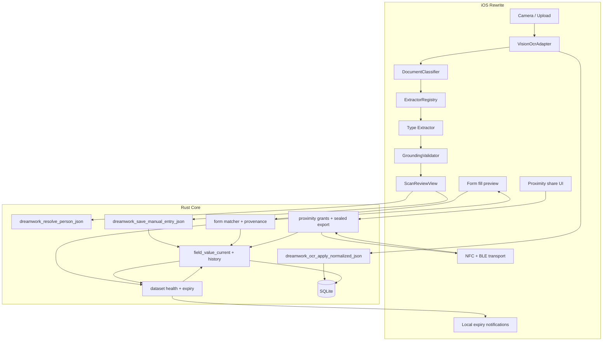

# Fresh start: lessons, failures, and principles

**Branch:** `docs/fresh-start-principles`  
**Status:** Founding document — read this before writing any extraction code  
**Audience:** Anyone rebuilding TrustNest / DreamWork document intelligence  
**Companion:** [fresh-start-implementation-baseline.md](fresh-start-implementation-baseline.md) (what exists today)  
**Related:** [trustnest-cross-platform-form-automation.md](trustnest-cross-platform-form-automation.md), [ADR 0008](adr/0008-provenance-and-field-value-history.md), [ADR 0009](adr/0009-proximity-sharing-ble-secure-channel-time-bound-grants.md), [zero-egress constraint](trustnest-zero-egress-design-constraint.md)

---

## North star: automate forms from a trusted household vault

**End goal:** Help users **submit forms** (school intake, medical portals, government sites, in-app flows) by **reusing household data stored in SQLite over months and years** — without retyping the same fields every time.

**Why extraction must work first:** Form fill is only as trustworthy as the profile values behind it. Wrong DL number or spouse’s name in a school form is worse than an empty field. That is why this rewrite starts with field accuracy, not with more form UI.

### Product arc (the full loop)

```text
┌──────────────┐    ┌─────────────────┐    ┌──────────────────┐    ┌─────────────────┐
│ Scan / upload│ →  │ Extract + review │ →  │ SQLite profiles  │ →  │ Form fill       │
│ (new DL, etc)│    │ (user confirms)  │    │ (accumulate)     │    │ (user confirms) │
└──────────────┘    └─────────────────┘    └──────────────────┘    └─────────────────┘
        │                     │                      │                       │
        └─────────────────────┴──────────────────────┴───────────────────────┘
                                    DATA LINEAGE AT EVERY STEP
                                              │
                    ┌─────────────────────────▼─────────────────────────┐
                    │ Proximity share (NFC tap) — scoped subset, TTL      │
                    │ device-to-device only; no internet / no cloud relay  │
                    └─────────────────────────────────────────────────────┘
```

| Stage | User intent | What we must guarantee |
|-------|-------------|------------------------|
| **Ingest** | “Scan my new Texas DL — my address changed” | Correct fields from photo; user reviews before save |
| **Store** | “Keep my household up to date over time” | Each profile field has **current value** + **history** linked to source |
| **Refresh** | “Replace old DL# with the one from this scan” | Rescan **supersedes** stale values; old version retained in history |
| **Remind** | “My DL expires today — don’t let me forget” | **Local notifications** before/on expiry; profile shows dataset health |
| **Fill** | “Fill this form for my child” | Matcher picks values from vault; user sees **which document / scan / edit** each value came from; **expired datasets prompt rescan** before applying |
| **Submit** | “I trust what went into the form” | User confirms fill batch; optional write-back from form edits also gets lineage (`source=form`) |
| **Share** | “Give my spouse only my DL fields for 24 hours” | User picks **person + dataset scope + TTL**; transfer over **proximity radio only**; receiver sees **foreign provenance** |

### Data lineage (non-negotiable product requirement)

Users must always be able to answer: **“Where did this value come from?”**

Lineage applies in **four surfaces** — not only scan review:

1. **Scan review** — badge per field: `MRZ`, `Barcode`, `Layout`, `Manual`, `Empty`
2. **Profile / People** — “DL# last updated from Texas DL scan on 2026-05-12” or “typed manually”
3. **Form fill preview** — before apply: “Child DOB ← passport scan (run `abc123`)” vs “Insurance member ID ← Blue Cross card scan”
4. **Shared data (receiver)** — “DL# ← shared by Alex · expires in 23h · originally from Texas DL scan 2026-04-01”

**Minimum lineage record per field value** (SQLite; see [ADR 0008](adr/0008-provenance-and-field-value-history.md)):

```text
profile_key, value, effective_from,
  source_kind:     scan | manual | form_writeback | proximity_share
  document_id:     optional — which stored document image/PDF
  extraction_run_id: optional — which OCR run produced the suggestion
  document_type:   driversLicense | passport | insuranceCard | ...
  capture_at:      when the source document was scanned
  user_confirmed:  true after review or fill confirm
  share_grant_id:  optional — proximity grant when source_kind=proximity_share
  sharer_display:  optional — who shared (receiver-side foreign provenance)
  expires_at:      optional — TTL on shared grants
```

**Rules:**

- **No silent overwrite** — rescan or form edit creates a new history row; previous value stays queryable.
- **No fill without disclosure** — form automation never applies a value the user cannot trace to a source.
- **Expired data is visible and actionable** — see [dataset expiry reminders](#dataset-expiry-reminders--form-fill-guardrails) below; never auto-fill expired government ID fields without explicit user acknowledgment.
- **Provenance is not optional glue** — today `provenance.rs` is in-memory only; rewrite **persists lineage in SQLite** before form automation ships.

Form surfaces (browser extension, in-app checklist, future platform autofill) all read the **same Rust profile + history API** — see [trustnest-cross-platform-form-automation.md](trustnest-cross-platform-form-automation.md).

### Dataset expiry reminders & form-fill guardrails

Many vault fields belong to a **dataset** with a document **expiry date**. When that date passes, the dataset is **stale** — the user should scan an updated document, not keep reusing old values in forms.

#### Datasets with expiry anchors (v1)

| Dataset preset | Expiry field (`profile_key`) | Related fields that depend on it |
|----------------|---------------------------|--------------------------------|
| `Driver license` | `drivers_license_expiry` | `drivers_license_number`, `drivers_license_state`, name, DOB, address |
| `Passport` | `passport_expiry` | `passport_number`, name, DOB, nationality |
| `State ID` | `state_id_expiry` | `state_id_number`, name, DOB |

Insurance cards may gain plan-year expiry later; v1 focuses on government IDs where expiry is on the document.

**Dataset health** (computed in Rust from SQLite, not guessed):

```text
status:  valid | expiring_soon | expired | missing_expiry
expires_on: parsed date from expiry field (or null)
days_remaining: integer (negative if expired)
last_scan_at: from lineage on expiry field or latest scan of that document_type
```

#### Proactive reminders (local notifications only)

When a dataset has `expires_on`, schedule **on-device** reminders — **no push server, no internet** (`UNUserNotificationCenter` on iOS).

| Trigger | Default schedule (user-configurable in Settings) |
|---------|---------------------------------------------------|
| **Expiring soon** | 30 days, 7 days, and 1 day before `expires_on` |
| **Expires today** | Morning of expiry day: “Your driver license expires today — scan your new license to stay current” |
| **Expired** | Day after expiry + weekly until user rescans or dismisses |

Notification payload includes: **person name**, **dataset** (e.g., Driver license), **expiry date**, deep link to **Scan → [document type]**.

**Rules:**

- Reschedule reminders when user saves a new scan that updates the expiry field.
- Cancel reminders for a dataset when expiry moves to `valid` (future date).
- Respect system notification permission; if denied, show **in-app banner** on Home / People instead (never silently skip).
- One notification bundle per person per dataset — avoid spamming duplicate alerts for every field.

#### Form-fill guardrails (when expiry matters)

When the user starts a form fill (or confirms a fill preview) and the matcher needs a field from an **expired** or **expiring_today** dataset:

1. **Intercept before apply** — do not copy expired DL# / passport # into the form silently.
2. Show **update prompt**:

   ```text
   Your driver license expired on March 17, 2026.
   Forms may reject outdated ID information.

   [ Scan new license ]   [ Use current data anyway ]   [ Leave field empty ]
   ```

3. **Scan new license** — opens camera/import with `documentType=driversLicense` and person pre-selected; on successful save, return to form fill with refreshed values.
4. **Use anyway** — requires explicit tap; log audit event; show **Expired** badge on that field in fill preview; user confirms fill batch knowing the risk.
5. **Leave empty** — skip that field; user fills manually on the target form.

Same pattern for passport / state ID when form matcher requests those keys. If expiry is **missing** but document type was never scanned, prompt **“Scan your driver license to add DL number”** (missing data — different copy from expired).

#### Profile & Home surfaces

- **People / profile:** dataset card shows `Valid until …` / `Expires in 7 days` / `Expired — tap to update` with one-tap scan CTA.
- **Home:** “2 items need attention” summary (expired + expiring soon across household).
- **Form fill preview:** per-field row includes dataset health chip (`Valid` / `Expires today` / `Expired`) next to lineage.

#### Extraction requirement

Expiry reminders are useless if `drivers_license_expiry` is wrong or empty. Texas DL extractor must populate expiry from layout (`4b.` / “EXP” line) — included in [acceptance matrix](#acceptance-matrix-definition-of-basic-things-right) for DL row.

### Proximity share: scoped datasets, time-bound, zero egress

Users must be able to **share a specific slice** of their vault — e.g., only **driver license fields** for one person — with a **household member or friend** by **bringing devices close together (NFC tap)**, with an **explicit time limit** chosen at share time.

**Hard constraint:** Shared payload **never** travels over the internet, through product servers, email, SMS, or cloud sync. Transfer is **device-to-device** using near-field / proximity radios only ([zero-egress constraint](trustnest-zero-egress-design-constraint.md), [ADR 0009](adr/0009-proximity-sharing-ble-secure-channel-time-bound-grants.md)).

#### Share UX (what the user does)

1. Open **Share** on a person profile (or document bundle).
2. Pick **scope** — preset datasets, not “export everything”:
   - `Driver license` — name, DOB, DL#, state, issue/expiry (no SSN unless user explicitly adds)
   - `Insurance card` — carrier, member ID, group ID, subscriber name
   - `Passport` — passport #, name, DOB, nationality, expiry
   - `Custom` — explicit field checklist (advanced)
3. Set **time limit** — e.g., 1 hour, 24 hours, 7 days, or “until I revoke” (revocation always available on sender).
4. Tap phones (**NFC**) to start; receiver confirms import on their device.
5. Receiver sees data labeled **“Shared by [Name] · expires [time]”** with per-field **foreign provenance** — not as if they scanned it themselves.

#### Technical model (honest about radios)

| Layer | Responsibility |
|-------|----------------|
| **NFC (primary UX)** | Tap-to-start: exchange session intro, short auth code, confirm both parties are present |
| **BLE (payload channel)** | Encrypted bulk transfer when dataset exceeds NFC payload limits — still **local radio**, still **no internet** |
| **Rust `proximity` module** | x25519 handshake + sealed payload manifest (already scaffolded in `core/dreamwork_core/src/proximity/mod.rs`) |
| **Grant manifest** | `grant_id`, issuer device key, `scope` (field keys or dataset preset), `expires_at`, nonce, optional recipient hint |
| **Receiver import** | Stored under `source_kind=proximity_share` + `foreign_provenance`; **does not** silently overwrite sender’s canonical rows on receiver’s own profiles without merge confirm |

**Why NFC + BLE:** NFC alone cannot move large encrypted packages reliably; ADR 0009 uses NFC (or QR) for **out-of-band bootstrap** and BLE for **encrypted payload** in the same proximity session. Product copy must say **“nearby transfer — not uploaded”**, not “NFC only” if BLE completes the bytes.

#### Share rules (non-negotiable)

- **Scoped by default** — never share full vault in one tap; presets map to explicit `profile_key` lists.
- **TTL required** — every grant has `expires_at`; receiver UI shows countdown; expired grants stop displaying (and optionally purge per policy).
- **Revocable** — sender can revoke early; audit log records share / revoke ([ADR 0008](adr/0008-provenance-and-field-value-history.md) audit events).
- **Confirm on both sides** — sender confirms scope + TTL; receiver confirms import before data is usable.
- **Lineage preserved** — shared fields on receiver show: original scan source (from sender) **and** share grant (`grant_id`, sharer, `expires_at`).
- **No cloud relay** — if transfer cannot complete over proximity radios, **fail visibly**; do not fall back to upload “for convenience.”

---

## Why we are starting over

We spent months iterating across **heuristics**, **optional HTTP LLM**, **Apple NaturalLanguage / Create ML**, and a **15-agent orchestrator**. Users still report the same failure mode:

> OCR text in review looks readable, but **basic profile fields are wrong, empty, or from the wrong document type.**

Examples that must work before anything else:

| Field | Document examples |
|-------|-------------------|
| First name / last name | DL, passport, SSN card, insurance card |
| Date of birth | DL, passport, insurance card |
| SSN | SSN card, W-2 |
| Driver license number | Texas DL, state ID |
| Passport number | US passport |
| Insurance carrier | Insurance card / EOB |
| Member ID / Group ID | Insurance card |

**This is not a hope problem. It is an engineering discipline problem.** We kept adding layers without proving each layer works on **real phone photos** before moving on.

This document records **what went wrong**, **what we will not repeat**, and **how the rewrite will be structured** so progress is measurable instead of circular.

---

## The central truth (read this twice)

```text
┌─────────────────────────────────────────────────────────────────┐
│  OCR (Vision) is mostly OK.                                      │
│  Field mapping is what fails.                                      │
│  More classifiers, agents, and embeddings do not fix bad mapping.│
└─────────────────────────────────────────────────────────────────┘
```

Evidence:

- TestFlight users see correct lines in the scan preview.
- SQLite stores the OCR JSON correctly (`extraction_run`).
- Wrong values appear **after** the intelligence pipeline runs.

See [field-mapping-accuracy-analysis.md](field-mapping-accuracy-analysis.md) and [ssn-ocr-field-mapping-gap.md](ssn-ocr-field-mapping-gap.md).

---

## What we tried (chronology of approaches)

| Approach | What we hoped | What actually happened |
|----------|---------------|------------------------|
| **Regex / `UniversalDocumentParser`** | Fast fallback for all docs | First matching line wins: issuer names, issue dates, random 9-digit numbers become “name”, “DOB”, “SSN” |
| **Texas DL / passport post-processors** | Better names on IDs | `PersonNameResolver` ran on **non-ID** text (e.g. “BLUE CROSS OF **TEXAS**”) → crashes or wrong names |
| **Document type classifier** | Route to right parser | Misclassification → wrong parser; keyword “DRIVER LICENSE” in OCR triggers DL logic on utility bills |
| **Optional Ollama / OpenAI (`GenAIFieldMapper`)** | Smart extraction | Default **Off**; on iPhone `127.0.0.1` always fails silently → regex fallback; user sees “High” confidence anyway |
| **Apple NL + embeddings + Create ML** | On-device semantic mapping | Still fed **flattened text** without reliable label→value structure; overloaded schema (40+ keys) |
| **15-agent orchestrator** | Modular, extensible | Hard to debug; tests passed on **synthetic OCR lines** while **photo scans** failed in TestFlight |
| **More specialized parsers** | Texas DL, passport, SSN fixes | Fixed one doc, broke another; parsers fought each other via shared post-processing |
| **Synthetic lifecycle tests** | Coverage across life stages | **Tier 1** tests use perfect OCR strings — green CI, red real world |

**Pattern:** We confused *having code for extraction* with *extracting correctly on device*.

---

## Root causes (not symptoms)

### 1. No single source of truth for “what is the value?”

Multiple systems can set the same field:

- `ExtractionAgent` → specialized parser
- `UniversalDocumentParser` → regex
- `PersonNameResolver` → overwrites name **after** extraction
- `AppleSemanticFieldExtractor` → NL embedding guess
- Rust `entity_resolution` → separate from field extraction (profile matching only)

**Result:** Last writer wins; debugging requires reading five files and a 20-step `pipelineTrace`.

### 2. Flattened text heuristics cannot solve structured documents

Government IDs and forms are **layout problems**, not **regex problems**.

| Document | Real structure | What we did |
|----------|----------------|-------------|
| Texas DL | Numbered fields `1.` `2.` `3.` `4d.` `8.` | Sometimes parsed; often overridden by `PersonNameResolver` |
| SSN card | Name line **above** street address; no `Name:` label | First two-word line → garbled header text |
| Passport | MRZ + labeled biodata | MRZ collected but **not applied** when GenAI off |
| Insurance card | `MEMBER ID`, `GROUP #`, `SUBSCRIBER` labels | Keyword classify OK; values still from generic regex |
| W-2 | Numbered IRS boxes | Treated as generic text |

**Lesson:** Extraction must be **anchor-based** (label, line number, relative position, MRZ, barcode) — never “first date in document”.

### 3. Tests lied to us

| Test type | Input | Trust level |
|-----------|-------|-------------|
| `LifecycleDocumentSimulationHarness` | Perfect synthetic OCR lines, top-to-bottom | ⚠️ **Proves pipeline wiring only** |
| `DriverLicenseParserTests` | Hand-crafted Texas OCR string | ✅ Good for parser unit tests |
| `SimulatorDocumentPipelineE2ETests` | Real PNG (when fixture present) | ✅ **Only trustworthy E2E** |
| TestFlight on friend’s phone | Real lighting, skew, glare | ✅ **Ground truth** — we underweighted this |

**Anti-pattern:** Adding a new parser fix + synthetic test → declaring victory → TestFlight failure → add another layer.

**Rule for rewrite:** **No parser merges without a photo fixture test** that runs Vision OCR first, then extraction.

### 4. Silent failure and dishonest confidence

| Situation | User sees |
|-----------|-----------|
| LLM unreachable | Same UI as success; regex garbage fields |
| Classifier unsure | “Review fields” with 0.92 “High” on regex |
| Wrong doc type | DL fields on insurance card |

Users cannot tell **guess** vs **verified** vs **machine-readable decode**.

### 5. Scope creep before basics

We built before basics worked:

- Knowledge graph, vector memory, fraud detection, incremental learning
- Storage routing planner (Rust + Apple duplicate)
- 10 household fixture families
- Extension demo + k8s + core_api

Meanwhile **insurance member ID on a real card** still fails.

**Lesson:** **Freeze features** until the [acceptance matrix](#acceptance-matrix) passes on photos.

### 6. Architecture optimized for extensibility, not correctness

The orchestrator has 15 steps, 12+ agents, 6 model artifact slots. Adding a step felt like progress. **Removing** a wrong step was never done.

**Lesson:** The rewrite pipeline has **4 stages** max. If a stage does not improve measured field accuracy, delete it.

---

## Symptom → cause cheat sheet (keep for QA)

| User report | Actual cause (check first) |
|-------------|---------------------------|
| Wrong name | `extractNames` first 2-word line, or Texas `PersonNameResolver` on non-DL |
| Wrong DOB | First `MM/DD/YYYY` in text (issue/expiry/statement date) |
| Wrong SSN | SSN regex on account/EIN-like number |
| Empty fields | Extraction returned nothing; UI still shows doc type |
| DL number on utility bill | `shouldIncludeDriverLicenseFields` or “DRIVER” in OCR |
| Crash on insurance scan | “TEXAS” triggered Texas DL range logic (fixed in build 33 — example of symptom fix without systemic fix) |
| Works on Mac, fails on phone | Ollama at localhost; or Simulator HTTP fixtures ≠ camera |
| Tests green, TestFlight red | Synthetic OCR tests without photo path |

---

## What actually worked (keep these)

| Technique | Why it worked | Rewrite usage |
|-----------|---------------|---------------|
| **Texas numbered field parser** (`4d. DL`, `1.` `2.`) | Matches real AAMVA layout | **Only** when `documentType == driversLicense` with high confidence |
| **SSA layout rule** — name above street line | Matches physical card layout | SSN extractor module; no `Name:` label needed |
| **MRZ / PDF417 decode** | Machine-readable, high precision | **Always run first**; fields marked `source: mrz \| barcode` |
| **`OcrGroundingValidator`** — value in OCR text | Catches hallucinations | **Required** for every suggestion |
| **Identity conflict rules** (household) | Stops merging spouses/kids | Keep in Rust `entity_resolution`; single matcher |
| **Vision OCR** | Good English text on device | Keep; do not replace in v1 |
| **Scan review UI** | User can correct before save | Keep; add per-field **source** badge |

---

## What we will NOT repeat (non-negotiable)

### Process anti-patterns

| # | Never again |
|---|-------------|
| N1 | Ship a parser fix without a **photo-based test** (Vision OCR → extract → assert) |
| N2 | Add a new agent/layer while basic fields fail on TestFlight |
| N3 | Treat synthetic OCR line tests as E2E proof |
| N4 | Run global post-processors (`PersonNameResolver`) on all documents |
| N5 | Use “first regex match in full text” for name, DOB, or SSN |
| N6 | Show “High confidence” for regex-only guesses |
| N7 | Fail silently when optional AI is enabled but unreachable |
| N8 | Expand schema/prompt with 40+ keys before core 10 fields work |
| N9 | Fix one document type by hardcoding without regression on others |
| N10 | Commit architecture docs instead of **field accuracy metrics** |

### Technical anti-patterns

| # | Never again |
|---|-------------|
| T1 | `UniversalDocumentParser` as the **default** extractor for all types |
| T2 | Keyword “TEXAS” / “DRIVER LICENSE” as sole signal for Texas name logic |
| T3 | Multiple classifiers returning different types with no single resolver |
| T4 | Discarding MRZ/barcode unless LLM is on |
| T5 | Flattening layout to string before structured docs (DL, W-2, insurance card) |
| T6 | Swift + Rust duplicate person matching logic that can diverge |
| T7 | Building ONNX/GGUF/LayoutLM paths before photo tests pass with rules-only |

---

## Rewrite principles (the new contract)

### Principle 1 — **Field accuracy unlocks form automation**

The product is **automated form submission backed by a trusted household vault** — not a “document intelligence platform.”

| Layer | Role |
|-------|------|
| **Foundation (v1 rewrite)** | Reliable extraction from scans → correct SQLite profile fields |
| **Vault (ongoing)** | Profiles accumulate and refresh via new scans (new DL, new insurance card, …) |
| **Freshness (ongoing)** | Local expiry reminders + in-app alerts nudge rescan before documents lapse |
| **Automation (after matrix green)** | Rules-first form matcher applies vault values with **full lineage disclosure** and **expiry guardrails** |
| **Proximity share (after vault trustworthy)** | Time-bound, scoped grants to household/friends via NFC-initiated device-to-device transfer |

We do not ship form autofill that cannot show per-field source. We do not ship extraction that poisons the vault with guesses. We do not ship share flows that upload PII to the internet as a fallback. We do not silently fill **expired** government ID fields without asking the user to update.

### Principle 2 — **One pipeline, four stages**

```text
1. CAPTURE   → image/PDF bytes
2. OCR       → Vision → NormalizedDocument (blocks with bounds)
3. EXTRACT   → type-specific extractor → [FieldSuggestion]
4. REVIEW    → user confirms → Rust SQLite
```

No orchestrator with 15 steps. No parallel semantic/heuristic/learning paths in v1.

### Principle 3 — **Extraction priority order (strict)**

For every document, extraction tries **only** this order:

```text
1. Machine-readable  (MRZ, PDF417/AAMVA barcode)     → confidence: VERIFIED
2. Type-specific     (registered extractor for classified type) → confidence: HIGH if grounded
3. Label-anchored    (keyword left, value right / next line)   → confidence: MEDIUM if grounded
4. STOP              → return partial fields + explicit "could not extract X" — NO global regex name/DOB/SSN
```

If step 4 would have been “guess from first date in document” in the old app — **leave the field empty**.

### Principle 4 — **Classify once, extract once**

- One classifier: keyword + layout signals + optional Create ML (single model).
- Classification picks **exactly one** extractor from a **registry** (map, not inheritance tree).
- Extractor **never** calls another extractor as fallback inside the same run.

### Principle 5 — **Ground every value**

A suggestion is dropped unless:

- Value is a fuzzy substring of OCR text, **or**
- Value came from MRZ/barcode decode, **or**
- User typed it in review

### Principle 6 — **Honest UI with lineage everywhere**

Each field shows **how we know the value** — at scan review, on the profile, and in the form-fill preview.

| Badge / label | Meaning |
|---------------|---------|
| `MRZ` / `Barcode` | Machine-readable decode from this scan |
| `Layout` | Label-anchored or numbered field from this scan |
| `Manual` | User typed or corrected |
| `Prior scan` | Carried forward; link to `extraction_run_id` + date |
| `Form` | User entered while filling a form (write-back) |
| `Shared` | Received via proximity grant; shows sharer + `expires_at` |
| `Expired` | Dataset past `expires_on`; fill blocked until user updates or explicitly overrides |
| `Expiring` | Expires within configured window (e.g., ≤ 7 days) |
| `Empty` | Not guessed — user must fill |

No “High” for regex. No “Extracted with AI” when AI did not run. **No form fill row without a source line** the user can tap to inspect. **Shared fields** always show grant expiry and sharer identity. **Expired datasets** show update CTA, not silent autofill.

### Principle 7 — **Tests mirror reality**

```text
Test pyramid (rewrite):

  ┌─────────────────────┐
  │ TestFlight / manual │  real phone, real cards (sanitized)
  └──────────┬──────────┘
  ┌──────────▼──────────┐
  │ Photo fixture E2E   │  PNG → Vision OCR → extract → assert fields
  └──────────┬──────────┘
  ┌──────────▼──────────┐
  │ Extractor unit      │  OCR string IN, fields OUT (per type)
  └──────────┬──────────┘
  ┌──────────▼──────────┐
  │ Classifier unit     │  OCR string IN, type OUT
  └─────────────────────┘

Synthetic perfect-line tests are NOT in the top two tiers.
```

### Principle 8 — **Rust owns persistence, identity, lineage, and form match (v1)**

| Concern | Owner | Why |
|---------|-------|-----|
| Field extraction from OCR | Swift (Vision ecosystem) | Layout + Apple APIs |
| Profile CRUD + SQLite | Rust FFI | Single persistence path |
| **Field value history + lineage** | Rust SQLite ([ADR 0008](adr/0008-provenance-and-field-value-history.md)) | One source of truth for “where did this value come from?” |
| Person match on save | Rust `entity_resolution` only | No duplicate Swift matcher |
| OCR run audit | Rust `extraction_run` | Links scans to extracted suggestions |
| Form field match | Rust `form.rs` (rules-first) | Same matcher for extension + in-app; returns value **and** `sourcePersonId` + provenance pointer |
| **Proximity share** | Rust `proximity` + grant store | x25519 session + encrypted scoped export; NFC/BLE transport in Swift platform layer ([ADR 0009](adr/0009-proximity-sharing-ble-secure-channel-time-bound-grants.md)) |
| **Dataset expiry evaluation** | Rust (query `profile_key` expiry fields) | Single health status per dataset; drives reminders + form-fill guard |
| **Local reminder schedule** | iOS (`UNUserNotificationCenter`) | Platform scheduler; Rust/Swift pass `expires_on` + person + dataset id |

**Delete** `PersonProfileMatcher` duplicate logic in Swift rewrite — call Rust only.  
**Replace** in-memory `provenance.rs` with persisted `field_value_current` + `field_value_history` before form automation.  
**Wire** existing `proximity/mod.rs` handshake into share UI — do not build a parallel crypto path in Swift.

### Principle 9 — **Small schema, expand later**

v1 extractors target **only** these keys:

```text
legal_first_name, legal_last_name, display_name, date_of_birth,
ssn, drivers_license_number, drivers_license_state, drivers_license_expiry,
passport_number, passport_expiry,
state_id_number, state_id_expiry,
insurance_carrier, insurance_member_id, insurance_group_id
```

Expiry keys are **required for reminders and form guardrails** — not optional metadata. Add employer, utility, tax keys **after** the core fields reach 90% on photo fixtures.

### Principle 10 — **Weekly metric, not weekly architecture**

Track one dashboard:

| Metric | Target (v1 exit) |
|--------|------------------|
| Field precision on photo corpus | ≥ 95% per key per doc type |
| Field recall on photo corpus | ≥ 90% per key per doc type |
| Hallucination rate (value ∉ OCR) | 0% |
| Classifier accuracy (photo corpus) | ≥ 95% |
| Crash rate on scan | 0 |

No new features until metrics flatline below target.

### Principle 11 — **Profiles are a living vault, not a one-time dump**

- Household data **accumulates** in SQLite: multiple people, multiple document types, multiple scans over time.
- Users **keep data current** by scanning replacements (e.g., renewed driver license, new insurance card) — not by re-entering everything manually.
- A rescan **supersedes** the current value for affected keys (DL#, expiry, address, member ID, …) while **history retains** the old value and its source.
- **Conflict UX:** if a new scan disagrees with an existing value, show both with dates and let the user pick — never auto-merge silently.
- **Expiry-aware vault:** each dataset shows health (`valid` / `expiring_soon` / `expired`); rescans clear expired state and reschedule reminders.

### Principle 12 — **Form fill is confirmed automation, not silent injection**

- Matcher proposes `field → value` bindings from the vault; user **confirms** before values are applied (clipboard, extension, or platform autofill).
- Every proposed fill value includes **lineage**: profile key, person, source document type, scan date, `extraction_run_id` or `manual`.
- **Expired dataset guard:** if a required field (e.g., `drivers_license_number`) belongs to a dataset whose `expires_on` is **today or in the past**, show **update prompt** before apply — default action is **Scan new document**, not fill with stale ID.
- User edits during fill are **write-back** events with `source_kind=form` — they become the new current value with the same history model.
- **Form subject** must be explicit (e.g., “this school form is about [Child]”) — parent vs child vs emergency contact fields resolve to the right person with provenance recorded per field.

### Principle 13 — **Proximity share is scoped, time-bound, and never cloud-routed**

- User shares a **named dataset** (e.g., driver license fields only) — not an implicit full-profile dump.
- User sets **TTL at share time** (1h / 24h / 7d / until revoked); receiver UI shows expiry prominently.
- Transfer uses **NFC tap to start** + **encrypted proximity channel** (BLE for payload per [ADR 0009](adr/0009-proximity-sharing-ble-secure-channel-time-bound-grants.md)); **zero internet egress** for payload bytes.
- Receiver imports with `foreign_provenance` — fields remain attributable to **sharer + original scan lineage + grant expiry**.
- **Revocation** on sender immediately invalidates grant on next receiver sync/check (best-effort over proximity re-handshake; local expiry enforced regardless).
- **Household member or friend** — same mechanism; trust is established by physical tap + explicit confirm, not by server friend lists in v1.

### Principle 14 — **Remind before expiry; guard forms when data is stale**

- **Proactive:** local notifications when a dataset’s `expires_on` approaches (30d / 7d / 1d / day-of) or has passed — user is nudged to **scan an update**, not to ignore it.
- **Reactive:** form fill that needs DL#, passport #, or state ID # checks dataset health **at preview time**; expired → **remind + offer scan** before values are applied.
- **No silent stale fill** — expired government ID values are never copied into forms without user seeing expiry status and choosing **Scan**, **Use anyway**, or **Leave empty**.
- **Reminder + guard use same Rust dataset health** — one computation, consistent copy in notification, profile, and form UI.
- **Zero egress** — reminders are scheduled locally; notification text stays on device (no remote push payload with PII).

---

## Acceptance matrix (definition of “basic things right”)

Each cell must pass **photo fixture E2E** (Vision OCR on PNG, not synthetic lines).

| Document | first_name | last_name | dob | ssn | dl_number | dl_expiry | passport_no | passport_expiry | carrier | member_id | group_id |
|----------|:----------:|:---------:|:---:|:---:|:---------:|:---------:|:-----------:|:---------------:|:-------:|:---------:|:--------:|
| Texas DL | ✅ | ✅ | ✅ | — | ✅ | ✅ | — | — | — | — | — |
| US Passport | ✅ | ✅ | ✅ | — | — | — | ✅ | ✅ | — | — | — |
| SSN card | ✅ | ✅ | — | ✅ | — | — | — | — | — | — | — |
| Insurance card | ✅ | ✅ | ✅ | — | — | — | — | — | ✅ | ✅ | ✅ |
| State ID (child) | ✅ | ✅ | ✅ | — | — | — | — | — | — | — | — |

**v1 ship gate (extraction):** All ✅ cells pass on **≥ 3 distinct synthetic household PNGs** per row (use `demo/sample-documents/household-fixtures/`).

### Form automation + lineage gate (v1.1 — after extraction matrix green)

| Scenario | Must pass |
|----------|-----------|
| Rescan Texas DL updates `drivers_license_number` | New value current; old value in history; both linked to `extraction_run_id` |
| Profile screen | Each core field shows source summary (scan type + date or Manual) |
| In-app form fill preview | Every filled field shows lineage; user can cancel individual fields |
| Household form (child subject) | Child fields from child profile; parent fields from selected parent with per-field source |
| User corrects value at fill time | Write-back stored with `source_kind=form`; visible on profile |
| Form needs DL#; DL expired yesterday | Update prompt shown; **Scan** is default; no silent fill until user chooses |
| Form needs DL#; user taps **Use anyway** | Field applies with `Expired` badge; audit log entry |
| DL `expires_on` = today (local time) | “Expires today” notification fires; form fill shows same-day warning |

### Dataset expiry & reminders gate (v1.1 — with lineage)

| Scenario | Must pass |
|----------|-----------|
| DL expires in 7 days | Local notification scheduled (or in-app banner if notifications denied) |
| DL expires today | Notification: person + dataset + “scan to update” deep link |
| User rescans new DL | `drivers_license_expiry` updated; status → `valid`; old expiry in history; reminders rescheduled |
| Profile dataset card | Shows `Expired` / `Expires in N days` with scan CTA |
| Home summary | Lists household members with expiring/expired datasets |
| Rust `dataset_health` API | Same status returned for profile UI, notifications, and form matcher |

### Proximity share gate (v1.2 — after lineage + form basics)

| Scenario | Must pass |
|----------|-----------|
| Share preset `Driver license` only | Receiver gets DL fields; SSN and insurance fields **not** included |
| TTL = 1 hour | Receiver UI shows expiry; fields hidden or marked expired after TTL |
| Sender revokes grant | Receiver loses access to shared slice (local enforcement) |
| Receiver profile UI | Shared fields show `Shared by [Name] · expires [time]` + underlying scan lineage |
| Network monitor during share | **Zero** payload bytes to non-local destinations (assert in tests) |
| Two-device tap | NFC initiates; encrypted transfer completes without user email/cloud step |

---

## Proposed v1 architecture (rewrite)



### Extractor registry (initial)

| `ScannedDocumentType` | Extractor | Primary anchors |
|----------------------|-----------|-----------------|
| `driversLicense` | `TexasDriverLicenseExtractor` | `4d. DL`, `1.` `2.`, `3. DOB`, `8.` address |
| `passport` | `PassportExtractor` | MRZ TD3, biodata labels |
| `ssnCard` | `SSNCardExtractor` | SSN pattern, name above street, `ESTABLISHED FOR` |
| `insuranceCard` | `InsuranceCardExtractor` | `MEMBER ID`, `GROUP`, `SUBSCRIBER`, `RXBIN` |
| `stateId` | `StateIdExtractor` | `STATE ID`, `ID:`, `DOB:` |
| *all others* | `LabeledFormExtractor` | Generic label→value pairs only; **no name/DOB/SSN guess** |

### Files we do **not** port to v1

- `DocumentIntelligenceOrchestrator` (replace with 4-stage pipeline)
- `ExtractionAgent` multi-path router
- `PersonNameResolver` as global post-processor
- `UniversalDocumentParser` as default extractor
- `DocumentKnowledgeGraph`, `VectorDocumentMemory`, `IncrementalLearningStore`
- `GenAIFieldMapper` / Ollama path (revisit only after rules-only passes acceptance matrix)
- `AppleStoragePlanner` duplicate of Rust storage routing
- `LayoutLMv3CoreMLAdapter`, ONNX, GGUF slots

---

## Implementation phases (rewrite branch)

### Phase 0 — Foundation (this document + fixtures) ✅ you are here

- [x] Branch `docs/fresh-start-principles`
- [x] Lessons document (this file)
- [ ] Pin photo corpus: 5 PNGs minimum (DL, passport, SSN, insurance, state ID) from `household-fixtures`
- [ ] `FieldAccuracyScorecard.md` spreadsheet or script — track precision/recall weekly

### Phase 1 — OCR baseline (prove Vision output)

- [ ] Minimal app shell: import PNG only
- [ ] Run Vision → show raw blocks + `fullText`
- [ ] Test: each fixture produces expected **substrings** in OCR (not extraction yet)
- **Exit:** OCR contains ground-truth SSN, DL#, names as substrings

### Phase 2 — Classifier (one module)

- [ ] `DocumentClassifier.classify(ocrText, blocks)` → type + confidence
- [ ] Photo tests per type
- **Exit:** ≥ 95% type accuracy on fixture corpus

### Phase 3 — Extractors (one type at a time)

Build in this order (highest user pain first):

1. Texas DL  
2. SSN card  
3. Insurance card  
4. Passport  
5. State ID  

Per type:

- [ ] Unit test: OCR string → fields  
- [ ] Photo E2E: PNG → Vision → fields  
- [ ] Grounding validator wired  
- [ ] No other type regresses (run full matrix)

**Exit:** Acceptance matrix all green

### Phase 4 — Review + save + lineage

- [ ] `ScanReviewView` with source badges  
- [ ] Rust `resolvePerson` + `save_manual_entry_json`  
- [ ] SQLite `field_value_current` + `field_value_history` ([ADR 0008](adr/0008-provenance-and-field-value-history.md)) — link saves to `extraction_run_id` + document metadata  
- [ ] Rescan supersedes: second DL scan updates DL#; first value retained in history  
- [ ] Profile UI: per-field “source · date” summary  
- [ ] Household conflict: 3-person test on save  
- [ ] Rust `dataset_health(person, dataset)` → `valid` / `expiring_soon` / `expired`  
- [ ] Profile dataset cards + Home “needs attention” summary  

### Phase 5 — Camera + TestFlight

- [ ] Camera capture  
- [ ] Build → TestFlight → **one** external tester runs matrix on physical cards (sanitized)  

### Phase 6 — Form automation (after extraction + lineage)

- [ ] Rust rules-first matcher returns value + provenance pointer per form field  
- [ ] In-app form fill preview with per-field lineage + confirm/cancel per field  
- [ ] Form subject picker (child vs parent vs self)  
- [ ] Write-back from form edits → history with `source_kind=form`  
- [ ] Demo: `demo/form/demo-form.html` or school intake — fill from vault, user sees sources  
- [ ] Expired-dataset intercept on form fill (DL / passport / state ID)  
- [ ] Local notification scheduler for expiry (30d / 7d / 1d / day-of)  
- **Exit:** [Form automation + lineage gate](#form-automation--lineage-gate-v11--after-extraction-matrix-green) + [expiry gate](#dataset-expiry--reminders-gate-v11--with-lineage) all green  

### Phase 7 — Proximity share (after vault + lineage)

- [ ] Share UI: pick person, dataset preset (`Driver license`, `Insurance card`, …), TTL  
- [ ] Rust: build scoped grant manifest + encrypt payload (`proximity/mod.rs` handshake)  
- [ ] iOS: Core NFC tap-to-start + BLE encrypted transfer (platform transport)  
- [ ] Receiver: confirm import → `foreign_provenance` + `source_kind=proximity_share`  
- [ ] Sender: revoke grant + audit log entry  
- [ ] `ZeroEgressPolicyTests` extended: no network during share flow  
- **Exit:** [Proximity share gate](#proximity-share-gate-v12--after-lineage--form-basics) all green  

---

## Decision log (pre-decided — do not re-litigate)

| Question | Decision | Rationale |
|----------|----------|-----------|
| Replace Vision OCR? | **No** (v1) | Good enough; mapping was the bug |
| Default on-device LLM? | **No** (v1) | Failed to ship; rules+layout first |
| Apple NL embeddings? | **No** (v1) | Did not improve basic fields |
| Texas-only DL support? | **Yes** (v1) | Primary user base; add CA/NY in v2 |
| Keep 10 household fixtures? | **Yes** | Photo E2E corpus |
| Keep Rust core? | **Yes** | SQLite + entity resolution work |
| Keep orchestrator agents? | **No** | Complexity without accuracy |
| Empty field vs wrong guess? | **Empty wins** | User trust |
| Persist provenance in SQLite? | **Yes** (ADR 0008) | Form fill and profile UI need lineage; in-memory only is not enough |
| Rescan replaces old value? | **Supersede current, keep history** | Users refresh DL/insurance by scanning, not retyping |
| Form fill without source disclosure? | **Never** | Core product promise |
| Auto-submit forms without user confirm? | **No** (v1) | User confirms fill batch; submit button stays with user |
| Share via cloud upload / link? | **No** | Zero egress; proximity radios only ([ADR 0009](adr/0009-proximity-sharing-ble-secure-channel-time-bound-grants.md)) |
| Share full vault by default? | **No** | Scoped presets (e.g., DL only); custom field checklist for advanced |
| TTL on every share grant? | **Yes** | User picks duration at share time; receiver sees expiry |
| NFC role? | **Tap-to-start UX** | Session bootstrap; BLE may carry encrypted payload in same session |
| Receiver merge shared data? | **Explicit confirm** | `foreign_provenance`; no silent overwrite of receiver’s own canonical profile |
| Expired DL# in form fill? | **Prompt to update** | Default = scan; optional “Use anyway” with badge |
| Expiry reminders? | **Local notifications** | On-device schedule; no remote push with PII |
| Default reminder offsets? | **30d, 7d, 1d, day-of** | User-configurable in Settings |
| Fill with expired ID silently? | **Never** | Guard at form preview; same rules for extension when wired |

---

## How to avoid the back-and-forth loop

### Before every PR, answer:

1. **Which acceptance matrix cell** does this PR improve?  
2. **Which photo fixture test** proves it?  
3. **Which old code path** does this **remove** (not add)?  
4. Did any field get **less accurate** on another doc type? (run full matrix)

### PR is rejected if:

- Adds a new agent/orchestrator step  
- Adds regex name/DOB/SSN on flattened text without layout anchor  
- Only adds synthetic-line tests  
- Touches profile matching before extraction matrix is green  
- Adds a new document type before existing types pass  
- Adds form fill UI without persisted lineage ([ADR 0008](adr/0008-provenance-and-field-value-history.md))  
- Saves profile fields without `extraction_run_id` / source metadata when value came from a scan  
- Adds share path that uploads payload or uses internet as fallback  
- Ships share without TTL + scope manifest + revoke  
- Auto-fills government ID fields without checking dataset expiry status  
- Ships DL extractor without `drivers_license_expiry` when matrix requires it  

### Weekly review (15 min):

- Run photo E2E suite  
- Update scorecard  
- If metric dropped → revert before new work  

---

## References

| Doc | Use when |
|-----|----------|
| [fresh-start-implementation-baseline.md](fresh-start-implementation-baseline.md) | Need file paths / FFI list / what exists |
| [field-mapping-accuracy-analysis.md](field-mapping-accuracy-analysis.md) | Deep dive on P0–P3 root causes |
| [ssn-ocr-field-mapping-gap.md](ssn-ocr-field-mapping-gap.md) | Example of layout-aware fix done right |
| [apple-native-document-intelligence.md](apple-native-document-intelligence.md) | What the current branch shipped |
| [trustnest-cross-platform-form-automation.md](trustnest-cross-platform-form-automation.md) | Form fill pipeline, extension, form subject |
| [ADR 0008](adr/0008-provenance-and-field-value-history.md) | Field history + lineage schema |
| [ADR 0009](adr/0009-proximity-sharing-ble-secure-channel-time-bound-grants.md) | NFC/BLE proximity share, TTL grants |
| [trustnest-zero-egress-design-constraint.md](trustnest-zero-egress-design-constraint.md) | No PII on wire / internet |
| [architecture.md](architecture.md) §4.9 | Proximity sharing overview |
| `demo/sample-documents/household-fixtures/` | Photo test corpus |
| `demo/form/demo-form.html` | Form autofill demo target |

---

## Closing note

Losing hope usually means **the feedback loop is broken**: we could not see progress because we measured the wrong thing (pipeline trace length, agent count, synthetic tests) instead of **field correctness on real scans**.

The rewrite is not “try another ML approach.” It is:

1. **Fewer moving parts**  
2. **Layout-first extractors**  
3. **Photo tests as gate**  
4. **Empty beats wrong**  
5. **Lineage from scan → profile → form → share**  
6. **Remind on expiry; guard forms when data is stale**  
7. **One metric dashboard**

When the extraction acceptance matrix is green on photos, we earn the right to **persist lineage in SQLite**, ship **confirmed form automation** with **expiry guardrails**, **local renewal reminders**, and then **proximity share** — scoped datasets with TTL over NFC-initiated device-to-device transfer, never cloud upload. Semantic models and more document types come **after** that loop is trustworthy, not before.

---

*Document version: 1.3 — branch `docs/fresh-start-principles`, May 2026.*
