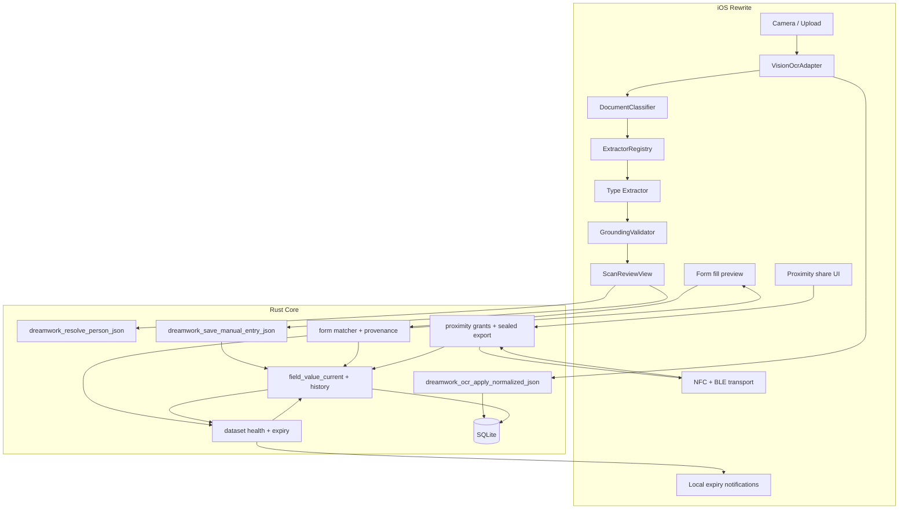

# Fresh start: lessons, failures, and principles

**Branch:** `docs/fresh-start-principles`  
**Status:** **FINAL** — principles and lessons (full detail)  
**Audience:** Anyone rebuilding TrustNest / DreamWork document intelligence  
**Read first:** [trustnest-rewrite-implementation.md](trustnest-rewrite-implementation.md) (**implementation document**) · [trustnest-rewrite-final.md](trustnest-rewrite-final.md) (executive summary) · [fresh-start-implementation-baseline.md](fresh-start-implementation-baseline.md) (legacy inventory)  
**Related:** [trustnest-cross-platform-form-automation.md](trustnest-cross-platform-form-automation.md), [ADR 0008](adr/0008-provenance-and-field-value-history.md), [ADR 0009](adr/0009-proximity-sharing-ble-secure-channel-time-bound-grants.md), [zero-egress constraint](trustnest-zero-egress-design-constraint.md)

---

## North star: automate forms from a trusted household vault

**End goal:** Help users **submit forms** (school intake, medical portals, government sites, in-app flows) by **reusing household data** — without retyping fields **or** re-scanning proof documents every time.

**Two jobs on every vendor form:**

| Job | What vendors want | TrustNest |
|-----|-------------------|-----------|
| **1. Fill fields** | Type name, DOB, insurance ID, address, … | Scan → extract → canonical vault → auto-fill |
| **2. Upload proof** | Attach immunization PDF, birth certificate, utility bill, insurance card photo, … | Scan → **auto-save file** → attach at form submit |

**Data model:** The vault is **data-centric** for typed fields — **canonical identity fields** (Layer B) are the source of truth per person. **Submission documents** are a separate, scoped file stash for vendor upload — not how profile fields are organized.

**Storage model (dual path):**

| Path | What we persist | When |
|------|-----------------|------|
| **Field vault** | `extraction_run` OCR JSON + confirmed Layer B fields + lineage | Always (after OCR) |
| **Submission stash** | **Metadata in SQLite** + **encrypted file on disk** for [submission-document types](#submission-document-stash-upload-at-form-submit) | **Auto-save** when user scans a stash-listed type |

Non-stash scans: OCR JSON only; image bytes released after run save. Stash scans: **metadata row in SQLite, bytes in encrypted filesystem** — never BLOBs in SQLite; never synced to cloud.

**Why extraction must work first:** Form fill is only as trustworthy as the profile values behind it. Wrong DL number or spouse’s name in a school form is worse than an empty field. That is why this rewrite starts with field accuracy, not with more form UI.

**Form-relevance rule:** TrustNest exists to **auto-fill forms**. Extraction runs only when a document supplies **canonical fields that form matchers actually use** — not merely because we recognize the paper type. Birth certificates, marriage certs, and similar archival docs may be **classified** but **never extracted** (name/DOB already come from passport/DL). Classify (Layer A) → inclusion test → **stop** or run mapping (Layer C) only for form-relevant types.

### Product arc (the full loop)

```text
┌──────────────┐    ┌──────────────────────────────────────┐    ┌──────────────────┐
│ Scan / upload│ →  │ Classify → dual path                 │ →  │ Form submit      │
│              │    │  • Fields: extract → Layer B vault   │    │  • Auto-fill     │
│              │    │  • Upload: auto-save submission stash  │    │  • Attach files  │
└──────────────┘    └──────────────────────────────────────┘    └──────────────────┘
        │                              │                                    │
        └──────────────────────────────┴────────────────────────────────────┘
                              DATA LINEAGE + LOCAL FILES ONLY
                                              │
                    ┌─────────────────────────▼─────────────────────────┐
                    │ Proximity share (NFC tap) — scoped fields, TTL    │
                    │ device-to-device only; no internet / no cloud relay │
                    └─────────────────────────────────────────────────────┘
```

| Stage | User intent | What we must guarantee |
|-------|-------------|------------------------|
| **Ingest** | “Scan my new Texas DL — my address changed” | Classify → extract fields + **auto-save** to submission stash; user reviews fields before save |
| **Stash** | “Scan Emma’s immunization record for school” | Classify → **auto-save** as `Immunization Record — Emma — 2026-06-01`; extract vaccine rows if form-relevant |
| **Reject** | “I scanned a random receipt / photo” | Classify → not on any list → **no extraction, no stash**; show message |
| **Store** | “Keep my household up to date over time” | Canonical fields + history in SQLite; submission files superseded on rescan (old file retained in history) |
| **Refresh** | “Replace old DL# with the one from this scan” | Rescan **supersedes** stale values; old version retained in history |
| **Remind** | “My DL expires today — don’t let me forget” | **Local notifications** before/on expiry; profile shows dataset health |
| **Fill** | “Fill this form for my child” | Matcher picks values from vault; user sees lineage per field; **expired datasets prompt rescan** |
| **Attach** | “School wants immunization record upload” | Matcher proposes **stored submission doc** for matching `document_type` + person; user confirms attach to file input |
| **Submit** | “I trust what went into the form” | User confirms fill batch + attachments; write-back from form edits gets lineage (`source=form`) |
| **Share** | “Give my spouse only my DL fields for 24 hours” | User picks **person + dataset scope + TTL**; transfer over **proximity radio only**; receiver sees **foreign provenance** |

### Data lineage (non-negotiable product requirement)

Users must always be able to answer: **“Where did this value come from?”**

Lineage applies in **four surfaces** — not only scan review:

1. **Scan review** — badge per field: `MRZ`, `Barcode`, `Layout`, `Manual`, `Empty`
2. **Profile / People** — “DL# last updated from Texas DL scan on 2026-05-12” or “typed manually”
3. **Form fill preview** — before apply: “Child DOB ← passport scan (run `abc123`)” vs “Insurance member ID ← Blue Cross card scan”
4. **Shared data (receiver)** — “DL# ← shared by Alex · expires in 23h · originally from Texas DL scan 2026-04-01”

**Minimum lineage record per field value** (SQLite; see [ADR 0008](adr/0008-provenance-and-field-value-history.md)):

```text
profile_key, value, effective_from,
  source_kind:       scan | manual | form_writeback | proximity_share
  extraction_run_id: required when source_kind=scan — links to persisted OCR JSON (blocks, bounds, fullText)
  document_type:     driversLicense | passport | insuranceCard | ...
  scanned_at:        when the OCR run was captured
  submission_doc_id: optional — links to stored file when type is on submission stash
  user_confirmed:    true after review or fill confirm
  share_grant_id:    optional — proximity grant when source_kind=proximity_share
  sharer_display:    optional — who shared (receiver-side foreign provenance)
  expires_at:        optional — TTL on shared grants
```

**What SQLite stores (and does not):**

| Persisted | Not persisted |
|-----------|---------------|
| `extraction_run` — normalized OCR JSON per scan | Random photos / receipts (no stash, no extract) |
| `field_value_current` + `field_value_history` — confirmed profile values | Unbounded “scan everything” archive |
| `stored_submission_document` — **metadata only** (path, checksum, display name — **not** file bytes) | JPEG/PNG/PDF **BLOBs inside SQLite** |
| Lineage metadata (`extraction_run_id`, `document_type`, `submission_doc_id`) | Cloud copies of submission files |

**Document bytes** live in the [encrypted file vault](#document-file-storage-sqlite-metadata--encrypted-files) — SQLite stores the pointer, not the image.

**Rules:**

- **Metadata in SQLite, bytes on disk** — never store scan images/PDFs as SQLite BLOBs.
- **Submission stash only** — persist files **only** for [submission-document types](#submission-document-stash-upload-at-form-submit); all other types release bytes after OCR.
- **Auto-save on scan** — stash-listed types save automatically with a generated display name; user can rename or delete.
- **Supersede on rescan** — new scan of same `person_id` + `document_type` becomes current; prior file kept in history.
- **No silent overwrite** — rescan or form edit creates a new history row; previous value stays queryable.
- **No fill without disclosure** — form automation never applies a value the user cannot trace to a source.
- **Expired data is visible and actionable** — see [dataset expiry reminders](#dataset-expiry-reminders--form-fill-guardrails) below; never auto-fill expired government ID fields without explicit user acknowledgment.
- **Provenance is not optional glue** — today `provenance.rs` is in-memory only; rewrite **persists lineage in SQLite** before form automation ships.

Form surfaces (browser extension, in-app checklist, future platform autofill) all read the **same Rust profile + history API** — see [trustnest-cross-platform-form-automation.md](trustnest-cross-platform-form-automation.md).

### Dataset expiry reminders & form-fill guardrails

Many **canonical government identifier fields** have an **expiry date** (from evidence documents). When that date passes, the identifier group is **stale** — the user should scan updated evidence, not keep reusing old values in forms.

#### Identifier groups with expiry anchors

| Field group | Expiry key (Layer B) | Related canonical fields |
|-------------|----------------------|--------------------------|
| Driver license | `driver_license_expiry` | `driver_license_number`, `driver_license_state`, name, DOB, address |
| Passport | `passport_expiry` | `full_name`, `first_name`, `last_name`, `date_of_birth`, `gender`, `nationality`, `passport_number`, `passport_issue_date`, `passport_issued_place`, `passport_address` |
| State ID | `state_id_expiry` | `state_id_number`, name, DOB |
| Visa | `visa_expiry` | `visa_number` |
| Work authorization | `work_authorization_expiry` | `work_authorization_number` |

Insurance cards may gain plan-year expiry later; v1 focuses on government IDs where expiry is on the document.

**Dataset health** (computed in Rust from SQLite, not guessed):

```text
status:  valid | expiring_soon | expired | missing_expiry
expires_on: parsed date from expiry field (or null)
days_remaining: integer (negative if expired)
last_scan_at: from lineage on expiry field or latest scan of that document_type
```

#### Proactive reminders (local notifications only)

When a dataset has `expires_on`, schedule **on-device** reminders — **no push server, no internet** (`UNUserNotificationCenter` on iOS).

| Trigger | Default schedule (user-configurable in Settings) |
|---------|---------------------------------------------------|
| **Expiring soon** | 30 days, 7 days, and 1 day before `expires_on` |
| **Expires today** | Morning of expiry day: “Your driver license expires today — scan your new license to stay current” |
| **Expired** | Day after expiry + weekly until user rescans or dismisses |

Notification payload includes: **person name**, **dataset** (e.g., Driver license), **expiry date**, deep link to **Scan → [document type]**.

**Rules:**

- Reschedule reminders when user saves a new scan that updates the expiry field.
- Cancel reminders for a dataset when expiry moves to `valid` (future date).
- Respect system notification permission; if denied, show **in-app banner** on Home / People instead (never silently skip).
- One notification bundle per person per dataset — avoid spamming duplicate alerts for every field.

#### Form-fill guardrails (when expiry matters)

When the user starts a form fill (or confirms a fill preview) and the matcher needs a field from an **expired** or **expiring_today** dataset:

1. **Intercept before apply** — do not copy expired DL# / passport # into the form silently.
2. Show **update prompt**:

   ```text
   Your driver license expired on March 17, 2026.
   Forms may reject outdated ID information.

   [ Scan new license ]   [ Use current data anyway ]   [ Leave field empty ]
   ```

3. **Scan new license** — opens camera/import with `documentType=driversLicense` and person pre-selected; on successful save, return to form fill with refreshed values.
4. **Use anyway** — requires explicit tap; log audit event; show **Expired** badge on that field in fill preview; user confirms fill batch knowing the risk.
5. **Leave empty** — skip that field; user fills manually on the target form.

Same pattern for passport / state ID when form matcher requests those keys. If expiry is **missing** but document type was never scanned, prompt **“Scan your driver license to add DL number”** (missing data — different copy from expired).

#### Profile & Home surfaces

- **People / profile:** dataset card shows `Valid until …` / `Expires in 7 days` / `Expired — tap to update` with one-tap scan CTA.
- **Home:** “2 items need attention” summary (expired + expiring soon across household).
- **Form fill preview:** per-field row includes dataset health chip (`Valid` / `Expires today` / `Expired`) next to lineage.

#### Extraction requirement

Expiry reminders are useless if `driver_license_expiry` is wrong or empty. Texas DL extractor must populate expiry from layout (`4b.` / “EXP” line) — included in [acceptance matrix](#acceptance-matrix-definition-of-basic-things-right) for DL row.

### Proximity share: scoped datasets, time-bound, zero egress

Users must be able to **share a specific slice** of their vault — e.g., only **driver license fields** for one person — with a **household member or friend** by **bringing devices close together (NFC tap)**, with an **explicit time limit** chosen at share time.

**Hard constraint:** Shared payload **never** travels over the internet, through product servers, email, SMS, or cloud sync. Transfer is **device-to-device** using near-field / proximity radios only ([zero-egress constraint](trustnest-zero-egress-design-constraint.md), [ADR 0009](adr/0009-proximity-sharing-ble-secure-channel-time-bound-grants.md)).

#### Share UX (what the user does)

1. Open **Share** on a person profile (or dataset preset).
2. Pick **scope** — **canonical field groups** from [Layer B](#layer-b--canonical-identity-schema-core), not “export everything”:
   - `Government IDs` — `driver_license_number`, `passport_number`, expiries (no `ssn` unless user explicitly adds)
   - `Healthcare` — `insurance_provider`, `policy_number`, `insurance_group_id`
   - `Contact & address` — `current_address`, `mailing_address`, `phone_number`
   - `Financial` — `employer_name`, `income` (no `bank_account_number` unless user explicitly checks)
   - `Custom` — explicit canonical field checklist (advanced)
3. Set **time limit** — e.g., 1 hour, 24 hours, 7 days, or “until I revoke” (revocation always available on sender).
4. Tap phones (**NFC**) to start; receiver confirms import on their device.
5. Receiver sees data labeled **“Shared by [Name] · expires [time]”** with per-field **foreign provenance** — not as if they scanned it themselves.

#### Technical model (honest about radios)

| Layer | Responsibility |
|-------|----------------|
| **NFC (primary UX)** | Tap-to-start: exchange session intro, short auth code, confirm both parties are present |
| **BLE (payload channel)** | Encrypted bulk transfer when dataset exceeds NFC payload limits — still **local radio**, still **no internet** |
| **Rust `proximity` module** | x25519 handshake + sealed payload manifest (already scaffolded in `core/dreamwork_core/src/proximity/mod.rs`) |
| **Grant manifest** | `grant_id`, issuer device key, `scope` (field keys or dataset preset), `expires_at`, nonce, optional recipient hint |
| **Receiver import** | Stored under `source_kind=proximity_share` + `foreign_provenance`; **does not** silently overwrite sender’s canonical rows on receiver’s own profiles without merge confirm |

**Why NFC + BLE:** NFC alone cannot move large encrypted packages reliably; ADR 0009 uses NFC (or QR) for **out-of-band bootstrap** and BLE for **encrypted payload** in the same proximity session. Product copy must say **“nearby transfer — not uploaded”**, not “NFC only” if BLE completes the bytes.

#### Share rules (non-negotiable)

- **Scoped by default** — never share full vault in one tap; presets map to explicit `profile_key` lists.
- **TTL required** — every grant has `expires_at`; receiver UI shows countdown; expired grants stop displaying (and optionally purge per policy).
- **Revocable** — sender can revoke early; audit log records share / revoke ([ADR 0008](adr/0008-provenance-and-field-value-history.md) audit events).
- **Confirm on both sides** — sender confirms scope + TTL; receiver confirms import before data is usable.
- **Lineage preserved** — shared fields on receiver show: original scan source (from sender) **and** share grant (`grant_id`, sharer, `expires_at`).
- **No cloud relay** — if transfer cannot complete over proximity radios, **fail visibly**; do not fall back to upload “for convenience.”

### Three-layer data model (not document-centric)

**Anti-pattern we are fixing:** Organizing the vault as “Identity Documents → Passport, DL, SSN card…” treats **documents as the source of truth**. Real systems are **data-centric**: one canonical field (e.g., `ssn`) may be updated from an SSN card, W-2, or tax return — the document type is **classification + evidence**, not storage structure.

```text
┌─────────────────────────────────────────────────────────────────────────┐
│ Layer B — Canonical identity schema (SOURCE OF TRUTH)                     │
│   Per person: first_name, ssn, driver_license_number, current_address, …  │
│   SQLite: field_value_current + field_value_history                     │
└───────────────────────────────▲─────────────────────────────────────────┘
                                │ extract + user confirm
┌───────────────────────────────┴─────────────────────────────────────────┐
│ Layer C — Document → Field Mapping (MOST IMPORTANT)                       │
│   Per document_type: OCR anchors → canonical Layer B fields                 │
│   + extraction_run (OCR JSON) + lineage for audit                         │
└───────────────────────────────▲─────────────────────────────────────────┘
                                │ classify + OCR
┌───────────────────────────────┴─────────────────────────────────────────┐
│ Layer A — Document types (CLASSIFICATION ONLY)                            │
│   Passport, W-2, utility bill, … → pick extractor, never the vault key  │
└─────────────────────────────────────────────────────────────────────────┘
```

**Rules:**

- **Vault keys are canonical** — form fill, share, and profile UI read **Layer B** only.
- **Documents update fields** — a Texas DL scan may set `first_name`, `driver_license_number`, `current_address`; it does not create a “DL document record” in the vault.
- **One scan → one `document_type`** — user confirms Layer A type if classifier confidence is low; never run DL parsers on utility bills.
- **SSN is a field, not a document** — `ssn` is a government identifier; SSN card, W-2, and 1099 are **evidence sources** that may populate it.
- **Sensitive fields** — SSN, bank account, routing never in default share presets; opt in per field group.
- **Layer C is where accuracy is won or lost** — classifiers and canonical schema are necessary, but **wrong field mapping** is the failure mode users see. Every extractor is a explicit **document → field** contract; ship no mapping without a photo E2E test.
- **Form-relevance gate** — extraction runs **only** for document types on the [form-relevant allowlist](#form-relevant-allowlist-layer-c-extraction-only). All other uploads: classification optional, **zero field extraction**.

#### Form-relevant allowlist (Layer C extraction only)

The app **only** runs Layer C extractors when a document supplies **at least one canonical field that form matchers actually use** — not merely because we can classify the paper.

**Inclusion test (all must pass):**

1. **Form-use** — the field appears on school, medical, government, insurance, or in-app forms we automate.
2. **Unique or best source** — the value is not already covered reliably by a higher-priority allowlisted type (e.g. name/DOB from passport/DL, not birth certificate).
3. **Grounded mapping** — Layer C can anchor the value in OCR with photo E2E proof (no free-text mining).

If a type fails the test → **classify-only** (Layer A may label it; `form_relevant: false`; no extractor).

**Form-relevant — extract (Layer C):**

| `document_type` | Why it stays | Layer C extractor |
|-----------------|--------------|-------------------|
| `passport` | `full_name`, `first_name`, `last_name`, `date_of_birth`, `gender`, `nationality`, `passport_number`, `passport_expiry`, `passport_issue_date`, `passport_issued_place`, `passport_address` | `PassportExtractor` |
| `driversLicense` | DL#, state, address, expiry | `TexasDriverLicenseExtractor` |
| `stateId` | State ID#, expiry | `StateIdExtractor` |
| `ssnCard` | `ssn` | `SSNCardExtractor` |
| `insuranceCard` | provider, policy#, group ID | `InsuranceCardExtractor` |
| `utility_bill` / `utilityBill` | `current_address` | `AddressProofExtractor` |
| `lease` | `current_address` | `AddressProofExtractor` |
| `financial.bank_statement` / `bankStatement` | address, account/routing | `BankStatementExtractor` |
| `immunizationRecord` | `vaccination_status[]` (school health forms) | `ImmunizationRecordExtractor` |
| `visa`, `workAuthorization`, `immigrationForm` | visa/work-auth # + expiry | `ImmigrationDocumentExtractor` |

**Classify-only — recognize, do not extract:**

| `document_type` | Why excluded | Product behavior |
|-----------------|--------------|------------------|
| `birthCertificate` | No unique typed fields (name/DOB from passport/DL); **stash for school upload** instead | `form_relevant: false`, **stash: true** |
| `marriageCertificate` | `marital_status` is a one-tap manual field on forms | `form_relevant: false` |
| `taxReturn` | Same tax fields as W-2/1099; full return not needed for form automation | `form_relevant: false` |
| `w2`, `form1099`, `payStub` | Must-have **stash** for loan/benefits upload; no intake field extract v1 | `form_relevant: false`, **stash: true** |
| `transcript`, `degree`, `studentId` | Education history is manual or form write-back; not reliable scan→fill | `form_relevant: false` |
| `medicationList`, `medicalRecord` | Unstructured clinical text; poor form-fill signal | `form_relevant: false` |
| `emergencyContact` | Emergency blocks are typed on forms; scan path adds noise | `form_relevant: false` |
| `unknown`, receipts, photos, menus, etc. | Not household form evidence | `form_relevant: false` |

**When not form-relevant:**

```json
{
  "document_type": "unknown",
  "confidence": 0.88,
  "form_relevant": false,
  "extracted_fields": null
}
```

**User-facing copy:** “This document isn’t used for form filling. No profile fields were extracted.”

**Example — birth certificate (classify-only):**

```json
{
  "document_type": "birthCertificate",
  "confidence": 0.91,
  "form_relevant": false,
  "extracted_fields": null
}
```

Child person records are created **manually** or via form write-back. Birth certificate scan **auto-saves the file** for school upload — no field extraction.

**Hard rules:**

- **No** `UniversalDocumentParser` on general scan/upload.
- **No** `LabeledFormExtractor` unless user is in an **active form-fill session** and the doc is explicitly tied to that form (future optional path — not default camera scan).
- **No** persisting guessed name/DOB/SSN from non-allowlisted types.
- OCR run may record `document_type` + `form_relevant: false` for audit; **do not** open scan review with empty guessed fields.

#### Submission document stash (upload at form submit)

Schools, clinics, and benefits portals often require **file uploads** in addition to typed fields. When the user scans a **submission-document** type, the app **automatically saves** the image/PDF locally so it can be **attached during form submit** — no re-scan at submission time.

**Auto-save rule:** classify → if type is on stash list → encrypt and persist file **before** user leaves scan review. Display name is generated immediately.

**Display name format (auto):**

```text
{DocumentTypeLabel} — {PersonName} — {YYYY-MM-DD}
```

Examples: `Immunization Record — Emma Chen — 2026-06-01` · `Birth Certificate — Emma Chen — 2026-06-01` · `Utility Bill — John Doe — 2026-05-15`

**Submission-document types (auto-stash on scan):**

| `document_type` | Typical vendor upload | Field extract too? |
|-----------------|----------------------|:------------------:|
| `immunizationRecord` | School health / camp forms | ✅ `vaccination_status[]` |
| `birthCertificate` | School age verification | ❌ classify-only for fields |
| `utility_bill` / `utilityBill` | School proof of residence | ✅ `current_address` |
| `lease` | School / rental proof of address | ✅ `current_address` |
| `insuranceCard` | Medical / school nurse portals | ✅ provider, member ID, group |
| `driversLicense` | Parent/guardian ID verification | ✅ identity + address |
| `stateId` | Child ID verification (non-driver) | ✅ identity fields |
| `passport` | ID verification (travel, some schools) | ✅ passport fields |
| `ssnCard` | SSN verification upload (when requested) | ✅ `ssn` fields |
| `w2`, `form1099`, `payStub` | Loan / benefits / tax file upload | ❌ stash only |
| `bankStatement` | Benefits / loan proof (when requested) | ✅ address, routing/account |

**Not auto-stashed:** `unknown`, receipts, marriage cert, medical records, tax returns (full return).

#### Must-have documents (household baseline)

| ✓ | Category | `document_type`(s) | Stash | Extract v1 |
|---|----------|-------------------|:-----:|:----------:|
| ✓ | Passport / ID | `passport`, `stateId` | ✅ | ✅ |
| ✓ | Driver License | `driversLicense` | ✅ | ✅ |
| ✓ | SSN Card | `ssnCard` | ✅ | ✅ |
| ✓ | Address Proof | `utility_bill`, `lease` | ✅ | ✅ |
| ✓ | Insurance Card | `insuranceCard` | ✅ | ✅ |
| ✓ | W-2 / 1099 / Pay stub | `w2`, `form1099`, `payStub` | ✅ | ❌ |
| ✓ | Bank Statement | `bankStatement` | ✅ | partial |
| ✓ | Emergency Contact | — | manual | manual (`emergency_contacts[]`) |
| ✓ | Employment Information | — | manual | manual (`employment` profile section) |

#### Auto form fill extraction matrix (mandated documents)

What each **mandated** document contributes to **auto form fill** (typed fields → Layer B vault). File stash (upload at submit) is separate — see [submission stash](#submission-document-stash-upload-at-form-submit).

| Document | Field extract | File stash | Layer B fields extracted (auto form fill) | Typical USA form use |
|----------|:-------------:|:----------:|----------------------------------------|----------------------|
| **Passport** (`passport`) | ✅ | ✅ | `full_name`, `first_name`, `last_name`, `date_of_birth`, `gender`, `nationality`, `passport_number`, `passport_expiry`, `passport_issue_date`, `passport_issued_place`, `passport_address` | Travel, I-9 alt ID, some school ID fields |
| **Driver’s license** (`driversLicense`) | ✅ | ✅ | `first_name`, `last_name`, `date_of_birth`, `driver_license_number`, `driver_license_state`, `driver_license_expiry`, `current_address` | School registration, medical intake, rental, pharmacy |
| **State ID** (`stateId`) | ✅ | ✅ | `first_name`, `last_name`, `date_of_birth`, `state_id_number`, `state_id_expiry` | Child school forms (non-driver), youth programs |
| **SSN card** (`ssnCard`) | ✅ | ✅ | `first_name`, `last_name`, `ssn` | Benefits, credit, employment I-9 (SSN field) |
| **Insurance card** (`insuranceCard`) | ✅ | ✅ | `first_name`, `last_name`, `date_of_birth`, `insurance_provider`, `policy_number`, `insurance_group_id` | Medical portals, pharmacy, school nurse |
| **Utility bill** (`utility_bill`) | ✅ | ✅ | `full_name` (optional), `current_address` | School proof of residence, Medicaid address verify |
| **Lease** (`lease`) | ✅ | ✅ | `first_name`, `last_name`, `current_address` | School district, rental applications |
| **Bank statement** (`bankStatement`) | ✅ | ✅ | `current_address`, `mailing_address`, `bank_account_number` (last-4), `routing_number` | Direct deposit (job onboarding), address proof |
| **Immunization record** (`immunizationRecord`) | ✅ | ✅ | `first_name`, `vaccination_status[]` (vaccine, dose date, site per row) | School health / camp / sports physical **typed** vaccine table |
| **Visa** (`visa`) | ✅ | ❌ | `first_name`, `last_name`, `nationality`, `visa_number`, `visa_expiry` | Immigration portals, I-9 for foreign nationals |
| **Work authorization / EAD** (`workAuthorization`) | ✅ | ❌ | `first_name`, `last_name`, `work_authorization_number`, `work_authorization_expiry` | I-9, employer work-auth verification |
| **Immigration form** (`immigrationForm`, I-94, etc.) | ✅ | ❌ | `visa_number` or `work_authorization_number`, expiry, nationality (form-specific) | USCIS / border entry records |
| **Birth certificate** (`birthCertificate`) | ❌ | ✅ | — (no fields) | School **file upload** only; use state ID/passport for name/DOB fields |
| **W-2 / 1099 / pay stub** | ❌ | ✅ | — (stash only v1) | Loan / benefits upload attach; field extract future scope |
| **Marriage cert / transcript / medical records** | ❌ | ❌ | — | Manual entry or form write-back |

**Legend:** ✅ = runs on scan · ❌ = does not run · `vaccination_status[]` = structured list in SQLite.

**Per-document field detail** (OCR anchors): see [Layer C examples](#layer-c--document--field-mapping-most-important) below.

**Ship priority (photo E2E matrix):** Texas DL → SSN card → insurance card → passport → state ID (child). Stash + attach gate covers immunization, birth certificate, utility bill.

##### Document file storage (SQLite metadata + encrypted files)

Submission documents for future form upload use a **split store**. SQLite is **not** used for image/PDF bytes.

```text
┌──────────────────────────────────────────────────────────────┐
│  SQLite (SQLCipher) — metadata & structured data only         │
│  • stored_submission_document (row per saved file)            │
│  • extraction_run (OCR JSON text — KB scale, not MB scans)    │
│  • field_value_current / history (canonical form-fill fields) │
└────────────────────────────┬─────────────────────────────────┘
                             │ file_path + sha256
                             ▼
┌──────────────────────────────────────────────────────────────┐
│  Encrypted file vault (Application Support) — blob storage    │
│  • AES-GCM encrypted .enc files per person + document_type    │
└──────────────────────────────────────────────────────────────┘
```

**Why not SQLite BLOBs?** Multi-MB immunization PDFs and DL photos bloat the DB, increase backup size, raise corruption risk, and load large pages into memory. Filesystem storage with SQLite pointers is the standard pattern for mobile vault apps.

**On-disk layout (iOS):**

```text
Application Support/DreamWork/
├── vault.db                         # SQLCipher
├── submission_docs/                 # NSFileProtectionComplete; excluded from iCloud backup
│   └── {person_id}/
│       └── {document_type}/
│           ├── current.enc            # active file (AES-GCM)
│           └── history/
│               └── {uuid}.enc         # superseded scans
└── thumbs/                          # optional encrypted previews for UI lists
    └── {submission_doc_id}.enc
```

Internal filenames are **UUID-based** (`{uuid}.enc`). User-facing names (`Immunization Record — Emma — 2026-06-01`) live **only** in SQLite `display_name`.

**`stored_submission_document` table (SQLite — metadata only):**

```text
id                  UUID primary key
person_id           FK → person
document_type       ScannedDocumentType (immunizationRecord, birthCertificate, …)
display_name        user-visible label (auto-generated; user may rename)
file_path           relative path under submission_docs/ (NOT the bytes)
mime_type           image/jpeg | image/png | image/heic | application/pdf
file_extension      pdf | png | jpg | jpeg | heic — original format preserved (no forced conversion)
file_size_bytes     plaintext size before encryption
sha256              plaintext hash for integrity + dedup
scanned_at          ISO timestamp
extraction_run_id   optional FK → extraction_run
is_current          true for latest (person_id, document_type)
superseded_at       set when replaced by rescan
created_at          row insert time
```

**Encryption:**

| Layer | Mechanism |
|-------|-----------|
| Database | SQLCipher (or platform encrypted store) for `vault.db` |
| Files | Per-file **AES-GCM**; key from Keychain (Secure Enclave–backed where available) |
| Protection class | `NSFileProtectionComplete` on `submission_docs/` |
| Backup | `NSURLIsExcludedFromBackupKey` — do not upload stash to iCloud |

**Ownership:**

| Concern | Owner |
|---------|-------|
| `stored_submission_document` CRUD, supersede, form-matcher lookup | **Rust** FFI |
| Encrypt/write/read file bytes | **Swift** (iOS file I/O) |
| Decrypt + stream into browser file input at form submit | **Extension + Swift bridge** |

Rust never holds multi-MB images in memory — only paths, checksums, and metadata.

**Atomic save on scan:**

```text
1. Write encrypted bytes to temp path
2. fsync
3. Insert stored_submission_document row + link extraction_run_id (SQLite transaction)
4. Rename temp → current.enc; move prior current → history/{uuid}.enc
5. On DB failure → delete orphan temp file
```

**Policies:**

| Policy | Value |
|--------|-------|
| Max file size | 25 MB per document |
| Allowed formats | JPEG, PNG, HEIC, PDF — **preserve import format**; do not normalize all files to one type |
| Deduplication | Same `sha256` + `person_id` + `document_type` → optional skip or version bump |

**Example raw imports (mixed formats):**

| File | Type | Stash? | Extract? |
|------|------|:------:|:--------:|
| `passport.pdf` | `passport` | ✅ | ✅ |
| `license.jpg` | `driversLicense` | ✅ | ✅ |
| `insurance_card.png` | `insuranceCard` | ✅ | ✅ |
| `w2.pdf` | `w2` | ✅ | ❌ (stash only; `extractedFields: {}`) |

Internal paths use `{uuid}.enc`; `mime_type` + `file_extension` retain the original format for vendor upload attach.
| Delete UX | User may delete **file only**, **fields only**, or **both** — explicit choice |

**Form attach flow:**

1. User starts school (or other) form fill; extension/matcher detects `<input type="file">` or labeled upload slot.
2. Match upload label to `document_type` (e.g. “immunization”, “birth certificate”, “proof of residence”).
3. Propose **current** `stored_submission_document` for active **person** + type.
4. User confirms → file bytes injected into vendor upload field (local browser only; zero egress from TrustNest servers).

**Settings:** `Automatically save documents for form upload` — **on by default** for stash types; when off, scan still runs OCR/extract but does not persist file.

**Security:** Files encrypted at rest (Keychain-backed keys); never included in proximity share unless user explicitly shares a document grant (future); zero cloud sync. See [how-secure-is-the-data-locally.md](../how-secure-is-the-data-locally.md) §3.4.1.

---

#### Layer C — Document → Field Mapping (MOST IMPORTANT)

Layer C answers: **“Given this `document_type` and this OCR, which canonical fields do we set — and from which anchors?”**

This is **not** optional metadata. It is the **core engineering artifact**: one registered mapping per `document_type`, implemented by an extractor, validated by photo E2E, persisted with lineage (`extraction_run_id` + `document_type`).

**Mapping record shape (per field proposal):**

```text
document_type, canonical_key, value,
  anchor:        MRZ | Barcode | Layout label | Line number | Manual
  ocr_span:      substring proof in extraction_run (grounding)
  confidence:    VERIFIED | HIGH | MEDIUM | EMPTY (never fake HIGH on regex)
```

**JSON output contract:**

```json
// Layer A — classification only (before Layer C)
{
  "document_type": "financial.bank_statement",
  "confidence": 0.94,
  "form_relevant": true
}
```

```json
// Layer C — after mapping (form-relevant types only)
{
  "document_type": "passport",
  "form_relevant": true,
  "extracted_fields": {
    "full_name": "John Doe",
    "first_name": "John",
    "last_name": "Doe",
    "date_of_birth": "1990-01-01",
    "gender": "M",
    "nationality": "USA",
    "passport_number": "X1234567",
    "issue_date": "2022-05-01",
    "issued_place": "United States Department of State",
    "address": "123 Main St, Austin, TX 78701",
    "expiry_date": "2032-05-01"
  }
}
```

| JSON key | Meaning |
|----------|---------|
| `document_type` | Layer A type — snake_case or dotted (`utility_bill`, `financial.bank_statement`) |
| `confidence` | Classifier score (Layer A) |
| `form_relevant` | `true` only if type is on allowlist — then Layer C may run |
| `extracted_fields` | Document-native keys from mapping; `null` if not form-relevant |

**Save path:** `extracted_fields` → normalize to Layer B canonical keys → user confirms → SQLite + lineage.

**Rules:**

- **No extraction without `form_relevant: true`** — gate runs after Layer A, before any extractor.
- **Explicit map only** — if a field is not in the document’s mapping table, the extractor returns `EMPTY` for that key.
- **No cross-document bleed** — utility bill mapping must not include `driver_license_number`.
- **Multi-source fields** — `ssn` primary source is `ssnCard`; `current_address` may come from DL, utility bill, lease, or bank statement; Layer B holds one current value per key with lineage to the winning evidence run.
- **User confirm** — Layer C proposals become Layer B values only after review (or form write-back / proximity import).

---

##### Example: Passport (`passport`)

| Canonical field (Layer B) | OCR anchor (Layer C) | Source | Notes |
|---------------------------|----------------------|--------|-------|
| `full_name` | MRZ TD3 holder name / biodata holder name block | `VERIFIED` / `HIGH` | **Document holder only** — first name block on biodata; never parent, emergency contact, endorsement, or issuer names |
| `first_name` | MRZ TD3 given names (holder) | `VERIFIED` | Same holder block as `full_name`; fallback biodata `Given names` |
| `last_name` | MRZ TD3 surname (holder) | `VERIFIED` | Same holder block as `full_name`; fallback biodata `Surname` |
| `date_of_birth` | MRZ TD3 DOB (`YYMMDD`) | `VERIFIED` | Normalize to ISO date |
| `gender` | MRZ TD3 sex field / biodata `Sex` | `VERIFIED` | `M`/`F`/`X` |
| `nationality` | MRZ TD3 country code / biodata `Nationality` | `VERIFIED` | Map ISO → display nationality |
| `passport_number` | MRZ TD3 document number / biodata `Passport No.` | `VERIFIED` | Must match visual zone if present |
| `passport_expiry` | MRZ TD3 expiry (`YYMMDD`) | `VERIFIED` | Drives [expiry guardrails](#dataset-expiry-reminders--form-fill-guardrails) |
| `passport_issue_date` | Biodata label `Date of issue` | `HIGH` | Normalize to ISO date; empty if label absent |
| `passport_issued_place` | Biodata `Authority` / `Place of issue` | `HIGH` | Issuing authority or place of issue line |
| `passport_address` | Any address line(s) on biodata page | `HIGH` | Capture **as printed** on passport (residence, holder address, etc.) — not `current_address`; empty beats wrong |

**Does not map:** `ssn`, `driver_license_number`, `current_address`, `insurance_provider` — leave `EMPTY`.

**Extractor:** `PassportExtractor` · **Registry:** `passport` → `PassportExtractor`

**Extraction sequence (mandated order):** `full_name` (holder only) → `first_name` / `last_name` (same holder block; MRZ given names + surname; biodata `Given names` + `Surname`) → `date_of_birth` → `gender` (`Sex`) → `nationality` → `passport_number` → `passport_expiry` → `passport_issue_date` → `passport_issued_place` → `passport_address`.

**Holder-name rule:** All name fields (`full_name`, `first_name`, `last_name`) must come from the **passport holder** biodata/MRZ zone — not parents, emergency contacts, endorsements, or authority/issuer text. If multiple names appear on the page, use only the holder’s primary name block (first on biodata). Empty beats wrong.

**Layer C JSON output:**

```json
{
  "document_type": "passport",
  "form_relevant": true,
  "extracted_fields": {
    "full_name": "John Doe",
    "first_name": "John",
    "last_name": "Doe",
    "date_of_birth": "1990-01-01",
    "gender": "M",
    "nationality": "USA",
    "passport_number": "X1234567",
    "issue_date": "2022-05-01",
    "issued_place": "United States Department of State",
    "address": "123 Main St, Austin, TX 78701",
    "expiry_date": "2032-05-01"
  }
}
```

| `extracted_fields` key | Layer B canonical key |
|------------------------|----------------------|
| `full_name` | `full_name` |
| `first_name` | `first_name` |
| `last_name` | `last_name` |
| `date_of_birth` | `date_of_birth` |
| `gender` | `gender` |
| `nationality` | `nationality` |
| `passport_number` | `passport_number` |
| `issue_date` | `passport_issue_date` |
| `issued_place` | `passport_issued_place` |
| `address` | `passport_address` |
| `expiry_date` | `passport_expiry` |

---

##### Example: Driver’s license / Texas DL (`driversLicense`)

| Canonical field (Layer B) | OCR anchor (Layer C) | Source | Notes |
|---------------------------|----------------------|--------|-------|
| `first_name` | AAMVA `DAC` / field `1.` | `VERIFIED` if barcode, else `HIGH` if layout | Never from issuer name line |
| `last_name` | AAMVA `DCS` / field `1.` | `VERIFIED` / `HIGH` | Same |
| `date_of_birth` | AAMVA `DBB` / field `3. DOB` | `VERIFIED` / `HIGH` | |
| `driver_license_number` | AAMVA `DAQ` / `4d. DL` | `VERIFIED` / `HIGH` | |
| `driver_license_state` | Issuing state label | `HIGH` | e.g., `TX` |
| `driver_license_expiry` | AAMVA `DBA` / `4b. EXP` | `VERIFIED` / `HIGH` | Required for expiry reminders |
| `current_address` | Field `8.` address block | `HIGH` | Multi-line layout anchor |

**Does not map:** `passport_number`, `ssn`, `insurance_provider`.

**Extractor:** `TexasDriverLicenseExtractor`

---

##### Example: State ID (`stateId`)

| Canonical field | OCR anchor | Notes |
|-----------------|------------|-------|
| `first_name`, `last_name`, `date_of_birth` | `STATE ID`, `DOB:`, name lines | Layout anchors |
| `state_id_number` | `ID:` / `ID NO` | |
| `state_id_expiry` | `EXP` / `EXPIRES` | |

**Does not map:** `driver_license_number` unless dual-purpose card — classify as `driversLicense` if DL fields present.

---

##### Example: SSN card (`ssnCard`)

| Canonical field | OCR anchor | Notes |
|-----------------|------------|-------|
| `ssn` | `###-##-####` pattern + grounding | `HIGH` — must appear in OCR span |
| `first_name` | Name line **above** street address | Layout: not first two words of header |
| `last_name` | Same name block | |

**Does not map:** `driver_license_number`, `passport_number`.

---

##### Example: W-2 (`w2`)

**Must-have category — stash raw file on scan; no field extract in v1** (`form_relevant: false`). OCR JSON saved to `extraction_run`; `documents[]` entry has `extractedFields: {}`.

| Canonical field | OCR anchor | Notes |
|-----------------|------------|-------|
| `ssn` | Box `a` Employee SSN | **Future extract** — not v1 ship |
| `employer_name` | Box `c` Employer name | Links to `employment` profile section |
| `income` | Box `1` Wages | **Future extract** |
| `current_address` | Employee address block | **Future extract** |

**Does not map (v1):** all fields — stash + attach only.

---

##### Example: 1099 (`form1099`)

| Canonical field | OCR anchor | Notes |
|-----------------|------------|-------|
| `ssn` | Recipient TIN box | Labeled box |
| `income` | Box amount fields | Form-specific |
| `employer_name` | Payer name | |

---

##### Example: Insurance card (`insuranceCard`)

| Canonical field | OCR anchor | Notes |
|-----------------|------------|-------|
| `first_name` | `SUBSCRIBER` / member name | |
| `last_name` | Member name split | |
| `date_of_birth` | `DOB` label | |
| `insurance_provider` | Carrier / plan header | Migrate from `insurance_carrier` |
| `policy_number` | `MEMBER ID` / `ID#` | Migrate from `insurance_member_id` |
| `insurance_group_id` | `GROUP` / `GRP` | |

**Does not map:** `ssn` unless labeled on card (rare) — do not regex-guess.

---

##### Example: Utility bill (`utility_bill` / `utilityBill`)

| `extracted_fields` key | Layer B key | OCR anchor | Notes |
|------------------------|-------------|------------|-------|
| `full_name` | `full_name` | Account holder | Optional |
| `service_address` | `current_address` | Service address block | Primary field |
| `billing_date` | — (metadata) | Bill date | On `extraction_run` only |
| `provider` | — (metadata) | Utility header | e.g. `Xcel Energy` — audit only |

**Does not map:** any government identifier — **hard block** in extractor.

**Layer C JSON output:**

```json
{
  "document_type": "utility_bill",
  "form_relevant": true,
  "extracted_fields": {
    "full_name": "John Doe",
    "service_address": "123 Main St",
    "billing_date": "2026-01-01",
    "provider": "Xcel Energy"
  }
}
```

---

##### Example: Lease agreement (`lease`)

| Canonical field | OCR anchor | Notes |
|-----------------|------------|-------|
| `current_address` | Premises / property address | |
| `first_name` / `last_name` | Lessee name | Labeled party block |

---

##### Example: Bank statement (`financial.bank_statement` / `bankStatement`)

**Step 1 — Layer A (classification only):**

```json
{
  "document_type": "financial.bank_statement",
  "confidence": 0.94,
  "form_relevant": true
}
```

**Step 2 — Layer C (after allowlist check + extract):**

| `extracted_fields` key | Layer B key | OCR anchor |
|------------------------|-------------|------------|
| `mailing_address` | `mailing_address` | Mailing block |
| `service_address` | `current_address` | Service address |
| `account_number` | `bank_account_number` | Account line (last-4 display) |
| `routing_number` | `routing_number` | ABA / routing |
| `statement_date` | — (metadata) | Statement period |

**Layer C JSON output:**

```json
{
  "document_type": "financial.bank_statement",
  "form_relevant": true,
  "extracted_fields": {
    "mailing_address": "123 Main St",
    "service_address": "123 Main St",
    "account_number": "****1234",
    "routing_number": "021000021",
    "statement_date": "2026-01-31"
  }
}
```

---

##### Example: Pay stub (`payStub`)

| Canonical field | OCR anchor | Notes |
|-----------------|------------|-------|
| `employer_name` | Employer header | |
| `income` | Gross pay / net pay line | |
| `pay_frequency` | Pay period label | |

---

##### Classify-only + stash: Birth certificate (`birthCertificate`)

**Not form-relevant for fields.** Layer A detects the type; Layer C **does not run**; **submission stash auto-saves** the file.

| Would-be field | Why no extract | What we do instead |
|----------------|----------------|-------------------|
| `first_name`, `last_name`, `date_of_birth` | Already from passport/state ID/DL | Type identity fields from ID scans |
| School upload slot | Vendor wants the **file**, not typed fields | Auto-save as `Birth Certificate — {Person} — {date}` |

Use passport/DL/state ID for child identity **fields**; use birth certificate scan for **school file upload**.

---

##### Example: Visa document (`visa`)

| Canonical field | OCR anchor | Notes |
|-----------------|------------|-------|
| `visa_number` | Visa control number | |
| `visa_expiry` | Expiration date | |
| `nationality` | Nationality field | If present |
| `first_name`, `last_name` | Holder name | |

---

##### Example: Work authorization / EAD (`workAuthorization`)

| Canonical field | OCR anchor | Notes |
|-----------------|------------|-------|
| `work_authorization_number` | USCIS # / Card # | |
| `work_authorization_expiry` | Valid thru | |
| `first_name`, `last_name` | Name on card | |

---

##### Example: Immunization record (`immunizationRecord`)

| Canonical field | OCR anchor | Notes |
|-----------------|------------|-------|
| `vaccination_status[]` | Vaccine row table | Structured list: vaccine, date, site |
| `first_name` | Patient name | Child or adult subject |

---

##### Classify-only: Marriage certificate, emergency contact, medical records

**Not form-relevant** — same gate as birth certificate. `marital_status` and `emergency_contacts[]` are set via **manual entry** or **form write-back** when the user fills those sections on a form.

---

##### Layer C summary registry

| `document_type` | Extractor | # canonical fields (typical) |
|-----------------|-----------|------------------------------|
| `passport` | `PassportExtractor` | 8 |
| `driversLicense` | `TexasDriverLicenseExtractor` | 7 |
| `stateId` | `StateIdExtractor` | 5 |
| `ssnCard` | `SSNCardExtractor` | 3 |
| `insuranceCard` | `InsuranceCardExtractor` | 6 |
| `utilityBill` | `AddressProofExtractor` | 1–2 |
| `immunizationRecord` | `ImmunizationRecordExtractor` | 1+ (list) |
| `visa` | `ImmigrationDocumentExtractor` | 4+ |
| `birthCertificate`, `marriageCertificate`, `taxReturn`, `transcript`, `degree`, … | **none** | Classify-only — `form_relevant: false` |
| `unknown` / off-allowlist | **none** | `form_relevant: false` — **no extraction** |

Full extractor list: [extractor registry](#extractor-registry-initial).

---

#### Layer A — Document types (classification only)

Used by `DocumentClassifier`. **Classification taxonomy is broader than the form-relevant allowlist** — we may recognize birth certificates and marriage certs without extracting from them.

| Category | Classify (`ScannedDocumentType`) | Form-relevant extract |
|----------|----------------------------------|:---------------------:|
| **Identity** | Passport, DL / state ID, birth certificate, SSN card | Passport, DL, state ID, SSN card only |
| **Financial / tax** | W-2, 1099, tax returns, bank statements, pay stubs | Bank statement only |
| **Address proof** | Utility bills, lease, bank statements | Utility bill, lease, bank statement |
| **Education** | Transcripts, degrees, immunization records, student ID | Immunization record only |
| **Healthcare** | Insurance card, medication lists, medical records | Insurance card only |
| **Immigration / travel** | Visa, EAD, I-94, etc. | Visa, work authorization, immigration form |
| **Family / emergency** | Marriage certificate, birth certificates, emergency contacts | Birth certificate: **stash only** (school upload) |

**Classifier guardrail:** address-proof and utility types must **not** trigger identity parsers (no DL# / passport# from a gas bill).

---

#### Layer B — Canonical identity schema (core)

**This is how the vault is organized.** Every person record holds these universal fields (current + history). Form matchers map web form labels → canonical keys.

**Profile UI shape:** Layer B serializes to grouped JSON (`identity`, `contact`, `addresses`, `emergencyContacts`, `documents.passport`, `documents.driversLicense`, …) — see [Profile JSON schema](trustnest-rewrite-implementation.md#profile-json-schema-ui--api-view).

**1. Personal identity**

| Canonical key | Notes |
|---------------|-------|
| `full_name` | Display / legal composite when needed |
| `first_name` | |
| `last_name` | |
| `date_of_birth` | |
| `gender` | Optional |
| `nationality` | |

**2. Government identifiers**

| Canonical key | Expiry key (if applicable) | Evidence document types |
|---------------|---------------------------|-------------------------|
| `ssn` | — | SSN card, W-2, 1099 |
| `passport_number` | `passport_expiry` | Passport |
| `passport_issue_date` | — | Passport |
| `passport_issued_place` | — | Passport |
| `passport_address` | — | Passport (address as printed on biodata) |
| `driver_license_number` | `driver_license_expiry` | Driver’s license, state ID |
| `driver_license_state` | — | Driver’s license, state ID |
| `state_id_number` | `state_id_expiry` | State ID |
| `visa_number` | `visa_expiry` | Visa documents |
| `work_authorization_number` | `work_authorization_expiry` | EAD, work authorization |

**3. Contact & address**

| Canonical key | Evidence document types |
|---------------|-------------------------|
| `current_address` | DL, utility bill, lease, bank statement |
| `mailing_address` | Bank statement, lease |
| `phone_number` | Manual, labeled forms |
| `email` | Manual, labeled forms |

**4. Financial identity**

| Canonical key | Notes |
|---------------|-------|
| `bank_account_number` | Sensitive — last-4 display default |
| `routing_number` | |
| `employer_name` | W-2, pay stub |
| `income` | W-2, pay stub, 1099 |
| `pay_frequency` | Pay stub |

**5. Education**

| Canonical key | Evidence document types |
|---------------|-------------------------|
| `highest_degree` | Manual, form write-back |
| `institution_name` | Manual, form write-back |
| `graduation_year` | Manual, form write-back |

Structured lists (separate tables or JSON blobs per person):

- `vaccination_status[]` — vaccine, dose date, source (`immunizationRecord`)

**6. Healthcare**

| Canonical key | Legacy alias (migrate) | Evidence |
|---------------|------------------------|----------|
| `insurance_provider` | `insurance_carrier` | Insurance card |
| `policy_number` | `insurance_member_id` | Insurance card |
| `insurance_group_id` | — | Insurance card |
| `blood_type` | Optional | Manual, form write-back |

**7. Family / emergency**

| Canonical key | Structure | Evidence |
|---------------|-----------|----------|
| `emergency_contacts[]` | `{ name, relationship, phone }` | Manual, form write-back |
| `dependents[]` | Links to child `person_id` | Manual household setup |
| `marital_status` | enum / string | Manual, form write-back |

**Household model:** Each **person** (parent, child, spouse) has their own Layer B record. Add children as persons manually; populate their identity fields from **passport / state ID / DL** scans — not birth certificates.

**Expiry guardrails** apply to government identifier keys (`driver_license_expiry`, `passport_expiry`, `visa_expiry`, …) — see [dataset expiry](#dataset-expiry-reminders--form-fill-guardrails).

---

#### Single rollout (all layers together)

All Layer B schema groups, **form-relevant** Layer C extractors, and Layer A classifiers (including classify-only types) ship in **one rollout**.

| What ships | Gate |
|------------|------|
| **Layer B schema** + history/lineage | [Form automation gate](#form-automation--lineage-gate) |
| **Layer C** — form-relevant types only | Per-type photo E2E; [acceptance matrix](#acceptance-matrix-definition-of-basic-things-right) green |
| **Layer A** — classify-only types | Classifier accuracy; must return `form_relevant: false` without extraction |
| **Expiry + share** | [Expiry gate](#dataset-expiry--reminders-gate), [proximity share gate](#proximity-share-gate) |

**Share presets** (proximity) map to **canonical field groups**, not document folders: `Government IDs`, `Contact & address`, `Healthcare`, `Financial` — never “all documents for this person.”

**Build order:** implement extractors one `document_type` at a time (Texas DL → SSN card → insurance → passport → …), each writing into Layer B; **do not ship** until all gates are green.

---

## Why we are starting over

We spent months iterating across **heuristics**, **optional HTTP LLM**, **Apple NaturalLanguage / Create ML**, and a **15-agent orchestrator**. Users still report the same failure mode:

> OCR text in review looks readable, but **basic profile fields are wrong, empty, or from the wrong document type.**

Examples that must work before anything else (canonical fields populated via [Layer C document → field mapping](#layer-c--document--field-mapping-most-important)):

| Field | Document examples |
|-------|-------------------|
| First name / last name | DL, passport, state ID, SSN card, insurance card |
| Date of birth | DL, passport, state ID, insurance card |
| SSN | SSN card, W-2 |
| Driver license number | Texas DL, state ID |
| Passport number | US passport |
| Passport issue date / issued place | US passport |
| Insurance carrier | Insurance card / EOB |
| Member ID / Group ID | Insurance card |
| Passport address (as printed) | US passport |
| Residence address | DL, utility bill, lease, bank statement |

**This is not a hope problem. It is an engineering discipline problem.** We kept adding layers without proving each layer works on **real phone photos** before moving on.

This document records **what went wrong**, **what we will not repeat**, and **how the rewrite will be structured** so progress is measurable instead of circular.

---

## The central truth (read this twice)

```text
┌─────────────────────────────────────────────────────────────────┐
│  OCR (Vision) is mostly OK.                                      │
│  Field mapping is what fails.                                      │
│  More classifiers, agents, and embeddings do not fix bad mapping.│
└─────────────────────────────────────────────────────────────────┘
```

Evidence:

- TestFlight users see correct lines in the scan preview.
- SQLite stores the OCR JSON correctly (`extraction_run`).
- Wrong values appear **after** the intelligence pipeline runs.

See [field-mapping-accuracy-analysis.md](field-mapping-accuracy-analysis.md) and [ssn-ocr-field-mapping-gap.md](ssn-ocr-field-mapping-gap.md).

---

## What we tried (chronology of approaches)

| Approach | What we hoped | What actually happened |
|----------|---------------|------------------------|
| **Regex / `UniversalDocumentParser`** | Fast fallback for all docs | First matching line wins: issuer names, issue dates, random 9-digit numbers become “name”, “DOB”, “SSN” |
| **Texas DL / passport post-processors** | Better names on IDs | `PersonNameResolver` ran on **non-ID** text (e.g. “BLUE CROSS OF **TEXAS**”) → crashes or wrong names |
| **Document type classifier** | Route to right parser | Misclassification → wrong parser; keyword “DRIVER LICENSE” in OCR triggers DL logic on utility bills |
| **Optional Ollama / OpenAI (`GenAIFieldMapper`)** | Smart extraction | Default **Off**; on iPhone `127.0.0.1` always fails silently → regex fallback; user sees “High” confidence anyway |
| **Apple NL + embeddings + Create ML** | On-device semantic mapping | Still fed **flattened text** without reliable label→value structure; overloaded schema (40+ keys) |
| **15-agent orchestrator** | Modular, extensible | Hard to debug; tests passed on **synthetic OCR lines** while **photo scans** failed in TestFlight |
| **More specialized parsers** | Texas DL, passport, SSN fixes | Fixed one doc, broke another; parsers fought each other via shared post-processing |
| **Synthetic lifecycle tests** | Coverage across life stages | **Tier 1** tests use perfect OCR strings — green CI, red real world |

**Pattern:** We confused *having code for extraction* with *extracting correctly on device*.

---

## Root causes (not symptoms)

### 1. No single source of truth for “what is the value?”

Multiple systems can set the same field:

- `ExtractionAgent` → specialized parser
- `UniversalDocumentParser` → regex
- `PersonNameResolver` → overwrites name **after** extraction
- `AppleSemanticFieldExtractor` → NL embedding guess
- Rust `entity_resolution` → separate from field extraction (profile matching only)

**Result:** Last writer wins; debugging requires reading five files and a 20-step `pipelineTrace`.

### 2. Flattened text heuristics cannot solve structured documents

Government IDs and forms are **layout problems**, not **regex problems**.

| Document | Real structure | What we did |
|----------|----------------|-------------|
| Texas DL | Numbered fields `1.` `2.` `3.` `4d.` `8.` | Sometimes parsed; often overridden by `PersonNameResolver` |
| SSN card | Name line **above** street address; no `Name:` label | First two-word line → garbled header text |
| Passport | MRZ + labeled biodata | MRZ collected but **not applied** when GenAI off |
| Insurance card | `MEMBER ID`, `GROUP #`, `SUBSCRIBER` labels | Keyword classify OK; values still from generic regex |
| W-2 | Numbered IRS boxes | Treated as generic text |

**Lesson:** Extraction must be **anchor-based** (label, line number, relative position, MRZ, barcode) — never “first date in document”.

### 3. Tests lied to us

| Test type | Input | Trust level |
|-----------|-------|-------------|
| `LifecycleDocumentSimulationHarness` | Perfect synthetic OCR lines, top-to-bottom | ⚠️ **Proves pipeline wiring only** |
| `DriverLicenseParserTests` | Hand-crafted Texas OCR string | ✅ Good for parser unit tests |
| `SimulatorDocumentPipelineE2ETests` | Real PNG (when fixture present) | ✅ **Only trustworthy E2E** |
| TestFlight on friend’s phone | Real lighting, skew, glare | ✅ **Ground truth** — we underweighted this |

**Anti-pattern:** Adding a new parser fix + synthetic test → declaring victory → TestFlight failure → add another layer.

**Rule for rewrite:** **No parser merges without a photo fixture test** that runs Vision OCR first, then extraction.

### 4. Silent failure and dishonest confidence

| Situation | User sees |
|-----------|-----------|
| LLM unreachable | Same UI as success; regex garbage fields |
| Classifier unsure | “Review fields” with 0.92 “High” on regex |
| Wrong doc type | DL fields on insurance card |

Users cannot tell **guess** vs **verified** vs **machine-readable decode**.

### 5. Document-centric vault design

We organized features around **document types** (DL parser, passport parser, insurance parser) instead of a **canonical field schema**. The same `ssn` could come from three document types but had no single field home. Form fill, share scopes, and expiry logic became tangled in “which document” instead of “which field.”

**Lesson:** Layer A classifies; Layer B stores; Layer C links evidence. Never navigate the profile by document folder.

### 6. Scope creep before basics

We built before basics worked:

- Knowledge graph, vector memory, fraud detection, incremental learning
- Storage routing planner (Rust + Apple duplicate)
- 10 household fixture families
- Extension demo + k8s + core_api

Meanwhile **insurance member ID on a real card** still fails.

**Lesson:** **Freeze features** until the [acceptance matrix](#acceptance-matrix) passes on photos.

### 7. Architecture optimized for extensibility, not correctness

The orchestrator has 15 steps, 12+ agents, 6 model artifact slots. Adding a step felt like progress. **Removing** a wrong step was never done.

**Lesson:** The rewrite pipeline has **4 stages** max. If a stage does not improve measured field accuracy, delete it.

---

## Symptom → cause cheat sheet (keep for QA)

| User report | Actual cause (check first) |
|-------------|---------------------------|
| Wrong name | `extractNames` first 2-word line, or Texas `PersonNameResolver` on non-DL |
| Wrong DOB | First `MM/DD/YYYY` in text (issue/expiry/statement date) |
| Wrong SSN | SSN regex on account/EIN-like number |
| Empty fields | Extraction returned nothing; UI still shows doc type |
| DL number on utility bill | `shouldIncludeDriverLicenseFields` or “DRIVER” in OCR |
| Crash on insurance scan | “TEXAS” triggered Texas DL range logic (fixed in build 33 — example of symptom fix without systemic fix) |
| Works on Mac, fails on phone | Ollama at localhost; or Simulator HTTP fixtures ≠ camera |
| Tests green, TestFlight red | Synthetic OCR tests without photo path |

---

## What actually worked (keep these)

| Technique | Why it worked | Rewrite usage |
|-----------|---------------|---------------|
| **Texas numbered field parser** (`4d. DL`, `1.` `2.`) | Matches real AAMVA layout | **Only** when `documentType == driversLicense` with high confidence |
| **SSA layout rule** — name above street line | Matches physical card layout | SSN extractor module; no `Name:` label needed |
| **MRZ / PDF417 decode** | Machine-readable, high precision | **Always run first**; fields marked `source: mrz \| barcode` |
| **`OcrGroundingValidator`** — value in OCR text | Catches hallucinations | **Required** for every suggestion |
| **Identity conflict rules** (household) | Stops merging spouses/kids | Keep in Rust `entity_resolution`; single matcher |
| **Vision OCR** | Good English text on device | Keep; do not replace in v1 |
| **Scan review UI** | User can correct before save | Keep; add per-field **source** badge |

---

## What we will NOT repeat (non-negotiable)

### Process anti-patterns

| # | Never again |
|---|-------------|
| N1 | Ship a parser fix without a **photo-based test** (Vision OCR → extract → assert) |
| N2 | Add a new agent/layer while basic fields fail on TestFlight |
| N3 | Treat synthetic OCR line tests as E2E proof |
| N4 | Run global post-processors (`PersonNameResolver`) on all documents |
| N5 | Use “first regex match in full text” for name, DOB, or SSN |
| N6 | Show “High confidence” for regex-only guesses |
| N7 | Fail silently when optional AI is enabled but unreachable |
| N8 | Expand schema/prompt with 40+ keys before core 10 fields work |
| N9 | Fix one document type by hardcoding without regression on others |
| N10 | Commit architecture docs instead of **field accuracy metrics** |
| N11 | Unbounded document archive for every scan — use **submission stash whitelist** only |
| N12 | Organize vault navigation by document type — use **canonical fields** (Layer B) as source of truth |
| N13 | Extract fields from non-form-relevant uploads (receipts, random photos) — **allowlist gate only** |

### Technical anti-patterns

| # | Never again |
|---|-------------|
| T1 | `UniversalDocumentParser` as the **default** extractor for all types |
| T2 | Keyword “TEXAS” / “DRIVER LICENSE” as sole signal for Texas name logic |
| T3 | Multiple classifiers returning different types with no single resolver |
| T4 | Discarding MRZ/barcode unless LLM is on |
| T5 | Flattening layout to string before structured docs (DL, W-2, insurance card) |
| T6 | Swift + Rust duplicate person matching logic that can diverge |
| T7 | Building ONNX/GGUF/LayoutLM paths before photo tests pass with rules-only |
| T8 | Persisting scan bytes **outside** the [submission stash whitelist](#submission-document-stash-upload-at-form-submit) |
| T10 | Storing document images/PDFs as **SQLite BLOBs** — use filesystem + metadata pointer |
| T9 | Running `UniversalDocumentParser` / generic regex on `unknown` or off-allowlist scans |

---

## Rewrite principles (the new contract)

### Principle 1 — **Field accuracy unlocks form automation**

The product is **automated form submission backed by a trusted household vault** — not a “document intelligence platform.”

| Layer | Role |
|-------|------|
| **Foundation (v1 rewrite)** | Reliable extraction from scans → correct SQLite profile fields |
| **Vault (ongoing)** | Profiles accumulate and refresh via new scans (new DL, new insurance card, …) |
| **Freshness (ongoing)** | Local expiry reminders + in-app alerts nudge rescan before documents lapse |
| **Automation (after matrix green)** | Rules-first form matcher applies vault values with **full lineage disclosure** and **expiry guardrails** |
| **Proximity share (after vault trustworthy)** | Time-bound, scoped grants to household/friends via NFC-initiated device-to-device transfer |

We do not ship form autofill that cannot show per-field source. We do not ship extraction that poisons the vault with guesses. We do not ship share flows that upload PII to the internet as a fallback. We do not silently fill **expired** government ID fields without asking the user to update.

### Principle 2 — **One pipeline, six stages (dual path)**

```text
1. CAPTURE           → image/PDF bytes in memory
2. OCR               → Vision → NormalizedDocument → persist JSON to extraction_run
3. CLASSIFY          → Layer A document_type + confidence
4. SUBMISSION STASH? → if on stash list → auto-save encrypted file + display name (link extraction_run_id)
5. FORM-RELEVANT?    → if on extract allowlist → Layer C mapping; else skip field extract
6. REVIEW+SAVE       → user confirms fields (if any) → Layer B + lineage; stash already saved
```

Release image bytes only when type is **not** on submission stash. No orchestrator with 15 steps.

### Principle 3 — **Extraction priority order (strict)**

For every document, extraction tries **only** this order:

```text
1. Machine-readable  (MRZ, PDF417/AAMVA barcode)     → confidence: VERIFIED
2. Type-specific     (registered extractor for classified type) → confidence: HIGH if grounded
3. Label-anchored    (keyword left, value right / next line)   → confidence: MEDIUM if grounded
4. STOP              → return partial fields + explicit "could not extract X" — NO global regex name/DOB/SSN
```

If step 4 would have been “guess from first date in document” in the old app — **leave the field empty**.

### Principle 4 — **Classify once; extract only if form-relevant**

- One classifier: keyword + layout signals + optional Create ML (single model).
- After classify: **`form_relevant` gate** — only allowlisted types proceed to Layer C.
- Classification picks **exactly one** extractor from a **registry** (map, not inheritance tree).
- Extractor **never** calls another extractor as fallback inside the same run.
- Off-allowlist types: **no** `LabeledFormExtractor`, **no** universal regex parser.

### Principle 5 — **Ground every value**

A suggestion is dropped unless:

- Value is a fuzzy substring of OCR text, **or**
- Value came from MRZ/barcode decode, **or**
- User typed it in review

### Principle 6 — **Honest UI with lineage everywhere**

Each field shows **how we know the value** — at scan review, on the profile, and in the form-fill preview.

| Badge / label | Meaning |
|---------------|---------|
| `MRZ` / `Barcode` | Machine-readable decode from this scan |
| `Layout` | Label-anchored or numbered field from this scan |
| `Manual` | User typed or corrected |
| `Prior scan` | Carried forward; link to `extraction_run_id` + date |
| `Form` | User entered while filling a form (write-back) |
| `Shared` | Received via proximity grant; shows sharer + `expires_at` |
| `Expired` | Dataset past `expires_on`; fill blocked until user updates or explicitly overrides |
| `Expiring` | Expires within configured window (e.g., ≤ 7 days) |
| `Empty` | Not guessed — user must fill |

No “High” for regex. No “Extracted with AI” when AI did not run. **No form fill row without a source line** the user can tap to inspect. **Shared fields** always show grant expiry and sharer identity. **Expired datasets** show update CTA, not silent autofill.

### Principle 7 — **Tests mirror reality**

```text
Test pyramid (rewrite):

  ┌─────────────────────┐
  │ TestFlight / manual │  real phone, real cards (sanitized)
  └──────────┬──────────┘
  ┌──────────▼──────────┐
  │ Photo fixture E2E   │  PNG → Vision OCR → extract → assert fields
  └──────────┬──────────┘
  ┌──────────▼──────────┐
  │ Extractor unit      │  OCR string IN, fields OUT (per type)
  └──────────┬──────────┘
  ┌──────────▼──────────┐
  │ Classifier unit     │  OCR string IN, type OUT
  └─────────────────────┘

Synthetic perfect-line tests are NOT in the top two tiers.
```

### Principle 8 — **Rust owns persistence, identity, lineage, and form match (v1)**

| Concern | Owner | Why |
|---------|-------|-----|
| Field extraction from OCR | Swift (Vision ecosystem) | Layout + Apple APIs |
| Profile CRUD + SQLite | Rust FFI | Single persistence path |
| **Field value history + lineage** | Rust SQLite ([ADR 0008](adr/0008-provenance-and-field-value-history.md)) | One source of truth for “where did this value come from?” |
| Person match on save | Rust `entity_resolution` only | No duplicate Swift matcher |
| **OCR run persistence** | Rust `extraction_run` | Normalized OCR JSON per scan |
| **Submission stash metadata** | Rust `stored_submission_document` | File path, display name, person, type; links to `extraction_run_id` |
| **Submission file bytes** | iOS encrypted Application Support | Stash whitelist types only; Rust holds metadata |
| OCR run audit | Rust `extraction_run` | Links profile values + stash records to OCR snapshot |
| Form field match | Rust `form.rs` (rules-first) | Same matcher for extension + in-app; returns value **and** `sourcePersonId` + provenance pointer |
| **Proximity share** | Rust `proximity` + grant store | x25519 session + encrypted scoped export; NFC/BLE transport in Swift platform layer ([ADR 0009](adr/0009-proximity-sharing-ble-secure-channel-time-bound-grants.md)) |
| **Dataset expiry evaluation** | Rust (query `profile_key` expiry fields) | Single health status per dataset; drives reminders + form-fill guard |
| **Local reminder schedule** | iOS (`UNUserNotificationCenter`) | Platform scheduler; Rust/Swift pass `expires_on` + person + dataset id |

**Delete** `PersonProfileMatcher` duplicate logic in Swift rewrite — call Rust only.  
**Replace** in-memory `provenance.rs` with persisted `field_value_current` + `field_value_history` before form automation.  
**Wire** existing `proximity/mod.rs` handshake into share UI — do not build a parallel crypto path in Swift.

### Principle 9 — **Canonical schema first (Layer B)**

The vault is keyed by **canonical identity fields**, not document types. Full schema in [Layer B](#layer-b--canonical-identity-schema-core). Minimum keys for acceptance matrix + ship gate:

```text
# Personal identity
full_name, first_name, last_name, date_of_birth, nationality

# Government identifiers (+ expiry keys)
ssn, passport_number, passport_expiry, passport_issue_date, passport_issued_place, passport_address,
driver_license_number, driver_license_state, driver_license_expiry,
state_id_number, state_id_expiry

# Healthcare (migrate legacy names)
insurance_provider, policy_number, insurance_group_id
```

**Legacy migration:** `legal_first_name` → `first_name`, `insurance_carrier` → `insurance_provider`, `insurance_member_id` → `policy_number`, `drivers_license_*` → `driver_license_*`.

Remaining Layer B groups (contact, financial, education, family) ship in the **same rollout** — add keys as extractors land, but form fill and share always read canonical keys only.

Expiry keys on government identifiers are **required** for reminders and form guardrails — not optional metadata.

### Principle 10 — **Weekly metric, not weekly architecture**

Track one dashboard:

| Metric | Target (v1 exit) |
|--------|------------------|
| Field precision on photo corpus | ≥ 95% per key per doc type |
| Field recall on photo corpus | ≥ 90% per key per doc type |
| Hallucination rate (value ∉ OCR) | 0% |
| Classifier accuracy (photo corpus) | ≥ 95% |
| Crash rate on scan | 0 |

No new features until metrics flatline below target.

### Principle 11 — **Profiles are a living vault, not a one-time dump**

- Household data **accumulates** in SQLite: multiple people, **canonical fields** updated from many evidence scans over time.
- Users **keep data current** by scanning replacements (e.g., renewed driver license, new insurance card) — not by re-entering everything manually.
- A rescan **supersedes** the current value for affected keys (DL#, expiry, address, member ID, …) while **history retains** the old value and its source.
- **Conflict UX:** if a new scan disagrees with an existing value, show both with dates and let the user pick — never auto-merge silently.
- **Expiry-aware vault:** each dataset shows health (`valid` / `expiring_soon` / `expired`); rescans clear expired state and reschedule reminders.

### Principle 12 — **Form fill is confirmed automation, not silent injection**

- Matcher proposes `field → value` bindings from the vault; user **confirms** before values are applied (clipboard, extension, or platform autofill).
- Every proposed fill value includes **lineage**: canonical key, person, evidence `document_type`, scan date, `extraction_run_id` or `manual`.
- **Expired identifier guard:** if a required canonical field (e.g., `driver_license_number`) has `expires_on` **today or in the past**, show **update prompt** before apply — default action is **Scan new evidence**, not fill with stale ID.
- User edits during fill are **write-back** events with `source_kind=form` — they become the new current value with the same history model.
- **Form subject** must be explicit (e.g., “this school form is about [Child]”) — parent vs child vs emergency contact fields resolve to the right person with provenance recorded per field.

### Principle 13 — **Proximity share is scoped, time-bound, and never cloud-routed**

- User shares a **canonical field group** (e.g., government IDs only) — not an implicit full-profile dump.
- User sets **TTL at share time** (1h / 24h / 7d / until revoked); receiver UI shows expiry prominently.
- Transfer uses **NFC tap to start** + **encrypted proximity channel** (BLE for payload per [ADR 0009](adr/0009-proximity-sharing-ble-secure-channel-time-bound-grants.md)); **zero internet egress** for payload bytes.
- Receiver imports with `foreign_provenance` — fields remain attributable to **sharer + original scan lineage + grant expiry**.
- **Revocation** on sender immediately invalidates grant on next receiver sync/check (best-effort over proximity re-handshake; local expiry enforced regardless).
- **Household member or friend** — same mechanism; trust is established by physical tap + explicit confirm, not by server friend lists in v1.

### Principle 14 — **Remind before expiry; guard forms when data is stale**

- **Proactive:** local notifications when a dataset’s `expires_on` approaches (30d / 7d / 1d / day-of) or has passed — user is nudged to **scan an update**, not to ignore it.
- **Reactive:** form fill that needs DL#, passport #, or state ID # checks dataset health **at preview time**; expired → **remind + offer scan** before values are applied.
- **No silent stale fill** — expired government ID values are never copied into forms without user seeing expiry status and choosing **Scan**, **Use anyway**, or **Leave empty**.
- **Reminder + guard use same Rust dataset health** — one computation, consistent copy in notification, profile, and form UI.
- **Zero egress** — reminders are scheduled locally; notification text stays on device (no remote push payload with PII).

---

## Acceptance matrix (definition of “basic things right”)

Each cell must pass **photo fixture E2E** (Vision OCR on PNG, not synthetic lines).

| Document | first_name | last_name | dob | ssn | dl_number | dl_expiry | passport_no | passport_expiry | carrier | member_id | group_id |
|----------|:----------:|:---------:|:---:|:---:|:---------:|:---------:|:-----------:|:---------------:|:-------:|:---------:|:--------:|
| Texas DL | ✅ | ✅ | ✅ | — | ✅ | ✅ | — | — | — | — | — |
| US Passport | ✅ | ✅ | ✅ | — | — | — | ✅ | ✅ | — | — | — |
| SSN card | ✅ | ✅ | — | ✅ | — | — | — | — | — | — | — |
| Insurance card | ✅ | ✅ | ✅ | — | — | — | — | — | ✅ | ✅ | ✅ |
| State ID (child) | ✅ | ✅ | ✅ | — | — | — | — | — | — | — | — |

**Ship gate (extraction):** All ✅ cells pass on **≥ 3 distinct synthetic household PNGs** per row (use `demo/sample-documents/household-fixtures/`).

### Form automation + lineage gate

| Scenario | Must pass |
|----------|-----------|
| Rescan Texas DL updates `driver_license_number` | New value current; old value in history; both linked to `extraction_run_id` |
| Profile screen | Each core field shows source summary (scan type + date or Manual) |
| In-app form fill preview | Every filled field shows lineage; user can cancel individual fields |
| Household form (child subject) | Child fields from child profile; parent fields from selected parent with per-field source |
| User corrects value at fill time | Write-back stored with `source_kind=form`; visible on profile |
| Form needs DL#; DL expired yesterday | Update prompt shown; **Scan** is default; no silent fill until user chooses |
| Form needs DL#; user taps **Use anyway** | Field applies with `Expired` badge; audit log entry |
| DL `expires_on` = today (local time) | “Expires today” notification fires; form fill shows same-day warning |

### Submission document stash + attach gate

| Scenario | Must pass |
|----------|-----------|
| Scan immunization record for child | File auto-saved as `Immunization Record — {Child} — {date}`; vaccine fields extracted if allowlisted |
| Scan birth certificate for child | File auto-saved; **no** field extract; name shows in People → Documents |
| Rescan utility bill | New file becomes `is_current`; prior file `superseded_at` set |
| School form file upload (“immunization”) | Matcher proposes current immunization file for active person; user confirms attach |
| Scan receipt / unknown | **No** file saved; no field extract |
| Settings: auto-save off | OCR + extract run; file **not** persisted |
| Stash file at rest | Encrypted `.enc` on disk; metadata in SQLite only; zero cloud egress |
| No BLOB in SQLite | Submission doc bytes never written to `vault.db` |
| Rescan atomicity | New `current.enc` + supersede row; orphan temp cleaned on failure |

### Dataset expiry & reminders gate

| Scenario | Must pass |
|----------|-----------|
| DL expires in 7 days | Local notification scheduled (or in-app banner if notifications denied) |
| DL expires today | Notification: person + dataset + “scan to update” deep link |
| User rescans new DL | `driver_license_expiry` updated; status → `valid`; old expiry in history; reminders rescheduled |
| Profile dataset card | Shows `Expired` / `Expires in N days` with scan CTA |
| Home summary | Lists household members with expiring/expired datasets |
| Rust `dataset_health` API | Same status returned for profile UI, notifications, and form matcher |

### Proximity share gate

| Scenario | Must pass |
|----------|-----------|
| Share preset `Driver license` only | Receiver gets DL fields; SSN and insurance fields **not** included |
| TTL = 1 hour | Receiver UI shows expiry; fields hidden or marked expired after TTL |
| Sender revokes grant | Receiver loses access to shared slice (local enforcement) |
| Receiver profile UI | Shared fields show `Shared by [Name] · expires [time]` + underlying scan lineage |
| Network monitor during share | **Zero** payload bytes to non-local destinations (assert in tests) |
| Two-device tap | NFC initiates; encrypted transfer completes without user email/cloud step |

---

## Proposed v1 architecture (rewrite)



### Extractor registry (initial)

**Layer C contracts:** each `ScannedDocumentType` registers one extractor implementing the [document → field mapping](#layer-c--document--field-mapping-most-important) for that type. Classifier picks type; mapping table defines which Layer B keys may be set.

| `ScannedDocumentType` | Layer A category | Extractor | Primary anchors |
|----------------------|------------------|-----------|-----------------|
| `driversLicense` | Identity | `TexasDriverLicenseExtractor` | `4d. DL`, `1.` `2.`, `3. DOB`, `8.` address |
| `passport` | Identity | `PassportExtractor` | MRZ TD3, biodata labels |
| `ssnCard` | Identity | `SSNCardExtractor` | SSN pattern, name above street, `ESTABLISHED FOR` |
| `insuranceCard` | Healthcare | `InsuranceCardExtractor` | `MEMBER ID`, `GROUP`, `SUBSCRIBER`, `RXBIN` |
| `stateId` | Identity | `StateIdExtractor` | `STATE ID`, `ID:`, `DOB:` |
| `utilityBill`, `lease` | Address proof | `AddressProofExtractor` | service/mailing address only |
| `bankStatement` | Address / financial | `BankStatementExtractor` | mailing address, routing, account |
| `immunizationRecord` | Education / health | `ImmunizationRecordExtractor` | vaccine row table only |
| `visa`, `workAuthorization`, `immigrationForm` | Immigration / travel | `ImmigrationDocumentExtractor` | visa class, auth number, expiry |
| `birthCertificate`, `marriageCertificate`, `taxReturn`, `w2`, `form1099`, `payStub`, `transcript`, `degree`, `studentId`, `medicationList`, `medicalRecord`, `emergencyContact` | Various | **none** | Classify-only — `form_relevant: false` (birth cert: stash only) |
| *unknown / off-allowlist* | — | **none** | `form_relevant: false` — pipeline stops before extract |

### Files we do **not** port to v1

- `DocumentIntelligenceOrchestrator` (replace with 4-stage pipeline)
- `ExtractionAgent` multi-path router
- `PersonNameResolver` as global post-processor
- `UniversalDocumentParser` as default extractor
- `DocumentKnowledgeGraph`, `VectorDocumentMemory`, `IncrementalLearningStore`
- `GenAIFieldMapper` / Ollama path (revisit only after rules-only passes acceptance matrix)
- `AppleStoragePlanner` duplicate of Rust storage routing
- `LayoutLMv3CoreMLAdapter`, ONNX, GGUF slots

---

## Implementation rollout (single phase)

One release wave — extraction, lineage, form fill, expiry reminders, and proximity share ship together when all gates pass. Workstreams below are **build order**, not separate product phases.

### Foundation ✅ you are here

- [x] Branch `docs/fresh-start-principles`
- [x] Lessons document (this file)
- [ ] Pin photo corpus: fixtures for every [Layer A document type](#layer-a--document-types-classification-only) from `household-fixtures`
- [ ] `FieldAccuracyScorecard.md` spreadsheet or script — track precision/recall weekly

### Pipeline (OCR → classify → extract)

- [ ] Minimal app shell: import PNG + camera capture
- [ ] Run Vision → show raw blocks + `fullText`; photo tests: OCR contains ground-truth substrings per fixture
- [ ] `DocumentClassifier.classify(ocrText, blocks)` → type + confidence; ≥ 95% type accuracy on corpus
- [ ] Extractors per [registry](#extractor-registry-initial) — build in priority order (Texas DL → SSN card → insurance → passport → state ID → remaining tiers)
- [ ] Per type: unit test (OCR string → fields), photo E2E (PNG → Vision → fields), grounding validator, full matrix regression
- [ ] `ScanReviewView` with source badges

### Vault + lineage (Rust / SQLite)

- [ ] Rust `resolvePerson` + `save_manual_entry_json`
- [ ] `extraction_run` persists normalized OCR JSON; **assert no image/PDF bytes** written to disk after save
- [ ] SQLite `field_value_current` + `field_value_history` ([ADR 0008](adr/0008-provenance-and-field-value-history.md)) — link saves to `extraction_run_id` + `document_type` + `scanned_at` (no `document_id` / file path)
- [ ] Rescan supersedes: second DL scan updates DL#; first value retained in history
- [ ] Profile UI: per-field “source · date” summary
- [ ] Household conflict: 3-person test on save
- [ ] Rust `dataset_health(person, dataset)` → `valid` / `expiring_soon` / `expired`
- [ ] Profile dataset cards + Home “needs attention” summary

### Form fill + expiry reminders

- [ ] Rust rules-first matcher returns value + provenance pointer per form field
- [ ] In-app form fill preview with per-field lineage + confirm/cancel per field
- [ ] Form subject picker (child vs parent vs self)
- [ ] Write-back from form edits → history with `source_kind=form`
- [ ] Demo: `demo/form/demo-form.html` or school intake — fill from vault, user sees sources
- [ ] Expired-dataset intercept on form fill (DL / passport / state ID)
- [ ] Local notification scheduler for expiry (30d / 7d / 1d / day-of)

### Proximity share

- [ ] Share UI: pick person, dataset preset (`Driver license`, `Insurance card`, …), TTL
- [ ] Rust: build scoped grant manifest + encrypt payload (`proximity/mod.rs` handshake)
- [ ] iOS: Core NFC tap-to-start + BLE encrypted transfer (platform transport)
- [ ] Receiver: confirm import → `foreign_provenance` + `source_kind=proximity_share`
- [ ] Sender: revoke grant + audit log entry
- [ ] `ZeroEgressPolicyTests` extended: no network during share flow

### Ship gate (all must pass before release)

- [ ] [Acceptance matrix](#acceptance-matrix-definition-of-basic-things-right) green on photo fixtures
- [ ] [Form automation + lineage gate](#form-automation--lineage-gate) green
- [ ] [Submission document stash + attach gate](#submission-document-stash--attach-gate) green
- [ ] [Dataset expiry & reminders gate](#dataset-expiry--reminders-gate) green
- [ ] [Proximity share gate](#proximity-share-gate) green
- [ ] TestFlight → **one** external tester runs matrix on physical cards (sanitized)

---

## Decision log (pre-decided — do not re-litigate)

| Question | Decision | Rationale |
|----------|----------|-----------|
| Replace Vision OCR? | **No** (v1) | Good enough; mapping was the bug |
| Default on-device LLM? | **No** (v1) | Failed to ship; rules+layout first |
| Apple NL embeddings? | **No** (v1) | Did not improve basic fields |
| Texas-only DL support? | **Yes** (v1) | Primary user base; add CA/NY in v2 |
| Keep 10 household fixtures? | **Yes** | Photo E2E corpus |
| Keep Rust core? | **Yes** | SQLite + entity resolution work |
| Keep orchestrator agents? | **No** | Complexity without accuracy |
| Empty field vs wrong guess? | **Empty wins** | User trust |
| Persist provenance in SQLite? | **Yes** (ADR 0008) | Form fill and profile UI need lineage; in-memory only is not enough |
| Rescan replaces old value? | **Supersede current, keep history** | Users refresh DL/insurance by scanning, not retyping |
| Form fill without source disclosure? | **Never** | Core product promise |
| Auto-submit forms without user confirm? | **No** (v1) | User confirms fill batch; submit button stays with user |
| Share via cloud upload / link? | **No** | Zero egress; proximity radios only ([ADR 0009](adr/0009-proximity-sharing-ble-secure-channel-time-bound-grants.md)) |
| Share full vault by default? | **No** | Scoped presets (e.g., DL only); custom field checklist for advanced |
| TTL on every share grant? | **Yes** | User picks duration at share time; receiver sees expiry |
| NFC role? | **Tap-to-start UX** | Session bootstrap; BLE may carry encrypted payload in same session |
| Receiver merge shared data? | **Explicit confirm** | `foreign_provenance`; no silent overwrite of receiver’s own canonical profile |
| Expired DL# in form fill? | **Prompt to update** | Default = scan; optional “Use anyway” with badge |
| Expiry reminders? | **Local notifications** | On-device schedule; no remote push with PII |
| Default reminder offsets? | **30d, 7d, 1d, day-of** | User-configurable in Settings |
| Fill with expired ID silently? | **Never** | Guard at form preview; same rules for extension when wired |
| Store scanned image/PDF bytes? | **Yes — stash types only** | Auto-save for [submission-document types](#submission-document-stash-upload-at-form-submit); encrypted local |
| Re-open original scan for upload? | **Yes — stash types** | Attach at form submit; supersede on rescan |
| Auto-save on scan? | **Yes** (default on) | Generated name `{Type} — {Person} — {date}`; user can rename/delete |
| Birth certificate scan? | **Stash, no extract** | School wants file upload; fields come from ID scans |
| Document bytes in SQLite? | **No** | Metadata in `stored_submission_document`; bytes in encrypted filesystem |
| SQLite BLOB for scans? | **Never** | Filesystem + pointer pattern only |
| Vault organized by document type? | **No** | **Data-centric:** Layer B canonical fields are source of truth; documents are evidence ([3-layer model](#three-layer-data-model-not-document-centric)) |
| SSN as a document? | **No** | `ssn` is a government identifier field; SSN card / W-2 / 1099 are evidence sources |
| Extract on non-form-relevant scan? | **No** | Allowlist gate; no Layer C; `extracted_fields: null` |
| Extract from birth certificate? | **No** | Classify-only; name/DOB come from passport/DL/state ID |
| Default `LabeledFormExtractor` on camera scan? | **No** | Only allowlisted types; optional form-session path later |

---

## How to avoid the back-and-forth loop

### Before every PR, answer:

1. **Which acceptance matrix cell** does this PR improve?  
2. **Which photo fixture test** proves it?  
3. **Which old code path** does this **remove** (not add)?  
4. Did any field get **less accurate** on another doc type? (run full matrix)

### PR is rejected if:

- Adds a new agent/orchestrator step  
- Adds regex name/DOB/SSN on flattened text without layout anchor  
- Only adds synthetic-line tests  
- Touches profile matching before extraction matrix is green  
- Adds a new document type before existing types pass  
- Adds form fill UI without persisted lineage ([ADR 0008](adr/0008-provenance-and-field-value-history.md))  
- Saves profile fields without `extraction_run_id` / source metadata when value came from a scan  
- Persists scan bytes for types **outside** the submission stash whitelist  
- Stores image/PDF bytes as SQLite BLOBs  
- Attaches submission files to forms without user confirm  
- Adds share path that uploads payload or uses internet as fallback  
- Ships share without TTL + scope manifest + revoke  
- Auto-fills government ID fields without checking dataset expiry status  
- Ships DL extractor without `driver_license_expiry` when matrix requires it  
- Stores profile data under document-type folders instead of canonical keys  
- Runs Layer C extraction when `form_relevant` is false  
- Adds universal / regex extraction for `unknown` document types  

### Weekly review (15 min):

- Run photo E2E suite  
- Update scorecard  
- If metric dropped → revert before new work  

---

## References

| Doc | Use when |
|-----|----------|
| [fresh-start-implementation-baseline.md](fresh-start-implementation-baseline.md) | Need file paths / FFI list / what exists |
| [field-mapping-accuracy-analysis.md](field-mapping-accuracy-analysis.md) | Deep dive on P0–P3 root causes |
| [ssn-ocr-field-mapping-gap.md](ssn-ocr-field-mapping-gap.md) | Example of layout-aware fix done right |
| [apple-native-document-intelligence.md](apple-native-document-intelligence.md) | What the current branch shipped |
| [trustnest-cross-platform-form-automation.md](trustnest-cross-platform-form-automation.md) | Form fill pipeline, extension, form subject |
| [ADR 0008](adr/0008-provenance-and-field-value-history.md) | Field history + lineage schema |
| [ADR 0009](adr/0009-proximity-sharing-ble-secure-channel-time-bound-grants.md) | NFC/BLE proximity share, TTL grants |
| [trustnest-zero-egress-design-constraint.md](trustnest-zero-egress-design-constraint.md) | No PII on wire / internet |
| [architecture.md](architecture.md) §4.9 | Proximity sharing overview |
| `demo/sample-documents/household-fixtures/` | Photo test corpus |
| `demo/form/demo-form.html` | Form autofill demo target |

---

## Closing note

Losing hope usually means **the feedback loop is broken**: we could not see progress because we measured the wrong thing (pipeline trace length, agent count, synthetic tests) instead of **field correctness on real scans**.

The rewrite is not “try another ML approach.” It is:

1. **Fewer moving parts**  
2. **Layout-first extractors**  
3. **Photo tests as gate**  
4. **Empty beats wrong**  
5. **Lineage from OCR run → profile → form → share**  
6. **Submission stash** — auto-save proof documents for vendor upload (school immunization, birth cert, utility bill, …)  
7. **Remind on expiry; guard forms when data is stale**  
8. **One metric dashboard**  
9. **Dual path** — extract fields when form-relevant; stash file when vendors want uploads  
10. **Form-relevant extract only** — birth cert and similar: **stash, no field mining**

When the acceptance matrix and all ship gates are green on photos, we release **one complete rollout**: full [Layer B canonical schema](#layer-b--canonical-identity-schema-core), **form-relevant** [Layer C extractors](#form-relevant-allowlist-layer-c-extraction-only), **[submission document stash](#submission-document-stash-upload-at-form-submit)** with auto-save and form attach, **lineage in SQLite**, **confirmed form automation** with **expiry guardrails**, **local renewal reminders**, and **proximity share** — scoped canonical field groups with TTL over NFC-initiated device-to-device transfer, never cloud upload. Semantic models are optional enhancement only after the rules-first single rollout is trustworthy.

---

*Document version: 2.8 — branch `docs/fresh-start-principles`, June 2026. Implementation entry point: [trustnest-rewrite-implementation.md](trustnest-rewrite-implementation.md).*
