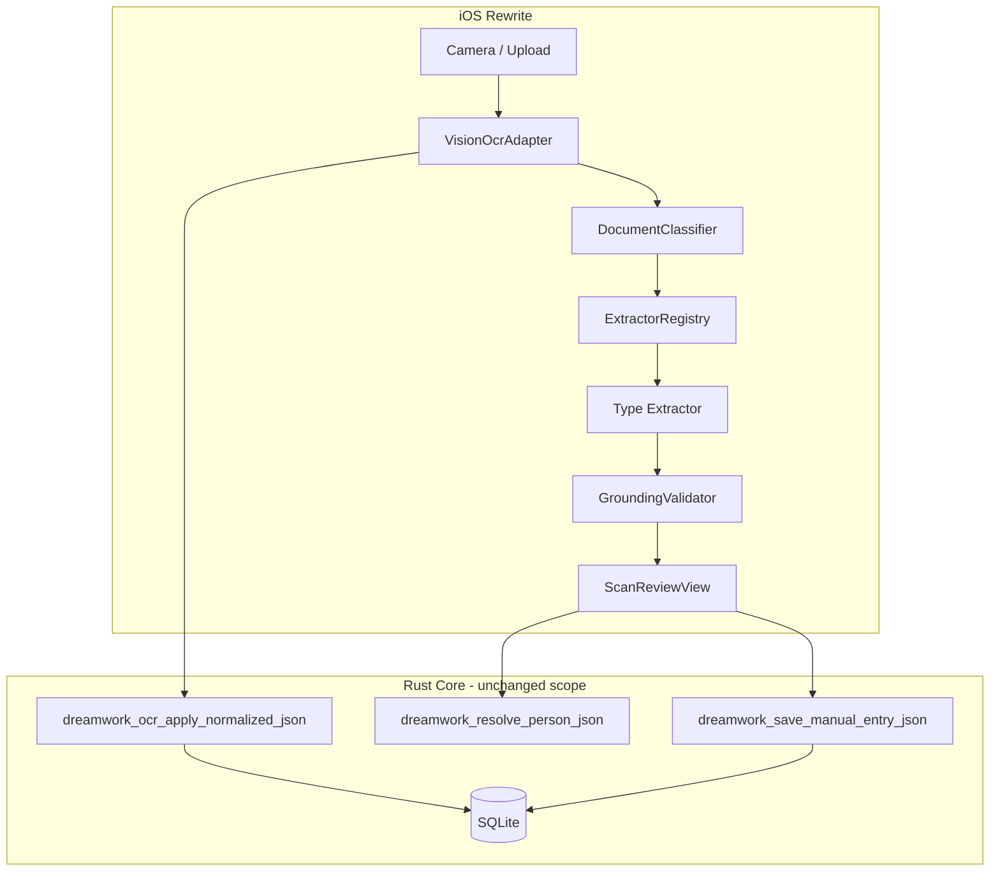

# Fresh start: lessons, failures, and principles

**Branch:** `rewrite/v2-fresh-start`  
**Status:** Founding document — read this before writing any extraction code  
**Audience:** Anyone rebuilding TrustNest / DreamWork document intelligence  
**Companion:** [fresh-start-implementation-baseline.md](fresh-start-implementation-baseline.md) (what exists today)

---

## Why we are starting over

We spent months iterating across **heuristics**, **optional HTTP LLM**, **Apple NaturalLanguage / Create ML**, and a **15-agent orchestrator**. Users still report the same failure mode:

> OCR text in review looks readable, but **basic profile fields are wrong, empty, or from the wrong document type.**

Examples that must work before anything else:

| Field | Document examples |
|-------|-------------------|
| First name / last name | DL, passport, SSN card, insurance card |
| Date of birth | DL, passport, insurance card |
| SSN | SSN card, W-2 |
| Driver license number | Texas DL, state ID |
| Passport number | US passport |
| Insurance carrier | Insurance card / EOB |
| Member ID / Group ID | Insurance card |

**This is not a hope problem. It is an engineering discipline problem.** We kept adding layers without proving each layer works on **real phone photos** before moving on.

This document records **what went wrong**, **what we will not repeat**, and **how the rewrite will be structured** so progress is measurable instead of circular.

---

## The central truth (read this twice)

```text
┌─────────────────────────────────────────────────────────────────┐
│  OCR (Vision) is mostly OK.                                      │
│  Field mapping is what fails.                                      │
│  More classifiers, agents, and embeddings do not fix bad mapping.│
└─────────────────────────────────────────────────────────────────┘
```

Evidence:

- TestFlight users see correct lines in the scan preview.
- SQLite stores the OCR JSON correctly (`extraction_run`).
- Wrong values appear **after** the intelligence pipeline runs.

See [field-mapping-accuracy-analysis.md](field-mapping-accuracy-analysis.md) and [ssn-ocr-field-mapping-gap.md](ssn-ocr-field-mapping-gap.md).

---

## What we tried (chronology of approaches)

| Approach | What we hoped | What actually happened |
|----------|---------------|------------------------|
| **Regex / `UniversalDocumentParser`** | Fast fallback for all docs | First matching line wins: issuer names, issue dates, random 9-digit numbers become “name”, “DOB”, “SSN” |
| **Texas DL / passport post-processors** | Better names on IDs | `PersonNameResolver` ran on **non-ID** text (e.g. “BLUE CROSS OF **TEXAS**”) → crashes or wrong names |
| **Document type classifier** | Route to right parser | Misclassification → wrong parser; keyword “DRIVER LICENSE” in OCR triggers DL logic on utility bills |
| **Optional Ollama / OpenAI (`GenAIFieldMapper`)** | Smart extraction | Default **Off**; on iPhone `127.0.0.1` always fails silently → regex fallback; user sees “High” confidence anyway |
| **Apple NL + embeddings + Create ML** | On-device semantic mapping | Still fed **flattened text** without reliable label→value structure; overloaded schema (40+ keys) |
| **15-agent orchestrator** | Modular, extensible | Hard to debug; tests passed on **synthetic OCR lines** while **photo scans** failed in TestFlight |
| **More specialized parsers** | Texas DL, passport, SSN fixes | Fixed one doc, broke another; parsers fought each other via shared post-processing |
| **Synthetic lifecycle tests** | Coverage across life stages | **Tier 1** tests use perfect OCR strings — green CI, red real world |

**Pattern:** We confused *having code for extraction* with *extracting correctly on device*.

---

## Root causes (not symptoms)

### 1. No single source of truth for “what is the value?”

Multiple systems can set the same field:

- `ExtractionAgent` → specialized parser
- `UniversalDocumentParser` → regex
- `PersonNameResolver` → overwrites name **after** extraction
- `AppleSemanticFieldExtractor` → NL embedding guess
- Rust `entity_resolution` → separate from field extraction (profile matching only)

**Result:** Last writer wins; debugging requires reading five files and a 20-step `pipelineTrace`.

### 2. Flattened text heuristics cannot solve structured documents

Government IDs and forms are **layout problems**, not **regex problems**.

| Document | Real structure | What we did |
|----------|----------------|-------------|
| Texas DL | Numbered fields `1.` `2.` `3.` `4d.` `8.` | Sometimes parsed; often overridden by `PersonNameResolver` |
| SSN card | Name line **above** street address; no `Name:` label | First two-word line → garbled header text |
| Passport | MRZ + labeled biodata | MRZ collected but **not applied** when GenAI off |
| Insurance card | `MEMBER ID`, `GROUP #`, `SUBSCRIBER` labels | Keyword classify OK; values still from generic regex |
| W-2 | Numbered IRS boxes | Treated as generic text |

**Lesson:** Extraction must be **anchor-based** (label, line number, relative position, MRZ, barcode) — never “first date in document”.

### 3. Tests lied to us

| Test type | Input | Trust level |
|-----------|-------|-------------|
| `LifecycleDocumentSimulationHarness` | Perfect synthetic OCR lines, top-to-bottom | ⚠️ **Proves pipeline wiring only** |
| `DriverLicenseParserTests` | Hand-crafted Texas OCR string | ✅ Good for parser unit tests |
| `SimulatorDocumentPipelineE2ETests` | Real PNG (when fixture present) | ✅ **Only trustworthy E2E** |
| TestFlight on friend’s phone | Real lighting, skew, glare | ✅ **Ground truth** — we underweighted this |

**Anti-pattern:** Adding a new parser fix + synthetic test → declaring victory → TestFlight failure → add another layer.

**Rule for rewrite:** **No parser merges without a photo fixture test** that runs Vision OCR first, then extraction.

### 4. Silent failure and dishonest confidence

| Situation | User sees |
|-----------|-----------|
| LLM unreachable | Same UI as success; regex garbage fields |
| Classifier unsure | “Review fields” with 0.92 “High” on regex |
| Wrong doc type | DL fields on insurance card |

Users cannot tell **guess** vs **verified** vs **machine-readable decode**.

### 5. Scope creep before basics

We built before basics worked:

- Knowledge graph, vector memory, fraud detection, incremental learning
- Storage routing planner (Rust + Apple duplicate)
- 10 household fixture families
- Extension demo + k8s + core_api

Meanwhile **insurance member ID on a real card** still fails.

**Lesson:** **Freeze features** until the [acceptance matrix](#acceptance-matrix) passes on photos.

### 6. Architecture optimized for extensibility, not correctness

The orchestrator has 15 steps, 12+ agents, 6 model artifact slots. Adding a step felt like progress. **Removing** a wrong step was never done.

**Lesson:** The rewrite pipeline has **4 stages** max. If a stage does not improve measured field accuracy, delete it.

---

## Symptom → cause cheat sheet (keep for QA)

| User report | Actual cause (check first) |
|-------------|---------------------------|
| Wrong name | `extractNames` first 2-word line, or Texas `PersonNameResolver` on non-DL |
| Wrong DOB | First `MM/DD/YYYY` in text (issue/expiry/statement date) |
| Wrong SSN | SSN regex on account/EIN-like number |
| Empty fields | Extraction returned nothing; UI still shows doc type |
| DL number on utility bill | `shouldIncludeDriverLicenseFields` or “DRIVER” in OCR |
| Crash on insurance scan | “TEXAS” triggered Texas DL range logic (fixed in build 33 — example of symptom fix without systemic fix) |
| Works on Mac, fails on phone | Ollama at localhost; or Simulator HTTP fixtures ≠ camera |
| Tests green, TestFlight red | Synthetic OCR tests without photo path |

---

## What actually worked (keep these)

| Technique | Why it worked | Rewrite usage |
|-----------|---------------|---------------|
| **Texas numbered field parser** (`4d. DL`, `1.` `2.`) | Matches real AAMVA layout | **Only** when `documentType == driversLicense` with high confidence |
| **SSA layout rule** — name above street line | Matches physical card layout | SSN extractor module; no `Name:` label needed |
| **MRZ / PDF417 decode** | Machine-readable, high precision | **Always run first**; fields marked `source: mrz \| barcode` |
| **`OcrGroundingValidator`** — value in OCR text | Catches hallucinations | **Required** for every suggestion |
| **Identity conflict rules** (household) | Stops merging spouses/kids | Keep in Rust `entity_resolution`; single matcher |
| **Vision OCR** | Good English text on device | Keep; do not replace in v1 |
| **Scan review UI** | User can correct before save | Keep; add per-field **source** badge |

---

## What we will NOT repeat (non-negotiable)

### Process anti-patterns

| # | Never again |
|---|-------------|
| N1 | Ship a parser fix without a **photo-based test** (Vision OCR → extract → assert) |
| N2 | Add a new agent/layer while basic fields fail on TestFlight |
| N3 | Treat synthetic OCR line tests as E2E proof |
| N4 | Run global post-processors (`PersonNameResolver`) on all documents |
| N5 | Use “first regex match in full text” for name, DOB, or SSN |
| N6 | Show “High confidence” for regex-only guesses |
| N7 | Fail silently when optional AI is enabled but unreachable |
| N8 | Expand schema/prompt with 40+ keys before core 10 fields work |
| N9 | Fix one document type by hardcoding without regression on others |
| N10 | Commit architecture docs instead of **field accuracy metrics** |

### Technical anti-patterns

| # | Never again |
|---|-------------|
| T1 | `UniversalDocumentParser` as the **default** extractor for all types |
| T2 | Keyword “TEXAS” / “DRIVER LICENSE” as sole signal for Texas name logic |
| T3 | Multiple classifiers returning different types with no single resolver |
| T4 | Discarding MRZ/barcode unless LLM is on |
| T5 | Flattening layout to string before structured docs (DL, W-2, insurance card) |
| T6 | Swift + Rust duplicate person matching logic that can diverge |
| T7 | Building ONNX/GGUF/LayoutLM paths before photo tests pass with rules-only |

---

## Rewrite principles (the new contract)

### Principle 1 — **Field accuracy is the product**

The app is not a “document intelligence platform.” It is a **reliable field extractor** for household documents. Everything else is deferred.

### Principle 2 — **One pipeline, four stages**

```text
1. CAPTURE   → image/PDF bytes
2. OCR       → Vision → NormalizedDocument (blocks with bounds)
3. EXTRACT   → type-specific extractor → [FieldSuggestion]
4. REVIEW    → user confirms → Rust SQLite
```

No orchestrator with 15 steps. No parallel semantic/heuristic/learning paths in v1.

### Principle 3 — **Extraction priority order (strict)**

For every document, extraction tries **only** this order:

```text
1. Machine-readable  (MRZ, PDF417/AAMVA barcode)     → confidence: VERIFIED
2. Type-specific     (registered extractor for classified type) → confidence: HIGH if grounded
3. Label-anchored    (keyword left, value right / next line)   → confidence: MEDIUM if grounded
4. STOP              → return partial fields + explicit "could not extract X" — NO global regex name/DOB/SSN
```

If step 4 would have been “guess from first date in document” in the old app — **leave the field empty**.

### Principle 4 — **Classify once, extract once**

- One classifier: keyword + layout signals + optional Create ML (single model).
- Classification picks **exactly one** extractor from a **registry** (map, not inheritance tree).
- Extractor **never** calls another extractor as fallback inside the same run.

### Principle 5 — **Ground every value**

A suggestion is dropped unless:

- Value is a fuzzy substring of OCR text, **or**
- Value came from MRZ/barcode decode, **or**
- User typed it in review

### Principle 6 — **Honest review UI**

Each field shows:

| Badge | Meaning |
|-------|---------|
| `MRZ` / `Barcode` | Machine-readable |
| `Layout` | Label-anchored or numbered field |
| `Empty` | Not guessed — user must fill |

No “High” for regex. No “Extracted with AI” when AI did not run.

### Principle 7 — **Tests mirror reality**

```text
Test pyramid (rewrite):

  ┌─────────────────────┐
  │ TestFlight / manual │  real phone, real cards (sanitized)
  └──────────┬──────────┘
  ┌──────────▼──────────┐
  │ Photo fixture E2E   │  PNG → Vision OCR → extract → assert fields
  └──────────┬──────────┘
  ┌──────────▼──────────┐
  │ Extractor unit      │  OCR string IN, fields OUT (per type)
  └──────────┬──────────┘
  ┌──────────▼──────────┐
  │ Classifier unit     │  OCR string IN, type OUT
  └─────────────────────┘

Synthetic perfect-line tests are NOT in the top two tiers.
```

### Principle 8 — **Rust owns identity; Swift owns extraction (v1)**

| Concern | Owner | Why |
|---------|-------|-----|
| Field extraction from OCR | Swift (Vision ecosystem) | Layout + Apple APIs |
| Profile CRUD + SQLite | Rust FFI | Single persistence path |
| Person match on save | Rust `entity_resolution` only | No duplicate Swift matcher |
| OCR run audit | Rust | Already works |

**Delete** `PersonProfileMatcher` duplicate logic in Swift rewrite — call Rust only.

### Principle 9 — **Small schema, expand later**

v1 extractors target **only** these keys:

```text
legal_first_name, legal_last_name, display_name, date_of_birth,
ssn, drivers_license_number, drivers_license_state,
passport_number, insurance_carrier, insurance_member_id, insurance_group_id
```

Add employer, utility, tax keys **after** the core 11 reach 90% on photo fixtures.

### Principle 10 — **Weekly metric, not weekly architecture**

Track one dashboard:

| Metric | Target (v1 exit) |
|--------|------------------|
| Field precision on photo corpus | ≥ 95% per key per doc type |
| Field recall on photo corpus | ≥ 90% per key per doc type |
| Hallucination rate (value ∉ OCR) | 0% |
| Classifier accuracy (photo corpus) | ≥ 95% |
| Crash rate on scan | 0 |

No new features until metrics flatline below target.

---

## Acceptance matrix (definition of “basic things right”)

Each cell must pass **photo fixture E2E** (Vision OCR on PNG, not synthetic lines).

| Document | first_name | last_name | dob | ssn | dl_number | passport_no | carrier | member_id | group_id |
|----------|:----------:|:---------:|:---:|:---:|:---------:|:-----------:|:-------:|:---------:|:--------:|
| Texas DL | ✅ | ✅ | ✅ | — | ✅ | — | — | — | — |
| US Passport | ✅ | ✅ | ✅ | — | — | ✅ | — | — | — |
| SSN card | ✅ | ✅ | — | ✅ | — | — | — | — | — |
| Insurance card | ✅ | ✅ | ✅ | — | — | — | ✅ | ✅ | ✅ |
| State ID (child) | ✅ | ✅ | ✅ | — | — | — | — | — | — |

**v1 ship gate:** All ✅ cells pass on **≥ 3 distinct synthetic household PNGs** per row (use `demo/sample-documents/household-fixtures/`).

---

## Proposed v1 architecture (rewrite)



### Extractor registry (initial)

| `ScannedDocumentType` | Extractor | Primary anchors |
|----------------------|-----------|-----------------|
| `driversLicense` | `TexasDriverLicenseExtractor` | `4d. DL`, `1.` `2.`, `3. DOB`, `8.` address |
| `passport` | `PassportExtractor` | MRZ TD3, biodata labels |
| `ssnCard` | `SSNCardExtractor` | SSN pattern, name above street, `ESTABLISHED FOR` |
| `insuranceCard` | `InsuranceCardExtractor` | `MEMBER ID`, `GROUP`, `SUBSCRIBER`, `RXBIN` |
| `stateId` | `StateIdExtractor` | `STATE ID`, `ID:`, `DOB:` |
| *all others* | `LabeledFormExtractor` | Generic label→value pairs only; **no name/DOB/SSN guess** |

### Files we do **not** port to v1

- `DocumentIntelligenceOrchestrator` (replace with 4-stage pipeline)
- `ExtractionAgent` multi-path router
- `PersonNameResolver` as global post-processor
- `UniversalDocumentParser` as default extractor
- `DocumentKnowledgeGraph`, `VectorDocumentMemory`, `IncrementalLearningStore`
- `GenAIFieldMapper` / Ollama path (revisit only after rules-only passes acceptance matrix)
- `AppleStoragePlanner` duplicate of Rust storage routing
- `LayoutLMv3CoreMLAdapter`, ONNX, GGUF slots

---

## Implementation phases (rewrite branch)

### Phase 0 — Foundation (this document + fixtures) ✅ you are here

- [x] Branch `rewrite/v2-fresh-start`
- [x] Lessons document (this file)
- [ ] Pin photo corpus: 5 PNGs minimum (DL, passport, SSN, insurance, state ID) from `household-fixtures`
- [ ] `FieldAccuracyScorecard.md` spreadsheet or script — track precision/recall weekly

### Phase 1 — OCR baseline (prove Vision output)

- [ ] Minimal app shell: import PNG only
- [ ] Run Vision → show raw blocks + `fullText`
- [ ] Test: each fixture produces expected **substrings** in OCR (not extraction yet)
- **Exit:** OCR contains ground-truth SSN, DL#, names as substrings

### Phase 2 — Classifier (one module)

- [ ] `DocumentClassifier.classify(ocrText, blocks)` → type + confidence
- [ ] Photo tests per type
- **Exit:** ≥ 95% type accuracy on fixture corpus

### Phase 3 — Extractors (one type at a time)

Build in this order (highest user pain first):

1. Texas DL  
2. SSN card  
3. Insurance card  
4. Passport  
5. State ID  

Per type:

- [ ] Unit test: OCR string → fields  
- [ ] Photo E2E: PNG → Vision → fields  
- [ ] Grounding validator wired  
- [ ] No other type regresses (run full matrix)

**Exit:** Acceptance matrix all green

### Phase 4 — Review + save

- [ ] `ScanReviewView` with source badges  
- [ ] Rust `resolvePerson` + `save_manual_entry_json`  
- [ ] Household conflict: 3-person test on save  

### Phase 5 — Camera + TestFlight

- [ ] Camera capture  
- [ ] Build → TestFlight → **one** external tester runs matrix on physical cards (sanitized)  

---

## Decision log (pre-decided — do not re-litigate)

| Question | Decision | Rationale |
|----------|----------|-----------|
| Replace Vision OCR? | **No** (v1) | Good enough; mapping was the bug |
| Default on-device LLM? | **No** (v1) | Failed to ship; rules+layout first |
| Apple NL embeddings? | **No** (v1) | Did not improve basic fields |
| Texas-only DL support? | **Yes** (v1) | Primary user base; add CA/NY in v2 |
| Keep 10 household fixtures? | **Yes** | Photo E2E corpus |
| Keep Rust core? | **Yes** | SQLite + entity resolution work |
| Keep orchestrator agents? | **No** | Complexity without accuracy |
| Empty field vs wrong guess? | **Empty wins** | User trust |

---

## How to avoid the back-and-forth loop

### Before every PR, answer:

1. **Which acceptance matrix cell** does this PR improve?  
2. **Which photo fixture test** proves it?  
3. **Which old code path** does this **remove** (not add)?  
4. Did any field get **less accurate** on another doc type? (run full matrix)

### PR is rejected if:

- Adds a new agent/orchestrator step  
- Adds regex name/DOB/SSN on flattened text without layout anchor  
- Only adds synthetic-line tests  
- Touches profile matching before extraction matrix is green  
- Adds a new document type before existing types pass  

### Weekly review (15 min):

- Run photo E2E suite  
- Update scorecard  
- If metric dropped → revert before new work  

---

## References

| Doc | Use when |
|-----|----------|
| [fresh-start-implementation-baseline.md](fresh-start-implementation-baseline.md) | Need file paths / FFI list / what exists |
| [field-mapping-accuracy-analysis.md](field-mapping-accuracy-analysis.md) | Deep dive on P0–P3 root causes |
| [ssn-ocr-field-mapping-gap.md](ssn-ocr-field-mapping-gap.md) | Example of layout-aware fix done right |
| [apple-native-document-intelligence.md](apple-native-document-intelligence.md) | What the current branch shipped |
| `demo/sample-documents/household-fixtures/` | Photo test corpus |

---

## Closing note

Losing hope usually means **the feedback loop is broken**: we could not see progress because we measured the wrong thing (pipeline trace length, agent count, synthetic tests) instead of **field correctness on real scans**.

The rewrite is not “try another ML approach.” It is:

1. **Fewer moving parts**  
2. **Layout-first extractors**  
3. **Photo tests as gate**  
4. **Empty beats wrong**  
5. **One metric dashboard**

When the acceptance matrix is green on photos, **then** we earn the right to add semantic models, more document types, and form autofill — not before.

---

*Document version: 1.0 — branch `rewrite/v2-fresh-start`, May 2026.*
