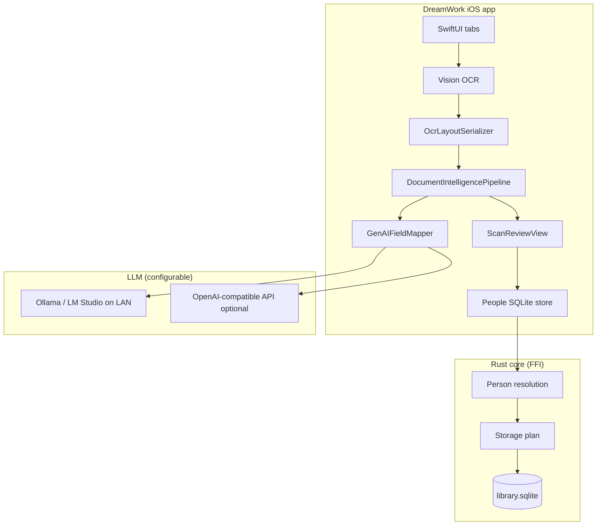

# DreamWork (TrustNest) — Implementation Status & TestFlight Build 27

**Date:** 2026-05-21  
**Branch:** `ganga-2026-05-16-2`  
**Commit:** `5889a25` — *Add on-device document intelligence pipeline and layout-aware scan review*  
**Audience:** Product, QA, and internal TestFlight testers

---

## 1. Executive summary

**DreamWork** (display name) / **Nest Ledger** (bundle family) is a **local-first iOS companion** for household identity data. Users scan or upload documents, review extracted fields, save structured profiles on-device, and use those profiles when filling forms in other apps.

This document records **what is implemented today**, **what is still planned**, and **what was delivered to TestFlight** on 2026-05-21.

| Item | Value |
|------|--------|
| App name (home screen) | DreamWork |
| Bundle ID | `com.dream.nestledger.dev` |
| Marketing version | **1.1.0** |
| Build number | **27** |
| Team ID | `RNBNZW828G` (TrustNest) |
| Minimum iOS | 17.0 |
| Distribution | TestFlight (internal testing) |
| IPA artifact | `apps/ios/build/DreamWorkApp.ipa` |

**Privacy posture:** Structured profiles and OCR run on-device. SQLite is stored under Application Support. Optional LLM for field extraction can be configured as **local (Ollama / LM Studio)** or **OpenAI-compatible cloud** in Settings — see §5.3.

---

## 2. TestFlight delivery record

### 2.1 Source & build

| Step | Status | Details |
|------|--------|---------|
| Git pull | Done | Fast-forward `163c2d1` → `5889a25` on `ganga-2026-05-16-2` |
| Build number | Done | `CURRENT_PROJECT_VERSION: "27"` in `apps/ios/project.yml` |
| Archive | Done | `./scripts/archive-for-testflight.sh RNBNZW828G` — Release, generic iOS device |
| Icon verification | Pass | `verify-ipa-icons.sh` — 120×120 icon, `CFBundleIconFiles`, `CFBundleIconName` |
| Upload | **Manual step** | Transporter opened with IPA; click **Deliver** (no App Store Connect API key on build machine) |

### 2.2 Post-upload checklist (App Store Connect)

1. [App Store Connect](https://appstoreconnect.apple.com/) → DreamWork → **TestFlight**
2. Wait for build **1.1.0 (27)** to finish **Processing** (typically 10–30+ minutes)
3. **Internal Testing** → attach build to tester group
4. Testers install via **TestFlight** app (not App Store Connect app)

### 2.3 What changed in this build vs prior TestFlight builds

Build **27** is the first TestFlight cut with the **unified document intelligence pipeline**:

- **Layout-aware OCR serialization** — text blocks with geometry fed to the mapper (not flat text only)
- **Single ingest path** — `DocumentIntelligencePipeline` replaces per-document-type routing for new scans
- **Open-vocabulary document type labels** — model returns human-readable type (e.g. “School Enrollment Form”) instead of forcing enum-only classification
- **Embedded payload hints** — optional barcode / MRZ hints merged into model input
- **Scan review UX** — shows extraction method (AI vs heuristics) and layout-aware field groups
- **Docs** — zero-egress design constraint and document-intelligence deep dive added under `docs/`

Prior builds (roughly 10–26) introduced: Rust SQLite persistence, people CRUD, GenAI driver-license mapping, passport parsing, person matching, field validation, and App Store icon compliance.

---

## 3. Implemented features (by area)

### 3.1 iOS app shell

| Feature | Status | Notes |
|---------|--------|-------|
| SwiftUI tab navigation | **Shipped** | Home, People, Forms, Settings |
| XcodeGen project | **Shipped** | `apps/ios/project.yml` → reproducible `.xcodeproj` |
| Rust core linked per destination | **Shipped** | Simulator vs device, Debug vs Release via `build_rust_core.sh` |
| App Store icon & privacy manifest | **Shipped** | Post-build `actool`, loose 120×120 PNG, `PrivacyInfo.xcprivacy` |
| TestFlight archive scripts | **Shipped** | `archive-for-testflight.sh`, `export-and-upload-testflight.sh`, `verify-ipa-icons.sh` |

### 3.2 Local data & persistence

| Feature | Status | Notes |
|---------|--------|-------|
| SQLite store via Rust FFI | **Shipped** | `Application Support/DreamWork/library.sqlite` |
| People profiles (CRUD) | **Shipped** | Add, edit, delete; autosave |
| Canonical profile schema | **Shipped** | 30+ fields: identity, contact, address, government IDs, tax, medical, insurance |
| Household relationships | **Shipped** | Self, spouse, child, parent, other |
| Manual field entry (no scan) | **Shipped** | Full profile editor without requiring a document |
| Extraction run audit | **Shipped** | Each OCR ingest appends an `extraction_run` row in SQLite |
| Field value history / provenance | **Partial** | Rust core has provenance module; iOS UI does not yet expose full history timeline |
| Export / delete all data | **Partial** | Per-person delete; no full vault export UI yet |
| SQLCipher encryption | **Planned** | ADR 0014; OS file protection only today |

### 3.3 Document capture & OCR

| Feature | Status | Notes |
|---------|--------|-------|
| Live camera scan | **Shipped** | Document camera flow from Home |
| Upload PDF or image | **Shipped** | Files, Photos, email attachments |
| On-device OCR (Apple Vision) | **Shipped** | `VisionOcrAdapter` → `NormalizedDocument` with regions/lines |
| Multi-page PDF support | **Shipped** | Text extraction across pages |
| ID-tuned OCR preprocessing | **Shipped** | Crops, contrast passes for license/ID cards |
| Simulator laptop import | **Shipped** | Dev-only batch import from Mac filesystem in simulator |
| Word / Excel import | **Not shipped** | On roadmap (mandatory in `features-list.md`) |
| Folder batch import | **Not shipped** | On roadmap |
| Watched folder | **Not shipped** | Hardening phase |

### 3.4 Document intelligence & field extraction

| Feature | Status | Notes |
|---------|--------|-------|
| Unified ingest pipeline | **Shipped (build 27)** | `DocumentIntelligencePipeline` — one path for all document types |
| Layout serialization | **Shipped (build 27)** | `OcrLayoutSerializer` — block bounds, reading order, label–value pairs |
| GenAI field mapping | **Shipped** | OpenAI-compatible API; JSON schema-constrained extraction |
| Local LLM (Ollama / LM Studio) | **Shipped** | Settings → provider, base URL, model |
| OpenAI cloud key | **Shipped** | Settings → optional; stored on-device in Keychain |
| Heuristic fallback parser | **Shipped** | `UniversalDocumentParser` when LLM unavailable |
| Field validation | **Shipped** | `ScanFieldValidator` — names, dates, DL numbers, US states |
| Person name reconciliation | **Shipped** | `PersonNameResolver`, `NameFieldReconciler` |
| Person match on ingest | **Shipped** | Rust FFI `resolvePerson` — match existing or create new |
| Storage plan (canonical + extension fields) | **Shipped** | Rust FFI `planStorage` — maps to schema keys |
| Legacy format parsers | **Present, demoted** | Texas DL, Indian passport, keyword classifier — fallback only; not strategic direction |
| Driver license barcode (PDF417 / AAMVA) | **Shipped** | `DriverLicenseScanner` — barcode preferred over OCR |
| Bundled on-device GGUF model | **Not shipped** | Rust `inference/gguf` scaffold exists; iOS uses HTTP LLM today |
| Retained document files (encrypted) | **Partial** | Fingerprint store exists; full “saved scans library” UI limited |

### 3.5 Scan review UI

| Feature | Status | Notes |
|---------|--------|-------|
| Review before save | **Shipped** | Edit fields, pick target person |
| Grouped field sections | **Shipped** | Identity, contact, government IDs, etc. |
| Person match suggestion | **Shipped** | Shows match confidence and reasons |
| Document type display | **Shipped (build 27)** | Open-vocabulary label + mapped enum for UX |
| AI vs heuristic indicator | **Shipped (build 27)** | Review screen notes extraction method |

### 3.6 Forms assistant (iOS)

| Feature | Status | Notes |
|---------|--------|-------|
| Form categories & templates | **Shipped** | Medical, tax, school, sports, etc. |
| Form subject picker | **Shipped** | Choose which household member the form is about |
| Copy-to-clipboard checklist | **Shipped** | Tap field → copy → paste in Safari/other apps |
| Multi-profile field resolution | **Partial** | Single subject per session; no father/mother role split yet |
| Browser extension autofill | **Not in iOS app** | See §3.8 |
| Attach from saved documents | **Not shipped** | On roadmap |
| In-app URL / embedded browser | **Not shipped** | On roadmap |

### 3.7 Settings & developer tools

| Feature | Status | Notes |
|---------|--------|-------|
| LLM provider configuration | **Shipped** | Off / OpenAI / Ollama / LM Studio |
| Ingest audit log (local) | **Shipped** | Recent extraction events in Settings |
| Core status / extraction count | **Shipped** | Home shows extraction run count |

### 3.8 Shared Rust core (`core/`)

| Module | Status | Notes |
|--------|--------|-------|
| SQLite memory layer | **Implemented** | Migrations, manual fields, extraction runs |
| Ingest FFI | **Implemented** | Person resolution, storage planning |
| Schema / DDL executor | **Scaffold** | Constrained LLM + transactional DDL (ADR 0005) |
| Form intelligence | **Scaffold** | Rules + LLM disambiguation |
| Proximity sharing (BLE/crypto) | **Scaffold** | ADR 0009; no iOS UI |
| On-device inference (GGUF/ONNX) | **Scaffold** | Not wired as default iOS path |
| UniFFI bindings | **Partial** | iOS uses C FFI bridge today |

### 3.9 Browser extension & backend

| Component | Status | Notes |
|-----------|--------|-------|
| Chrome MV3 demo extension | **Demo only** | `apps/extension-demo` — talks to `core-api` on localhost:18081 |
| Production native messaging | **Not shipped** | ADR 0007 / 0016 designed, not integrated |
| `core-api` HTTP service | **Dev/demo** | Profile seeding for extension demo; not used on device |
| Account-only remote API | **Not shipped** | ADR 0010; k8s deploy scaffold exists under `deploy/` |
| Android app | **Not in repo** | ADRs reference Android; no `apps/android` yet |

### 3.10 Automated tests

| Suite | Status | Notes |
|-------|--------|-------|
| Unit tests (Swift) | **Shipped** | Parsers, validators, layout serializer, pipeline, profile schema |
| OCR + SQLite integration | **Shipped** | `OcrSQLiteIntegrationTests` |
| UI tests | **Minimal** | `DreamWorkAppUITests` scaffold |
| Rust core tests | **Shipped** | `cargo test --workspace` |

---

## 4. Architecture snapshot (as shipped)



**Strategic direction** (see `docs/document-intelligence-deep-dive.md`): retire per-format parser routing; move to **OCR + layout → local bundled LLM → validators → review**. Build 27 is the first step — unified pipeline and layout input — with HTTP LLM still used until bundled GGUF lands on-device.

---

## 5. Tester guide (TestFlight build 27)

### 5.1 Install

1. Install **TestFlight** from the App Store
2. Accept the invite for **DreamWork** (same Apple ID as App Store Connect)
3. Install build **1.1.0 (27)**

### 5.2 Recommended test flows

**Flow A — Scan a driver’s license**

1. Home → **Scan with camera**
2. Capture front (and back if prompted)
3. Review extracted fields → **Save** to new or existing person
4. People tab → confirm fields persisted

**Flow B — Upload a PDF or photo**

1. Home → **Upload PDF or image**
2. Pick a document from Files or Photos
3. Review → Save

**Flow C — Manual profile (no document)**

1. People → **+** → enter fields manually
2. Save → use in Forms tab

**Flow D — Form assist (copy/paste)**

1. Forms → pick category (e.g. Medical)
2. Select form subject (person)
3. Copy fields → paste into Safari or another app

### 5.3 Enable AI field extraction (recommended for build 27)

Build 27’s pipeline works best with an LLM configured:

| Provider | Setup |
|----------|--------|
| **Ollama (local, preferred for privacy)** | Run Ollama on Mac; Settings → Provider **Ollama**, base URL `http://<mac-ip>:11434/v1`, model e.g. `llama3.2` |
| **LM Studio (local)** | Same pattern with LM Studio OpenAI-compatible server |
| **OpenAI (cloud)** | Settings → Provider **OpenAI**, enter API key — **document OCR text is sent to OpenAI** |

If LLM is **Off** or unreachable, the app falls back to **layout heuristics** (`UniversalDocumentParser`) — fewer fields, lower accuracy.

### 5.4 Known limitations in this build

- No browser extension integration on phone — form fill is **manual copy/paste**
- No proximity sharing UI — cannot AirDrop-style share profiles yet
- No Word/Excel/folder batch import
- OpenAI path sends OCR layout text off-device (dev/testing; production target is bundled on-device model)
- Legacy parsers may still influence some edge cases when LLM is off

---

## 6. Gap analysis vs product mandatory list

Reference: `features-list.md` §1 (mandatory features).

| Mandatory area | TestFlight 27 status |
|----------------|----------------------|
| Local relational store | **Met** — SQLite + Rust |
| Manual entry & edit | **Met** |
| On-device OCR | **Met** — Apple Vision |
| Generative structure + schema | **Partial** — LLM maps to fixed canonical schema; dynamic DDL not in iOS path |
| Household UI & CRUD | **Met** |
| Roles & relationships | **Partial** — labels exist; multi-profile form fill incomplete |
| Chrome extension + companion | **Not met** — demo extension only |
| Proximity sharing | **Not met** — Rust scaffold only |
| Account-only remote API | **Not met** |
| Field history trail | **Partial** — backend support, limited UI |
| Word/Excel/folder import | **Not met** |

**MVP phasing** (from `features-list.md` §3): this TestFlight build covers the **iOS local memory + capture + review + manual forms assist** slice. Extension, sharing, and full form automation remain **next phases**.

---

## 7. Release history

| Date | Version | Build | Branch | Highlights |
|------|---------|-------|--------|------------|
| 2026-05-21 | 1.1.0 | **27** | `ganga-2026-05-16-2` | Document intelligence pipeline, layout OCR, open doc types, zero-egress docs |
| 2026-05-16 | 1.0.0 | 14–26 | `ganga` / feature branches | GenAI DL mapping, ingest FFI, passport parsing, person match, TestFlight tooling |
| Earlier | 1.0.0 | ≤10 | various | People profiles, SQLite persistence, App Store icon fixes, Rust device build |

---

## 8. Related documentation

| Document | Purpose |
|----------|---------|
| [`apps/ios/PUBLISHING.md`](../apps/ios/PUBLISHING.md) | Step-by-step TestFlight & App Store publishing |
| [`docs/architecture.md`](architecture.md) | Platform diagrams and module guide |
| [`docs/document-intelligence-deep-dive.md`](document-intelligence-deep-dive.md) | OCR, classification, mapping accuracy roadmap |
| [`docs/trustnest-zero-egress-design-constraint.md`](trustnest-zero-egress-design-constraint.md) | Privacy boundary — what must stay on-device |
| [`features-list.md`](../features-list.md) | Mandatory vs wish-list product scope |
| [`docs/adr/README.md`](adr/README.md) | Architecture decision records |

---

## 9. Rebuild & redeploy commands

From repo root:

```bash
git checkout ganga-2026-05-16-2
git pull origin ganga-2026-05-16-2

cd apps/ios
# Bump CURRENT_PROJECT_VERSION in project.yml before each new upload
./scripts/archive-for-testflight.sh RNBNZW828G
./scripts/verify-ipa-icons.sh build/DreamWorkApp.ipa
open -a Transporter "$(pwd)/build/DreamWorkApp.ipa"
```

---

*Generated for TestFlight build **1.1.0 (27)** on branch **`ganga-2026-05-16-2`**, commit **`5889a25`**, 2026-05-21.*
