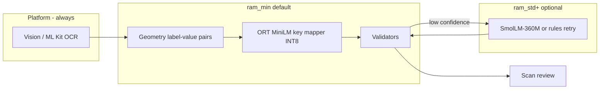

# Brainstorm: leaner on-device models for field extraction

**Date:** 2026-05-30  
**Context:** TestFlight crashes from Qwen 0.5B + OCR peak memory; product does **not** need document-type classification now.  
**Related:** [device-matrix.md](./device-matrix.md) · [document-scan-crash-simulator-investigation.md](./document-scan-crash-simulator-investigation.md)

---

## 1. Is the current stack overkill?

**Yes — for the job you actually need today.**

| Artifact | Size (approx) | Job | Verdict |
|----------|---------------|-----|---------|
| **Qwen2.5-0.5B-Instruct Q4_K_M** | ~380 MB file; **~450–600 MB peak** with llama context | Turn OCR layout text → JSON `{ fields: { profile_key: { value, label } } }` | **Overkill** — general chat/instruct model used as a structured extractor |
| **Same GGUF as `document.classifier.v1`** | (duplicate slot) | Open-vocabulary document type | **Not needed now** — already skipped in pipeline (`single_pass_parser`) |
| **SS-350M-SQL-Strict Q8_0** | ~362 MB | SQLite table/column/row planning | **Overkill for scan** — deferred; rules or simple routing suffice for profile fields |
| **LayoutLMv3 CoreML** | ~100–200 MB (typical) | Label→value pairs from layout | **Right class of model** but conversion blocked; would help *before* any LLM |

**What you actually need:** map **OCR text + simple layout** → **allowed profile keys** and **values**. That is closer to **information extraction / slot filling** than open-ended “understanding.”

A 500M-parameter autoregressive LLM is the **heaviest** way to do that on mobile.

---

## 2. Measured reality (why “small LLM” still fails)

From iPhone 17 Pro Simulator pipeline test (single synthetic scan image):

| Phase | Resident RAM |
|-------|----------------|
| Before OCR | ~289 MB |
| After Vision OCR | **~1170 MB** (+880 MB) |
| + Qwen load (device) | **+380 MB mmap + KV cache** → jetsam on many iPhones |

**Implication:** Even “0.5B” is too large when loaded **in the same session as OCR**. Budget for *all* ML after OCR on **`ram_min` (4 GB)** should target **≤ 80–120 MB**, not 380 MB.

---

## 3. Mobile memory headroom (planning targets)

Product tiers from [device-matrix.md](./device-matrix.md), translated into **post-OCR ML budget** (conservative):

| Tier | Example devices | RAM | Safe post-OCR ML budget* | Latency target (extract) |
|------|-----------------|-----|--------------------------|---------------------------|
| **`ram_min`** | iPhone SE 3, 4 GB Android | 4 GB | **50–100 MB** | **< 500 ms** |
| **`ram_std`** | iPhone 15, 6 GB Pixel | 6 GB | **100–180 MB** | **< 1.5 s** |
| **`ram_flagship`** | iPhone 17 Pro, S26 Ultra | 8 GB+ | **180–250 MB** | **< 3 s** (optional quality tier) |

\*Includes weights + runtime working set, not OCR buffers (OCR may still use hundreds of MB transiently).

**iOS note:** Jetsam uses **available memory at instant of allocation**, not total device RAM. After OCR, available is often **well below** tier nominal headroom.

**Android note:** Similar per-app limits; NNAPI/GPU adds separate pressure. Prefer **CPU INT8 ONNX** for predictable RAM on `ram_min`.

---

## 4. Alternative approaches (ranked for TrustNest)

### Option A — **Recommended vNext:** ONNX extraction stack (no generative LLM on scan)

Already sketched in device-matrix as `ort.embed.v1`, `ort.field_type.v1`, `ort.layout_hint.v1`.

```text
Vision/ML Kit OCR (platform)
    → normalize blocks + reading order
    → label/value pairing (geometry + light rules OR small layout model)
    → MiniLM-class encoder (~20–40 MB INT8) for "label text → profile_key"
    → validate values (regex, checksums for DOB/SSN/state)
    → optional confidence scores
```

| Pros | Cons |
|------|------|
| **30–80 MB** total ORT pack | Weaker on messy/novel layouts vs LLM |
| **10–50× faster** than token generation | Needs golden eval set + training/fine-tune data |
| Same Rust core + ORT on iOS/Android | Not “open vocabulary” without embedding coverage |

**Fits:** Known profile schema (`ProfileSchema.allFields`), forms with labels (“First Name:”, “DOB:”).

---

### Option B — **Tiny generative model** (if you must keep JSON-from-LLM)

Replace Qwen 0.5B with a **smaller instruct GGUF** for field JSON only:

| Model | Quant | File (approx) | Peak runtime (est.) | Quality |
|-------|-------|---------------|---------------------|---------|
| **SmolLM2-360M-Instruct** | Q4_K_M | ~220 MB | ~280–350 MB | OK for short JSON; test on your OCR snippets |
| **Qwen2.5-0.5B** (current) | Q4_K_M | ~380 MB | ~450–600 MB | Better JSON; still jetsam-prone after OCR |
| **SmolLM-135M** | Q4 | ~80–100 MB | ~120–180 MB | Lowest quality; may suffice for 10–15 fields |

**Requirements if staying on llama.cpp:**

- **Never load in same peak as OCR** — defer until review screen + user tap (build 42) or idle queue.
- **Drop `document_type` from prompt** — smaller output, fewer tokens.
- **Fixed schema JSON** — prompt lists allowed keys only; no open vocabulary.
- **Context 256–384**, max **64–128** output tokens.
- **CPU INT4**, `n_gpu_layers = 0`, unload after one shot.

Still slower than ONNX; use only on **`ram_std`+** or manual opt-in.

---

### Option C — **Apple / Google on-device APIs** (not in zero-egress story)

Foundation Models (iOS 26+) or ML Kit Entity Extraction — powerful but **policy/licensing** may conflict with strict local-only ADRs. Treat as separate product decision.

---

### Option D — **Keep storage planner off mobile entirely**

`SS-350M-SQL-Strict` (~362 MB) for SQLite routing is **not justified** on phone when:

- Primary action = upsert into known `manual_field` keys.
- Schema is mostly fixed (`ProfileSchema`).

Use **deterministic routing** in Rust for v1 mobile; reserve SQL SLM for desktop or server-assisted tooling if ever allowed.

---

## 5. What to remove now (product alignment)

You said document type is **not needed**:

| Remove / disable | Saves |
|------------------|-------|
| `document.classifier.v1` manifest slot | Duplicate 380 MB in manifest confusion; no runtime if skipped |
| `document_type` in LLM prompt & response schema | Tokens + parsing complexity |
| Auto classification trace / notices | UX noise |
| Storage planner on mobile scan path | 362 MB + second llama session |

**Keep:** single path **OCR → field key/value → profile**.

---

## 6. Proposed target architecture (mobile v2)



**Bundle sizes (target):**

| Tier | Bundled artifacts | Total ML |
|------|-------------------|----------|
| Default mobile | `ort.field_mapper.v1` (~40 MB) | **~40 MB** |
| Optional download | `llm.extract.micro.v1` SmolLM2-360M Q4 (~220 MB) | user opt-in |
| Not on phone | `sql.storage.planner.v1`, LayoutLM until CoreML ready | 0 |

---

## 7. Decision matrix

| Criterion | Qwen 0.5B (today) | SmolLM2-360M | ONNX embed + rules |
|-----------|-------------------|--------------|---------------------|
| Peak RAM after OCR | ❌ High | ⚠️ Medium | ✅ Low |
| Crash risk on 4 GB | ❌ High | ⚠️ Medium | ✅ Low |
| Speed | ❌ Slow (seconds) | ⚠️ Moderate | ✅ Fast |
| Novel doc types | ✅ Good | ⚠️ OK | ❌ Needs schema/key coverage |
| Zero egress / local | ✅ | ✅ | ✅ |
| Android parity | ✅ llama.cpp | ✅ llama.cpp | ✅ ORT |
| Matches “no doc type” | ❌ Over-scoped | ✅ Trim prompt | ✅ Natural |

**Recommendation:** Plan **Option A (ONNX)** as default mobile extractor; keep **Option B** as optional “deep extract” for flagship / user tap, not scan default.

---

## 8. Practical next steps (engineering)

1. **Short term (stabilize):** Ship **build 42** behavior — manual extract only; strip classifier + `document_type` from parser prompt/schema.
2. **Benchmark:** Golden set of 50–100 real scans; measure field F1 for Qwen 0.5B vs SmolLM2-360M vs ORT+rules on **`ram_min` device**.
3. **Implement `ort.field_mapper.v1`:** Sentence-transformer–class model (e.g. `all-MiniLM-L6-v2` INT8, ~22 MB) mapping OCR label strings → `profile_key`.
4. **Re-use OCR layout:** `OcrLayoutSerializer` label|value lines + block geometry before any neural model.
5. **Update manifest:** Replace `llm.schema.lite.v1` pin with tiered artifacts; document-matrix already defines `ram_min` → lite — **redefine lite as ONNX**, not 3B/0.5B Qwen.
6. **Android:** Same Rust `local_document_mapper` trait; ORT NNAPI EP + same INT8 pack.

---

## 9. Open questions for product

1. Is **open-vocabulary field keys** required, or only **`ProfileSchema` keys**?
2. Accept **manual entry** as primary and ML as **assist** (matches build 42)?
3. Optional **download larger model** for power users vs **single small bundled** model?
4. Accuracy bar: % fields correct vs **never crash** — which wins on 4 GB devices?

---

## 10. Summary one-liner

**Qwen 0.5B is overkill for “fill profile fields from OCR”; it is a general LLM doing a slot-filling task, and it does not fit iPhone/Android post-OCR memory headroom. Prefer a ~40 MB ONNX field mapper for default extraction, defer or optionalize any GGUF, and drop document type + storage planner from the mobile scan path.**
