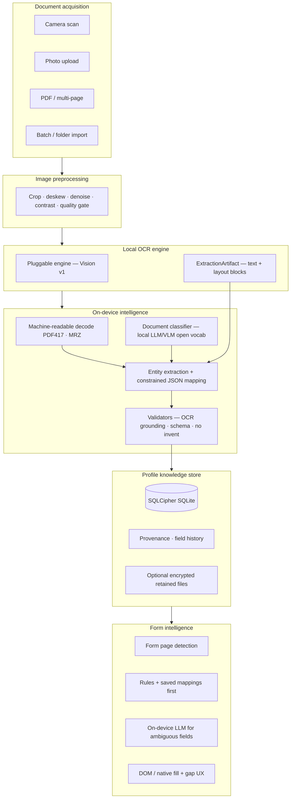

# Complete architecture — privacy-first on-device AI document intelligence (iOS)

**Product:** TrustNest / DreamWork  
**Platform (v1):** iOS (SwiftUI + shared Rust core)  
**Constraint:** [Zero egress](trustnest-zero-egress-design-constraint.md) — household document content and PII never sent to cloud APIs for product use cases.

**Related:** [Implementation gap vs this vision](project-requirements-and-implementation-gap.md) · [Platform module guide](architecture.md) · [Field mapping accuracy](field-mapping-accuracy-analysis.md) · [ADRs](adr/README.md)

---

## 1. Project goal

Build a **fully offline, privacy-first** iOS application that:

| # | Capability | Outcome |
|---|------------|---------|
| G1 | Scans or uploads documents | Camera, gallery, PDF, multi-page |
| G2 | Performs OCR **locally** on-device | No document bytes to cloud for OCR |
| G3 | Detects **document type** using **standalone on-device AI** | Open vocabulary; not a fixed template router |
| G4 | Extracts **structured entities** from OCR + layout | Names, IDs, dates, addresses, amounts, etc. |
| G5 | Maps values to **canonical profile fields** | One household knowledge graph |
| G6 | Stores processed data **securely on-device** | Encrypted SQLite + optional retained files |
| G7 | Powers **intelligent auto-form filling** | Browser extension + in-app assist, role-aware |
| G8 | **Never** sends user document data to cloud APIs | Default path is 100% on-device inference |

---

## 2. High-level vision — what we are building

This is a **document intelligence platform**, not a scanner utility.

```text
        ┌─────────────────────────────────────────┐
        │     Household Profile Knowledge Store    │
        │  (people, fields, history, provenance)   │
        └──────────────────▲──────────────────────┘
                           │
    ┌──────────────────────┼──────────────────────┐
    │                      │                      │
    ▼                      ▼                      ▼
 Ingest & understand   Form intelligence    Proximity share
 (OCR→classify→map)    (rules + LLM tier)   (explicit grant)
```

**User journey (target):**

1. Capture or import a document (any supported type).  
2. On-device pipeline produces **typed, grounded field suggestions** tied to a person profile.  
3. User reviews once; data persists in the vault.  
4. Later, opening a tax site, school form, or clinic portal → extension **fills fields** from the vault with gap detection and role selection (self vs child).

The **differentiator** is the closed loop: **understand document → enrich profile → act on forms** — all without exporting PII to a vendor API.

---

## 3. What we are NOT building

The product must not collapse into any of these anti-patterns:

| Anti-pattern | Why it fails the vision |
|--------------|-------------------------|
| **“OCR app”** | Showing raw text without classification, entity extraction, profile mapping, and form reuse is a commodity scanner — not TrustNest. |
| **Cloud-first ingest** | Sending images or OCR to OpenAI / Google Vision / hosted “document AI” breaks the privacy promise (ADR 0001, zero-egress). |
| **Per-state / per-form template zoo** | Hundreds of brittle parsers (e.g. Texas-only DL) do not scale to open document types (leases, immigration, arbitrary forms). |
| **Regex-only “AI”** | Keyword heuristics and global regex are **fallbacks**, not the primary classifier/extractor (see gap doc). |
| **Settings-default “GenAI off”** | Production ingest must run a **default on-device model** path without user wiring Ollama on a Mac. |
| **Copy-paste checklist only** | Clipboard helpers are a **degraded mode**, not “intelligent auto-form filling.” |
| **Extension without native host** | A Chrome extension that talks to `localhost` core-api is **dev/demo only**, not the shipping architecture (ADR 0016). |
| **Account sync of vault contents** | Optional backend is **metadata/account only** (ADR 0010), not family PII replication. |

**One-line positioning:** *Private, on-device document understanding that feeds a household profile and automates forms — not cloud OCR with a notes field.*

---

## 4. Target pipeline architecture



**Design rules (ADRs):**

- **Write-first ingest, review-second** (ADR 0011) — OCR persisted before user confirms fields.  
- **Constrained LLM output → transactional DDL** (ADR 0005) — no free-text SQL from models.  
- **Rules first, LLM second** for forms (ADR 0006).  
- **Inference runtimes:** ONNX + llama.cpp-class GGUF on device (ADR 0017).

---

## 5. Supported inputs

| Input | Target | iOS today ([gap](project-requirements-and-implementation-gap.md)) |
|-------|--------|-------------------------------------------------------------------|
| Camera scan | Required | **Done** |
| Photo upload | Required | **Done** |
| PDF upload | Required | **Done** |
| Multi-page documents | Required | **Done** |
| Batch scans / folder import | Required | **Missing** |

---

## 6. Supported document types (open vocabulary)

The classifier returns a **short snake_case label** (e.g. `utility_bill`, `school_enrollment_form`). The table below lists **priority clusters** — not a closed enum in code.

| Cluster | Examples | Extraction focus |
|---------|----------|------------------|
| Government ID | Driver license, passport, state ID, Aadhaar, PAN | Barcode/MRZ + LLM; high-trust IDs |
| Tax | W-2, 1099, 1040 helpers | Employer, EIN, wages, tax year |
| Insurance | Card, EOB | Member ID, group, carrier |
| Financial | Bank statement, utility bill | Account holder, address, provider |
| Employment | Pay stub, offer letter | Employer, role, compensation hints |
| Medical | Records, intake | Patient, provider, member ID |
| Vehicle | Registration, title | VIN, plate, owner |
| Immigration | Visa, I-94, permits | Document numbers, validity dates |
| Legal / housing | Contracts, lease | Parties, dates, address (future) |
| Generic | Letters, arbitrary forms | Layout + LLM with strict grounding |

**iOS today:** Strongest on US DL (PDF417), passport MRZ, partial Aadhaar/PAN heuristics; weakest on tax box-level, bank tables, immigration, contracts (see gap matrix §4.3).

---

## 7. Layer responsibilities

| Layer | Responsibility | Must not |
|-------|----------------|----------|
| **SwiftUI shell** | Capture, review UX, people CRUD, settings, form sessions | Implement security logic duplicated from Rust |
| **Rust core** | OCR FFI, mapping, storage plan, crypto, proximity scaffold | Call cloud APIs for ingest |
| **OCR engine** | Text + normalized layout blocks | Classify or map fields |
| **Classifier** | `document_type` + issuer hints | Write to DB directly |
| **Extractor / mapper** | `fields` JSON → canonical keys | Invent values not in OCR/MRZ |
| **Profile store** | People, manual fields, ingest runs, history | Sync PII to server by default |
| **Form intelligence** | Detect fields, propose fills, gaps | Send form DOM content to cloud |

---

## 8. Security and privacy model

| Principle | Implementation target |
|-----------|------------------------|
| Zero egress (default) | `ZeroEgressPolicy`; on-device provider default; cloud DEBUG-only |
| Encryption at rest | SQLCipher + OS data protection (ADR 0014) — **planned** |
| Provenance | Every field value traceable to scan / manual / share |
| Proximity share | Explicit time-bound grant; BLE + session crypto (ADR 0009) — **scaffold only** |
| Extension trust | Native messaging to host; no secrets in extension (ADR 0016) |

---

## 9. Client surfaces (platform roadmap)

| Surface | Role | Status |
|---------|------|--------|
| **iOS app** | Primary ingest + vault + review | **Shipping** (TestFlight) |
| **Desktop companion** | Extension host + batch import | Not started |
| **Chrome MV3 extension** | Form detect + fill | Demo only |
| **Android** | Parity with shared Rust core | Docs / adapter stub |

---

## 10. Implementation phases (aligned with repo)

| Phase | Scope | Status |
|-------|--------|--------|
| **A** | Remove harmful post-processors; PDF417/MRZ; honest review UX | **Shipped** |
| **A+** | OCR grounding; field sources; Aadhaar/PAN heuristics; layout label fix | **Shipped** (May 21, 2026) |
| **B** | Bundled Qwen GGUF + Metal; grammar-validated JSON mapping | **Next** |
| **C** | SQLCipher, provenance UI, retained scans, batch import | Planned |
| **D** | Production extension + native messaging + DOM injection | Planned |
| **E** | Android, Office docs, expanded legal/immigration corpora | Planned |

Detailed scorecard: [project-requirements-and-implementation-gap.md](project-requirements-and-implementation-gap.md) (~52% vs this brief).

---

## 11. Success metrics (product)

| Metric | Target |
|--------|--------|
| Ingest without network | 100% of default-path scans |
| Field grounding rate | ≥95% of non-MRZ fields are substring of OCR or machine-readable |
| Wrong-profile attach rate | <2% on golden corpus |
| Form fill coverage | ≥80% of fields on supported templates without manual copy |
| User trust | Clear per-field source + confidence in review |

---

## 12. Document map

| Audience | Start here |
|----------|------------|
| Product / PM | This doc + [gap analysis](project-requirements-and-implementation-gap.md) |
| iOS engineer | [Field mapping analysis](field-mapping-accuracy-analysis.md) + `DocumentIntelligencePipeline.swift` |
| Core / Rust | [core-development.md](core-development.md) + `local_document_mapper.rs` |
| Security review | [zero-egress design constraint](trustnest-zero-egress-design-constraint.md) |
| ADR history | [adr/README.md](adr/README.md) |

---

*Last updated: May 21, 2026 — canonical product architecture from privacy-first on-device brief; implementation status via gap doc.*
