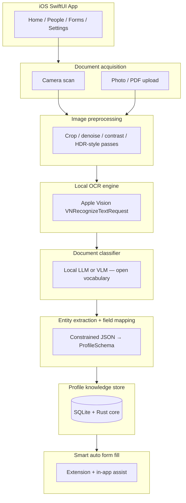
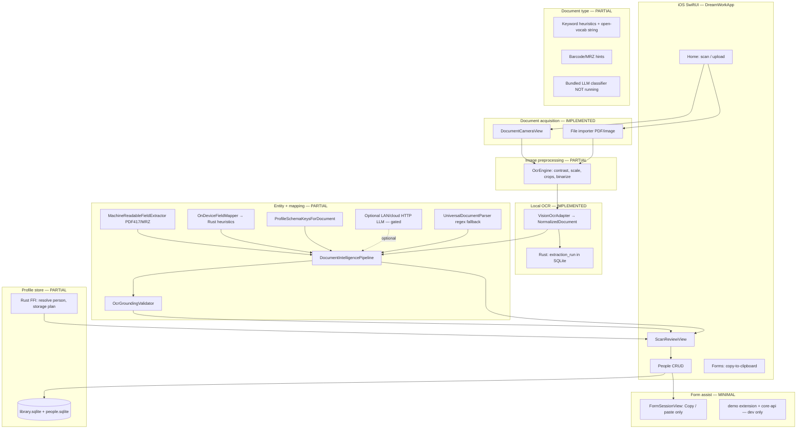

# Project requirements & implementation gap analysis

**Product:** TrustNest / DreamWork (iOS + shared Rust core)  
**Source:** Product architecture brief (May 2026)  
**Compared against:** `dream-work-reality` repo, branch `ganga-2026-05-16-2` (Phase A + May 21, 2026 mapping improvements)  
**Related:** [privacy-first-document-intelligence-architecture.md](privacy-first-document-intelligence-architecture.md) (canonical product vision) · [architecture.md](architecture.md) · [trustnest-zero-egress-design-constraint.md](trustnest-zero-egress-design-constraint.md) · [field-mapping-accuracy-analysis.md](field-mapping-accuracy-analysis.md), [features-list.md](../features-list.md), [implementation-status-testflight-build-27.md](implementation-status-testflight-build-27.md)

---

## 1. Project goal (requirements)

Build an iOS application that:

| # | Requirement | Success criterion |
|---|-------------|-------------------|
| G1 | Scans or uploads documents | Camera, gallery, PDF supported |
| G2 | Performs OCR **locally** on-device | No document bytes sent to cloud for OCR |
| G3 | Detects **document type** using **local AI models** | Open-vocabulary or model-inferred type; not keyword-only routing |
| G4 | Extracts **structured entities** from OCR text | Names, IDs, dates, addresses, etc. |
| G5 | Maps extracted values to **canonical profile fields** | Fixed schema + optional extension keys |
| G6 | Stores all processed data **securely on-device** | Encrypted-at-rest target; SQLite today |
| G7 | Uses extracted data for **intelligent auto-form filling** | Browser and/or in-app forms, role-aware |
| G8 | **Never** sends user data to cloud APIs for product use cases | Zero-egress default; proximity share is explicit exception |

---

## 2. Target architecture (from product brief)

### 2.1 Supported input sources (target)

| Input | Examples |
|-------|----------|
| Camera scan | Live capture |
| Photo upload | Gallery, Files |
| PDF upload | Multi-page |
| Batch scans | Multiple files / folder import |
| Document types (open vocabulary) | Driver license, passport, Aadhaar, PAN, SSN, tax (W-2/1099), insurance, utility, bank, employment, medical, vehicle registration, immigration, contracts, lease agreements — see [privacy-first architecture](privacy-first-document-intelligence-architecture.md) §6 |

---

## 3. As-built architecture (this repo today)

**Key code paths**

| Stage | Primary modules |
|-------|-----------------|
| Acquisition | `HomeView`, `DocumentCameraView`, `DocumentTextExtractor`, `AppState` |
| OCR | `OcrEngine`, `VisionOcrAdapter`, `dreamwork_ocr_apply_normalized_json` |
| Ingest / mapping | `DocumentIntelligencePipeline`, `OnDeviceFieldMapper`, `MachineReadableFieldExtractor`, `OcrGroundingValidator`, `ProfileSchemaKeysForDocument`, `local_document_mapper.rs`, `GenAIFieldMapper` |
| Review / save | `ScanReviewView`, `CoreBridgeService`, `PeopleSQLiteStore` |
| Forms | `FormsView`, `FormSessionView`, `FormTemplates` |

---

## 4. Requirements vs implementation matrix

Legend: **Done** = shipped and usable · **Partial** = exists but incomplete or weak · **Missing** = not implemented · **Dev only** = not production path

### 4.1 Core goals (G1–G8)

| Req | Requirement | Status | What exists | Gap |
|-----|-------------|--------|-------------|-----|
| G1 | Scan / upload documents | **Done** | Camera, PDF, images via Home | No batch/folder import on device |
| G2 | Local OCR | **Done** | Apple Vision, persisted `NormalizedDocument` | English-only v1; no pluggable OCR swap on iOS |
| G3 | Document type via **local AI** | **Partial** | Open-vocab label from heuristics/keywords; PDF417/MRZ inference | **No bundled LLM/VLM classifier**; not model-based understanding |
| G4 | Structured entity extraction | **Partial** | Barcode/MRZ decode; Rust label\|value + Aadhaar/PAN heuristics; OCR grounding drops hallucinations | No general NER/LLM extraction; tax/bank box-level fields missing |
| G5 | Map to canonical profile fields | **Partial** | Default **on-device** Rust mapper; `NameFieldReconciler`; per-field **source** in review UI | No schema-constrained **generative** mapper on device |
| G6 | Secure on-device storage | **Partial** | SQLite (Rust + Swift), OS file protection, privacy manifest | **SQLCipher not wired**; no full vault export; limited history UI |
| G7 | Intelligent **auto** form fill | **Missing** | Copy/paste checklist in app; Chrome extension **demo** only | No DOM injection, no role-aware multi-profile fill, no gap detection in browser |
| G8 | No cloud for use cases | **Done** (Release) | `ZeroEgressPolicy`; **default provider `.onDevice`**; cloud DEBUG-only; network LLM falls back to Rust | Optional LAN LLM in settings (user opt-in); bundled GGUF inference still not running |

### 4.2 Input sources

| Input | Status | Notes |
|-------|--------|-------|
| Camera scan | **Done** | `DocumentCameraView` / scanner flows |
| Photo upload | **Done** | File importer, gallery |
| PDF upload | **Done** | Multi-page via `DocumentTextExtractor` |
| Multi-page documents | **Done** | PDF pages rendered and OCR’d |
| Batch scans | **Missing** | Single document per import from Home; simulator laptop folder import is **dev-only** |
| Folder import / watched folder | **Missing** | In `features-list.md` mandatory/hardening; not in iOS app |

### 4.3 Document types (examples from brief)

| Document type | Status | Notes |
|---------------|--------|-------|
| Driver license (US) | **Partial** | PDF417 + heuristics + dedicated DL scanner path; Texas-specific legacy code demoted |
| Passport (US / Indian) | **Partial** | MRZ + `PassportParser` / `IndianPassportParser` legacy; general pipeline uses MRZ when detected |
| Aadhaar | **Partial** | Rust `find_aadhaar` + `aadhaar_card` type when UIDAI/Aadhaar keywords present |
| PAN card | **Partial** | Rust `find_pan` + `pan_card` type when PAN / Permanent Account Number present |
| SSN card / forms | **Partial** | SSN regex in `UniversalDocumentParser` |
| Tax (W-2, 1099) | **Partial** | Type label heuristics only; no box-level extraction |
| Insurance card | **Partial** | Schema fields exist; weak generic extraction |
| Utility bill | **Partial** | Type keyword; no bill-specific fields |
| Bank statement | **Partial** | Type keyword; no transaction/table extraction |
| Employment forms | **Partial** | Form templates only; no doc ingest templates |
| Medical records | **Partial** | Medical form template; no clinical doc parsing |
| Vehicle registration | **Partial** | Keyword classification in Rust mapper; no dedicated field extractors |
| Generic / arbitrary | **Partial** | Unified pipeline intent; accuracy limited without on-device LLM |

### 4.4 Pipeline stages (architecture diagram)

| Stage | Target | Status | Implementation |
|-------|--------|--------|----------------|
| **Document acquisition** | Camera + upload + batch | **Partial** | Camera + PDF/image; no batch |
| **Image preprocessing** | Crop, denoise, HDR | **Partial** | `OcrEngine` contrast/scale/crops/binarize — not full HDR/deskew pipeline |
| **Local OCR** | On-device text + layout | **Done** | Vision + `NormalizedDocument` blocks |
| **Document classifier** | Local LLM/VLM | **Missing** | Keywords + `DocumentTypePresentation`; GGUF file optional but **not inferred with** |
| **Entity extraction** | Local model | **Partial** | Rust `local_document_mapper` (label\|value, Aadhaar/PAN, SSN context gate); HTTP LLM optional |
| **Field mapping** | Canonical schema | **Partial** | On-device default; `OcrGroundingValidator`; no `PersonNameResolver` on general path |
| **Profile store** | Encrypted SQLite | **Partial** | `library.sqlite`, `people.sqlite`; provenance module in Rust, thin UI |
| **Smart auto form fill** | Extension + in-app | **Missing** | Clipboard-only forms; `apps/extension-demo` + `core-api` for dev |

### 4.5 Zero-egress & security (from [trustnest-zero-egress-design-constraint.md](trustnest-zero-egress-design-constraint.md))

| Capability | Status |
|------------|--------|
| OCR never leaves device | **Done** |
| Default ingest without cloud | **Done** (on-device Rust path) |
| Bundled Qwen GGUF inference | **Missing** (manifest + header check only) |
| Proximity sharing (BLE/NFC) | **Missing** in iOS UI (Rust `proximity` scaffold only) |
| Account-only remote API | **Missing** |
| SQLCipher at rest | **Missing** (ADR 0014 planned) |

### 4.6 Form assistant (from [features-list.md](../features-list.md) §1.4)

| Capability | Status |
|------------|--------|
| Chrome MV3 extension + native messaging | **Missing** (demo extension → localhost `core-api`) |
| Form-page detection | **Missing** |
| Inject values into web forms | **Missing** |
| Multi-profile / role-aware fill (child vs parent) | **Missing** |
| In-app forms in third-party apps | **Missing** |
| Copy-to-clipboard fallback | **Done** (`FormSessionView`) |
| Attach from saved document files | **Missing** |
| Session survivability for forms | **Missing** |

### 4.7 Household & data plane (from features-list)

| Capability | Status |
|------------|--------|
| People CRUD | **Done** |
| Manual entry without scan | **Done** |
| Household relationships | **Done** (labels in schema) |
| Field value history UI | **Missing** |
| Saved scans library | **Missing** |
| Retained document files (encrypted) | **Partial** (`DocumentFingerprintStore` only) |
| Word / Excel import | **Missing** |
| Delete person | **Done** |
| Export all vault data | **Missing** |
| Proximity share grants | **Missing** |

### 4.8 Platform & shared core

| Component | Status |
|-----------|--------|
| iOS app (SwiftUI) | **Done** (primary surface) |
| Android app | **Missing** (docs/adapter only) |
| Desktop companion | **Missing** |
| Rust shared core (`dreamwork_core`) | **Partial** — ingest FFI, SQLite, proximity/crypto stubs |
| `core-api` HTTP service | **Dev/demo** — not production ingest |
| ONNX on-device models | **Missing** (Rust stub) |
| llama.cpp / Metal GGUF | **Missing** (header parse only) |

---

## 5. Why field mapping can still fail (summary)

Phase A and May 21 improvements reduce wrong fields on IDs and bills, but accuracy is still capped because the **classifier + generative extractor are not the target bundled LLM**:

| Issue | Root cause | Doc |
|-------|------------|-----|
| OCR good, fields wrong | Mapper is heuristics, not generative model | [field-mapping-accuracy-analysis.md](field-mapping-accuracy-analysis.md) |
| Empty or few fields | No on-device LLM; regex finds little | Same |
| Wrong name/date on bills | Regex false positives (mitigated: grounding drops values not in OCR) | `OcrGroundingValidator` |
| IDs work sometimes | PDF417/MRZ path only when barcode visible | `MachineReadableFieldExtractor` |
| Random SSN on bills | Bare SSN regex (mitigated: SSN requires “social security” context in Rust mapper) | `local_document_mapper.rs` |
| Works on Mac, not phone | Optional Ollama at `127.0.0.1` | Settings + zero-egress doc |

**Target fix (Phase B):** wire **Qwen2.5 GGUF** + Metal per [device-matrix.md](device-matrix.md) into `DocumentIntelligencePipeline` as the default mapper.

---

## 6. Implementation coverage scorecard

Approximate completion against the **product brief architecture** (not the full `features-list.md` backlog):

| Layer | Weight | Completion | Blocker to 100% |
|-------|--------|------------|-----------------|
| Document acquisition | 15% | **75%** | Batch/folder import |
| Image preprocessing | 10% | **50%** | Deskew, HDR, quality gates |
| Local OCR | 15% | **90%** | Pluggable engines, non-English |
| Document classifier (local AI) | 15% | **20%** | **Bundled LLM not running** |
| Entity extraction + mapping | 25% | **48%** | On-device generative JSON + validation |
| Profile store (secure) | 10% | **55%** | SQLCipher, history, retained files |
| Smart auto form fill | 10% | **10%** | Production browser extension + injection |
| **Overall vs brief** | 100% | **~52%** | Bundled LLM classifier/mapper + form fill |

---

## 7. Recommended implementation order

Aligned with [field-mapping-accuracy-analysis.md](field-mapping-accuracy-analysis.md) and ADRs:

| Phase | Focus | Unblocks |
|-------|--------|----------|
| **A** | **Shipped** (May 2026) | No `PersonNameResolver` on general ingest; PDF417/MRZ; mapping notices; Estimated confidence | Fewer wrong fields on IDs/bills |
| **A+** | **Shipped** (May 21, 2026) | `OcrGroundingValidator`; field `mappingSource`; narrowed LLM schema keys; Aadhaar/PAN/1099 Rust types; layout label fix | Grounded heuristics; honest review |
| **B** | Bundle **Qwen GGUF** + Metal; grammar-validated JSON mapping | G3, G4, G5 accuracy |
| **C** | SQLCipher, provenance/history UI, retained scan files | G6 |
| **D** | Chrome extension + native messaging + form injection | G7 |
| **E** | Batch import, Office docs, Android parity | Input scale |

---

## 8. File map for reviewers

| Topic | Document |
|-------|----------|
| Product mandatory/wish features | [features-list.md](../features-list.md) |
| Zero egress rules | [trustnest-zero-egress-design-constraint.md](trustnest-zero-egress-design-constraint.md) |
| Field mapping diagnosis | [field-mapping-accuracy-analysis.md](field-mapping-accuracy-analysis.md) |
| OCR / mapping deep dive | [document-intelligence-deep-dive.md](document-intelligence-deep-dive.md) |
| TestFlight snapshot (may predate Phase A) | [implementation-status-testflight-build-27.md](implementation-status-testflight-build-27.md) |
| Model artifacts | [device-matrix.md](device-matrix.md) |
| ADR index | [adr/README.md](adr/README.md) |

---

## 9. Summary

The repo **implements the shell of the product brief**: local OCR, scan/upload, people profiles, review-before-save, and a **privacy-oriented** ingest path without cloud by default.

It **does not yet implement the core differentiators** in the brief:

1. **Local AI document classification** (bundled model inference)  
2. **Local AI entity extraction and field mapping** (beyond heuristics + barcode/MRZ)  
3. **Smart auto-form filling** (production browser extension and DOM automation)  
4. **Full secure data plane** (encryption, history, batch ingest, many document types)

The largest gap between **vision and code** is the middle of the pipeline — **classifier + extractor** — not the camera or OCR stage.

---

## 10. Changes implemented (May 21, 2026)

| Area | Change | Files |
|------|--------|-------|
| Phase A pipeline | Single ingest path: machine-readable → on-device Rust → optional network LLM with fallback → universal regex; `NameFieldReconciler` only | `DocumentIntelligencePipeline.swift` |
| Barcode/MRZ | PDF417 + MRZ fields without network | `MachineReadableFieldExtractor.swift` |
| Honest UX | `mappingNotice`, Estimated confidence, per-field source in review | `ScanReviewView.swift`, `OcrFieldSuggestion.swift` |
| OCR grounding | Drop mapped values not found in OCR (except barcode/MRZ) | `OcrGroundingValidator.swift` |
| Schema prompt | Category-narrowed keys for network LLM | `ProfileSchemaKeysForDocument.swift`, `GenAIFieldMapper.swift` |
| Rust mapper | Aadhaar/PAN extractors; SSN requires context; more `document_type` labels | `local_document_mapper.rs` |
| Layout | Fix label\|value pairing (mixed-case values no longer treated as labels) | `OcrLayoutSerializer.swift` |
| Tests | 74 iOS tests + 5 Rust mapper tests passing | `DreamWorkAppTests/*`, `local_document_mapper` tests |

**Still open for Phase B:** run inference on bundled Qwen GGUF (`GenerativeLlmSession` / Metal), grammar-constrained JSON, per-field provenance in SQLite UI.

---

*Last updated: May 21, 2026 — requirements from product architecture brief; gap analysis vs `ganga-2026-05-16-2` with Phase A/A+ shipped.*
