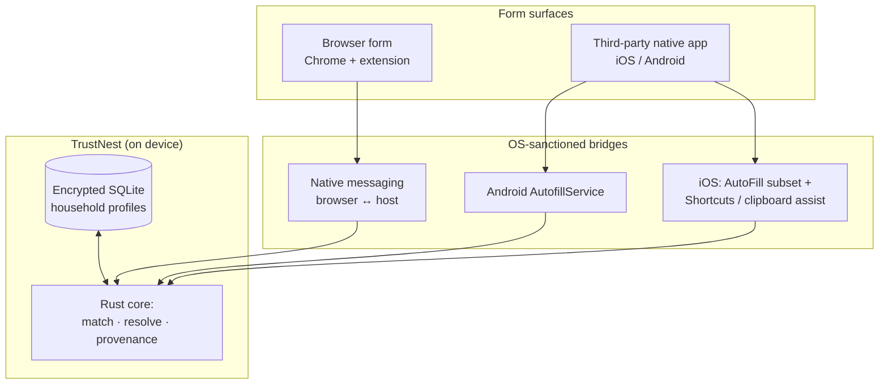
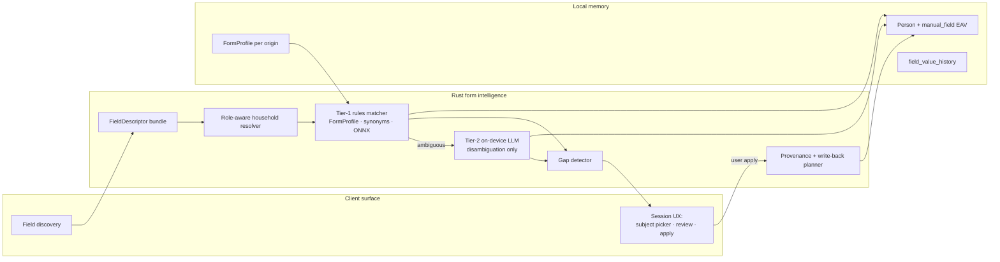
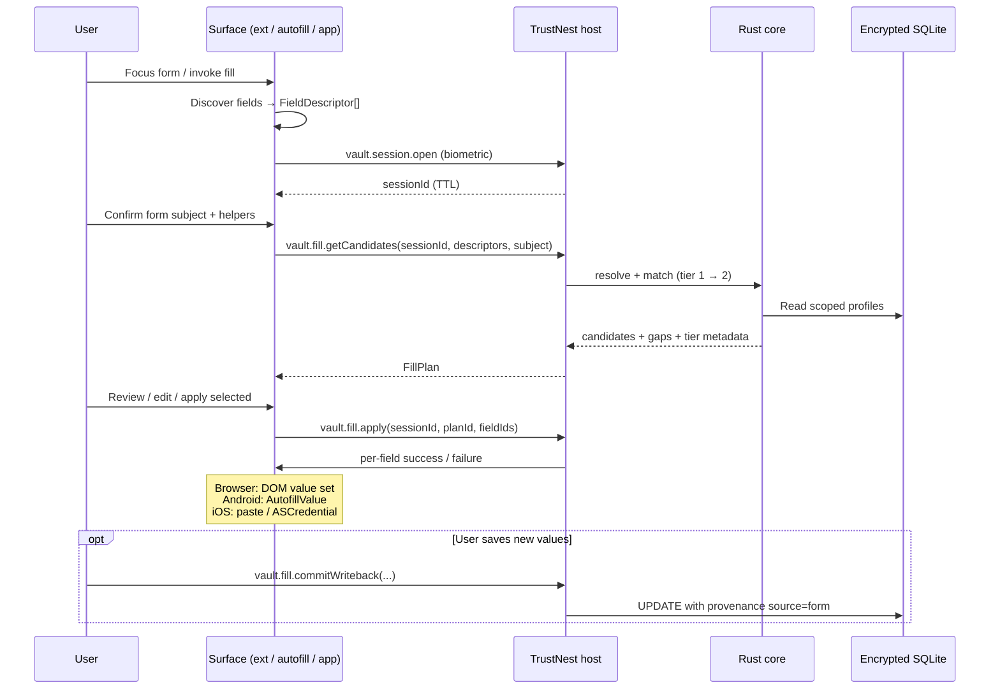
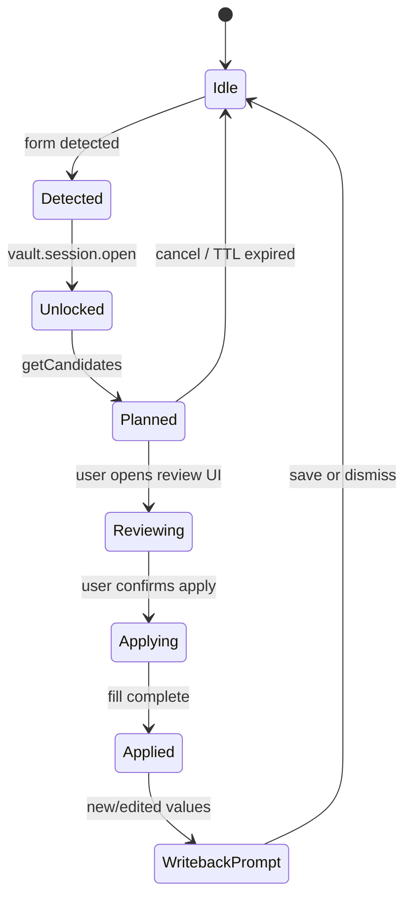
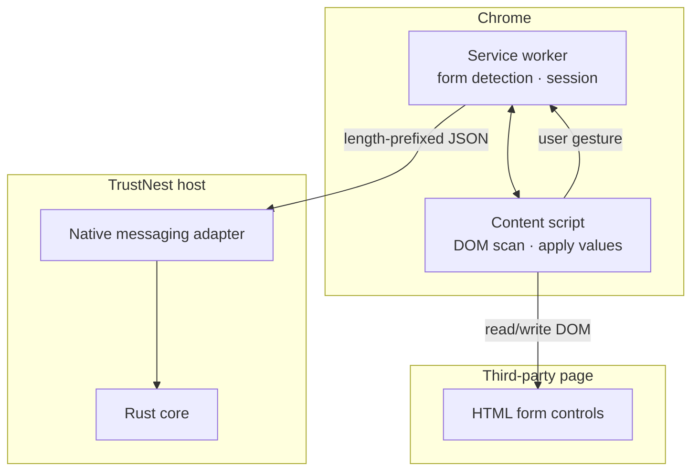
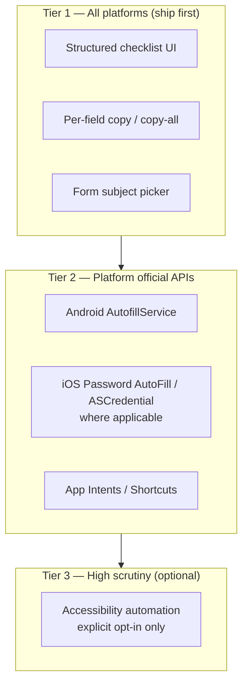
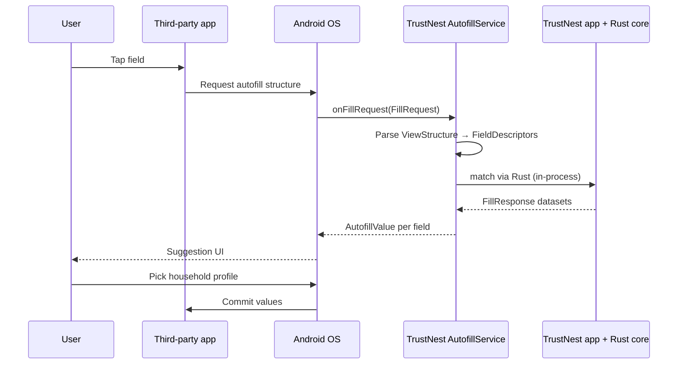
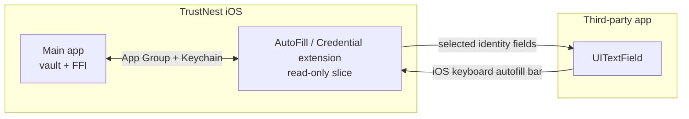
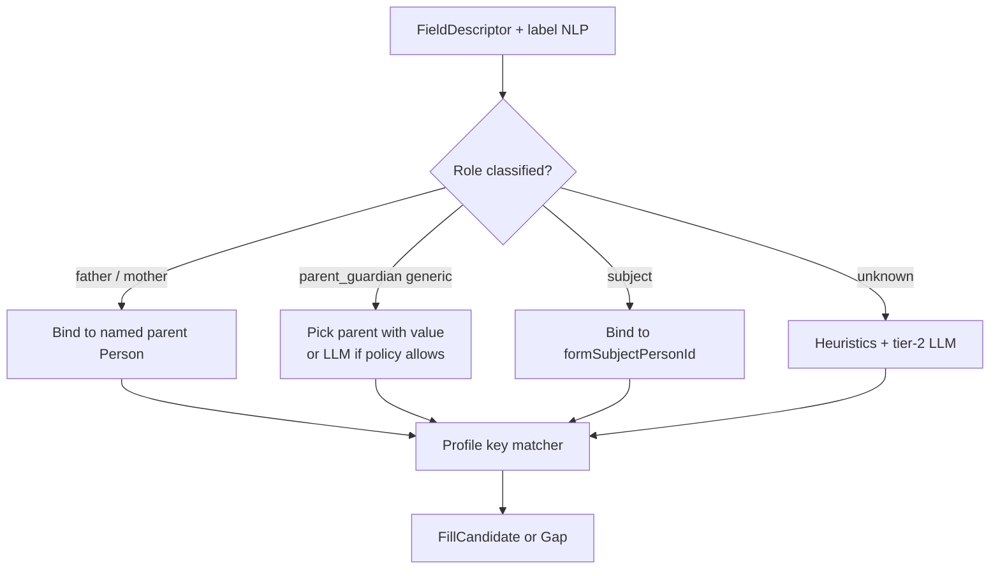
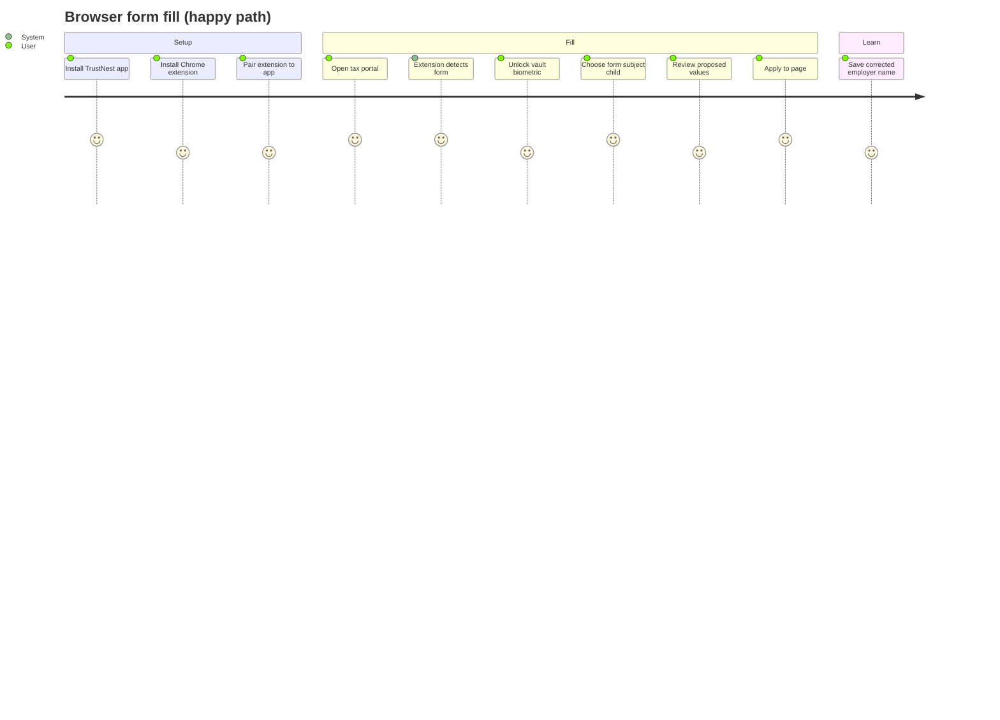

# TrustNest: Cross-Platform Form Automation — Technical Deep Dive

**Status:** Architecture & implementation guide  
**Audience:** Engineering, product, security review  
**Related:** [`architecture.md`](architecture.md), [`brainstorming-topic-filling-form-in-another-app.md`](../brainstorming-topic-filling-form-in-another-app.md), ADR [0006](adr/0006-form-fill-rules-first-llm-second.md), [0007](adr/0007-browser-extension-mv3-native-messaging.md), [0016](adr/0016-extension-native-messaging-protocol-and-threat-model.md), [`integration/`](../integration/)

---

## 1. Product vision (technical framing)

TrustNest is the **master store of household information** on the user’s device. A household is a set of **Person** records with **relationships** (Self, Spouse, Child, Parent, …) and **canonical profile fields** (identity, contact, address, government IDs, medical, tax).

**Form automation** means: given an arbitrary form (browser or native app), the platform must:

1. **Discover** input fields and their semantic intent (name, DOB, “Father’s phone”, insurance member ID, …).
2. **Resolve** which household member(s) each field refers to (form subject vs parent vs emergency contact).
3. **Match** discovered intents to values in encrypted local storage.
4. **Apply** values in a user-controlled, auditable way—never silent auto-submit, never fighting OS autofill without policy.



**Non-goals (honest positioning):** Universal silent injection into every third-party app on iOS; server-side form scraping; auto-submit or OTP harvesting.

---

## 2. Logical architecture (shared across surfaces)

All surfaces share one **Rust core** (`dreamwork_core`) and one **local vault**. UI shells (iOS SwiftUI, Android Compose, desktop host, extension) are thin; security-sensitive matching lives in Rust once (ADR 0013, 0015).



### 2.1 Canonical data model (today + target)

| Layer | Implementation today | Target |
|-------|---------------------|--------|
| Person | `manual_entry` + `manual_field` (Rust); `people` table (iOS SQLite) | Single source via FFI sync |
| Field keys | `ProfileFieldKey` / `profile_keys.rs` | Stable canonical keys + extension keys for unknowns |
| Relationships | `relationship` field → `HouseholdRelationship` | Graph edges for multi-profile resolution |
| Form learning | `FormProfile` (planned); demo uses static synonym map in `content.js` | Per-`origin` fingerprints in SQLite |
| Ingest → fill | Stages 1–3 ingest pipeline populates profiles | Same rows power fill |

**Household-aware fill** requires two inputs on every session:

- **`formSubjectPersonId`** — who the form is *about* (child on school form, patient on intake).
- **`fieldRoles`** — semantic role per discovered field: `subject`, `parent_guardian`, `father`, `mother`, `emergency_contact`, `subscriber`, etc.

Resolution rules (from product spec):

- **Role-specific** (“Father’s phone”) → only that person’s row; if missing → **gap**, no borrowing from spouse.
- **Undifferentiated** (“Parent/guardian phone”) → either parent with provenance; optional on-device LLM pick when one row is empty (policy-gated).

---

## 3. End-to-end form-fill pipeline

This pipeline is **identical in spirit** for browser and native; only **field discovery** and **value application** differ per platform.



### 3.1 `FieldDescriptor` (surface → core contract)

Every discovered control is normalized before matching:

```json
{
  "fieldId": "f_7a2c",
  "controlType": "text|email|tel|date|select|checkbox|radio|file",
  "hints": {
    "autofillHint": "emailAddress",
    "htmlName": "patient_email",
    "htmlId": "email",
    "labelText": "Patient email address",
    "placeholder": "you@example.com",
    "ariaLabel": null,
    "nearbyText": "Contact information"
  },
  "inferredRole": "subject|parent_guardian|father|mother|emergency_contact|unknown",
  "confidence": 0.82,
  "frameOrigin": "https://clinic.example.com"
}
```

| Source | Browser extension | Android Autofill | iOS (limited) |
|--------|-------------------|------------------|---------------|
| Labels | DOM `label[for]`, `aria-labelledby`, parent text | `ViewStructure` hints | Accessibility label (if exposed) |
| Types | `input type`, `autocomplete` | `AutofillId` + hint constants | `UITextContentType` via host app only |
| Context | `origin`, form fingerprint | `packageName` + activity | App bundle ID (autofill extension context) |

### 3.2 Matching tiers (ADR 0006)

| Tier | Mechanism | When used |
|------|-----------|-----------|
| **1** | Saved `FormProfile` for `origin` + field fingerprint; synonym tables; regex; small ONNX field-type classifier | Repeat visits, known portals |
| **2** | On-device LLM: label cluster + metadata → **reference** to `personId` + `profileKey` (not raw secret in prompt logs) | First visit, ambiguous labels |

Rust scaffold today: `RulesFirstMatcher` in `core/dreamwork_core/src/form.rs` — extend with `FormProfile` store and role-aware resolver.

### 3.3 Session state machine



**Never auto-submit.** OTP, payment, and CVV-class fields: **deny-by-default** unless explicit unlock policy.

---

## 4. Browser forms — extension + host

### 4.1 Trust boundary

| Component | Holds secrets? | Role |
|-----------|----------------|------|
| **MV3 extension** | No vault, no DB | DOM discovery, UI, IPC only |
| **TrustNest host** (mobile app or desktop companion) | Yes | Loads Rust core + SQLCipher; validates extension ID + `sessionId` |
| **Web page** | Untrusted | Must not receive vault IPC |

ADR 0007 + 0016: Chromium **native messaging** = `uint32` LE length + UTF-8 JSON body; application envelope is JSON-RPC 2.0.

### 4.2 Browser flow (target production)



**Form-page detection (mandatory):** Service worker scores active tab: `input`, `select`, `textarea` count, `form` elements, ARIA roles, URL heuristics. Below threshold → extension **idle** (no content script injection).

**Coexistence with Chrome Autofill:** Assisted fill only on **explicit user action** (toolbar, shortcut). No competing `input` events on focus.

### 4.3 Wire protocol (implemented in `integration/`)

| Method | Purpose |
|--------|---------|
| `vault.session.open` | User unlock in host → `sessionId` |
| `vault.fill.getCandidates` | Field descriptors + context → match plan |
| `vault.fill.apply` | *(spec)* Apply approved subset |
| `vault.fill.commitWriteback` | *(spec)* Persist user edits from form |

Example request (fixture):

```json
{
  "jsonrpc": "2.0",
  "id": "req-fill-001",
  "method": "vault.fill.getCandidates",
  "params": {
    "apiVersion": 1,
    "sessionId": "sess_8e6f2f90",
    "context": {
      "origin": "https://example.com",
      "formSubjectPersonId": "person_child_01",
      "fieldDescriptors": []
    }
  }
}
```

### 4.4 Host placement options

| Deployment | Host process | Typical user |
|------------|--------------|--------------|
| **Desktop** | TrustNest desktop companion | Laptop form filling |
| **Mobile** | TrustNest iOS/Android app (background bridge) | Phone Chrome + same vault as app |

**Mobile bridge note:** iOS/Android can register a native messaging host only where the platform allows (desktop Chromium is primary). On mobile Chrome, product may use:

- **Same-device loopback** (localhost with mutual auth — dev/demo only today via `core-api` HTTP), or
- **Custom URL scheme / App Group** handshake: extension opens app → app returns fill plan via shared container (product decision; stricter than desktop NM).

**Current repo state:** `apps/extension-demo` uses HTTP to `127.0.0.1:18081` for demos; `integration/` defines production JSON-RPC. Production path: **native messaging → host → Rust FFI**, not HTTP.

### 4.5 Extension implementation checklist

| Step | Component | Details |
|------|-----------|---------|
| 1 | `manifest.json` MV3 | `nativeMessaging`, `activeTab`, host permissions |
| 2 | Service worker | Tab listeners, form score, `connectNative('com.trustnest.host')` |
| 3 | Content script | `collectFieldDescriptors()`, `applyFillPlan()` — evolve from `extension-demo/content.js` |
| 4 | Popup / side panel | Person picker, “Form about: [Name]”, gap list, Apply |
| 5 | Host binary | Platform installer registers NM host manifest pointing to TrustNest |
| 6 | Pairing | Extension ID allowlist in host; first-run “Connect extension” in app |
| 7 | CI | `integration/validate_protocol.py` + Playwright e2e (`scripts/fill_form.py` pattern) |

### 4.6 DOM discovery (reference algorithm)

Already prototyped in `apps/extension-demo/content.js`:

1. Query `input`, `select`, `textarea` (visible, not `disabled`/`hidden`).
2. Build **best label** from: `label[for]`, wrapping `<label>`, `aria-labelledby`, `aria-label`, `placeholder`, `name`/`id`, nearby container text (`.field`, `role=group`, MUI roots).
3. Map label tokens to **canonical hints** via synonym table (first_name, insurance_member_id, …).
4. Infer **role** from label (“patient”, “mother”, “guardian”, …) + session subject.
5. Send bundle to host; receive `{ fieldId → { value, sourcePersonId, profileKey, tier } }`.
6. Apply: set `.value`, dispatch `input` + `change` events; respect `react`/`vue` controlled components; skip `readonly` unless policy allows.

---

## 5. Third-party native apps — platform strategies

Native UI has **no DOM**. Discovery uses **OS APIs**; application uses **Autofill**, **Accessibility** (restricted), or **assisted handoff**.

### 5.1 Strategy tiers (recommended product path)



| Tier | iOS | Android | Trust / review risk |
|------|-----|---------|---------------------|
| **1 Assisted handoff** | **High** feasibility | **High** | Low — current `FormSessionView` pattern |
| **2 OS Autofill** | Low–medium for rich household schema | **Medium–high** for standard hints | Medium — user enables in Settings |
| **3 Accessibility automation** | Technically possible, **App Store risk** | Technically strong, **Play policy risk** | High — not default launch |

### 5.2 Android — primary native automation path

Android 8+ **Autofill Framework** is the best-aligned “fill another app” mechanism.



**Implementation outline:**

| Piece | Package / class | Responsibility |
|-------|-----------------|----------------|
| `AutofillService` | `TrustNestAutofillService` | `onFillRequest`, `onSaveRequest` |
| Structure parser | `AutofillStructureWalker` | Map `AutofillId` → hints, labels, types |
| Dataset builder | `HouseholdFillDatasetBuilder` | One dataset per person or per “form session” |
| Settings | System → Autofill → TrustNest | User opt-in (required) |
| Save pipeline | `onSaveRequest` | Write-back new values user typed (with consent) |

**Manifest essentials:**

```xml
<service
    android:name=".autofill.TrustNestAutofillService"
    android:permission="android.permission.BIND_AUTOFILL_SERVICE"
    android:exported="true">
  <intent-filter>
    <action android:name="android.service.autofill.AutofillService" />
  </intent-filter>
  <meta-data
      android:name="android.autofill"
      android:resource="@xml/autofill_service_config" />
</service>
```

**Field mapping:** Map Android `AutofillHint` constants (`NAME_GIVEN`, `EMAIL_ADDRESS`, `PHONE`, …) to canonical `profile_keys`. For unknown labels, use same tier-1/tier-2 matcher as browser, keyed by `packageName` + activity class as `FormProfile` origin (`com.bank.app/MainActivity`).

**Limits:** Custom corporate apps with non-standard views may expose poor hints; fallback to Tier 1 overlay UI (“Copy mode”).

### 5.3 iOS — constraints and realistic paths

| Approach | Mechanism | Feasibility | Notes |
|----------|-----------|-------------|-------|
| **Assisted handoff** | In-app `FormSessionView`: checklist + clipboard | **Ship now** | No special entitlements |
| **Password AutoFill / ASCredential** | `ASCredentialProviderViewController` | Narrow | Credentials & associated domains—not arbitrary household JSON |
| **AutoFill Extension** | Custom credential provider extension | Medium for **saved identities** | Model as “identity cards” per person, not full DB exposure |
| **App Intents / Shortcuts** | User-run shortcut: “Copy child DOB” | Medium | Power users; not in-flow |
| **Accessibility API** | Traverse other apps’ AX tree | Technically possible | **Rejection risk** if used for non-a11y automation |
| **Screen OCR + tap** | Vision + simulated taps | Fragile | Not trust-first; avoid |

**Recommended iOS v1→v2:**

1. **v1:** Tier 1 only + excellent session UX (subject picker, multi-person “also using”, gap prompts). Already aligned with `FormsView` / `FormSessionView`.
2. **v2:** **Credential Provider / identity picker** extension packaged as discrete autofill identities (e.g. “Alex — contact card”) backed by same Rust core via App Group.
3. **v3:** Evaluate iOS 17+ APIs and App Store policy changes; avoid accessibility automation as default.



### 5.4 Tablet / phone Chrome on mobile

Same as desktop browser path where **Chrome + extension** is supported on the device. TrustNest app acts as **native messaging host** (or approved bridge). Vault is identical to People tab data (today synced via `CoreAPISync` in demos).

---

## 6. Multi-person / role-aware resolution (deep dive)

Pediatric clinic form example:

| Form field | Semantic role | Person resolved |
|------------|---------------|-----------------|
| Patient first name | `subject` | Child (form subject) |
| Patient DOB | `subject` | Child |
| Mother’s cell | `mother` | Mother’s profile only |
| Father’s cell | `father` | Father’s profile only |
| Parent/guardian phone | `parent_guardian` | Either parent (provenance recorded) |
| Insurance subscriber ID | `subscriber` | Policy holder (often self or spouse) |



**Gap types:**

- `missing_role_specific` — “Father’s phone” but father row empty → **must prompt**
- `missing_generic` — no parent has phone → prompt or scan document
- `ambiguous_person` — entity resolution returns `ambiguous` (reuse ingest `PersonResolution`)

Reuse ingest stage 3 (`dreamwork_resolve_person_json`) patterns for “which person is this document about?” adapted to “which person is this field about?”.

---

## 7. Security & privacy

| Principle | Implementation |
|-----------|----------------|
| Local-first | No household payload on TrustNest backend for fill (ADR 0001) |
| Session TTL | `sessionId` after biometric; 5–15 min default |
| Extension pairing | Host allowlists extension ID |
| Threat model | ADR 0016 T1–T5 (malicious page, extension, malware, shoulder surfing) |
| Logging | Method names + correlation IDs only; never PII in logs |
| Sensitive fields | SSN, full account numbers: extra confirm / mask in UI |
| Write-back | User consent per field batch; provenance `source=form` |

---

## 8. Implementation roadmap

### Phase 0 — Foundation (partially done)

- [x] Household CRUD + canonical keys (iOS + Rust)
- [x] Ingest pipeline stages 1–3
- [x] Demo extension + HTTP bridge
- [x] JSON-RPC fixtures (`vault.session.open`, `vault.fill.getCandidates`)
- [x] Tier-1 matcher scaffold (`form.rs`)
- [x] iOS Tier-1 copy checklist (`FormSessionView`)

### Phase 1 — Browser MVP

- [ ] Production native messaging host (desktop + mobile bridge design)
- [ ] Implement `vault.fill.apply` + schemas in `integration/`
- [ ] Replace HTTP demo with NM + session TTL
- [ ] Form-page detection in service worker
- [ ] Person / subject picker in extension UI
- [ ] `FormProfile` persistence per origin in SQLite
- [ ] Playwright + NM integration tests

### Phase 2 — Android native

- [ ] `TrustNestAutofillService` + structure walker
- [ ] Jetpack Compose shell sharing Rust `.so` (ADR 0015)
- [ ] Settings onboarding (“Enable TrustNest Autofill”)
- [ ] `onSaveRequest` write-back

### Phase 3 — iOS native polish

- [ ] Credential / identity AutoFill extension (App Group)
- [ ] Shortcuts for common copy actions
- [ ] Deep link from extension bridge on iOS Chrome

### Phase 4 — Intelligence & learning

- [ ] Tier-2 on-device LLM for ambiguous fields (ADR 0017)
- [ ] Opt-in telemetry: tier usage, user corrections
- [ ] ONNX field-type classifier in tier 1

---

## 9. Component map (repo → target)

| Concern | Current location | Target |
|---------|------------------|--------|
| Canonical keys | `profile_keys.rs`, `ProfileSchema.swift` | Single exported schema |
| Rules matcher | `core/dreamwork_core/src/form.rs` | + FormProfile + roles |
| DOM discovery | `apps/extension-demo/content.js` | Production content script |
| Protocol | `integration/protocol/*.json` | + apply / writeback methods |
| Host / API | `core/core_api` (demo HTTP) | NM adapter in desktop/mobile host |
| iOS handoff | `FormSessionView.swift` | Keep as fallback; add extension |
| Android autofill | `docs/android/mlkit-ocr-adapter.md` only | New `apps/android/` module |
| Entity resolution | `entity_resolution.rs` | Reuse in fill resolver |
| GenAI mapping | `GenAIFieldMapper.swift`, `/genai/map-fields` | Tier-2 fill disambiguation |

---

## 10. API surface summary (host methods)

| Method | Risk | Auth |
|--------|------|------|
| `vault.session.open` | Medium | Biometric in host |
| `vault.session.close` | Low | Session invalidate |
| `vault.fill.getCandidates` | Medium | `sessionId` |
| `vault.fill.apply` | High | `sessionId` + user gesture proof |
| `vault.fill.commitWriteback` | High | `sessionId` + per-field consent |
| `vault.profile.list` | Low | Optional session |
| `vault.formProfile.save` | Low | User-edited mapping override |

---

## 11. Testing strategy

| Layer | Approach |
|-------|----------|
| Protocol | `python3 integration/validate_protocol.py` |
| Matcher | Rust unit tests (`form.rs` pattern) + golden files per origin |
| Extension | Playwright against `demo/form/demo-form.html` |
| Android AF | Espresso + `AutofillService` test harness |
| iOS | UITests for copy flow; manual AX / AutoFill extension tests |
| E2E household | Multi-person fixtures (`demo/sample-documents/person-alex-profile.json`) |

---

## 12. Open decisions

1. **Mobile Chrome bridge:** Native messaging vs App Group return channel on iOS/Android?
2. **Desktop companion:** Required for browser fill on laptop, or optional if phone hosts vault?
3. **Android v1 scope:** Autofill-only vs Autofill + floating “copy assistant” overlay?
4. **iOS identity extension:** Ship as v2 or pursue ASCredential identity cards earlier?
5. **HTTP demo retirement:** Timeline to remove `core-api` from extension path?

---

## 13. Summary

| Surface | Discovery | Apply mechanism | MVP realism |
|---------|-----------|-----------------|-------------|
| **Browser** | DOM + extension | JS value set via user-invoked fill | **High** — primary investment |
| **Android other apps** | `AutofillService` structure | OS autofill datasets | **Medium–high** for standard fields |
| **iOS other apps** | Checklist + clipboard; later credential extension | User paste / system autofill bar | **High** (Tier 1); **medium** (Tier 2) |
| **All** | Rust core matching + household roles | Local vault only | Aligns with TrustNest privacy story |

TrustNest’s defensible promise: **“We fill forms where the OS and browser allow, with you in control; everywhere else we make handoff fast.”**—not universal silent automation of every app.

---

## Appendix A — Visual: user journey (browser)



## Appendix B — `FillPlan` response shape (proposed)

```json
{
  "jsonrpc": "2.0",
  "id": "req-fill-001",
  "result": {
    "planId": "plan_abc",
    "formSubject": { "personId": "p_child", "displayName": "Sam" },
    "alsoUsing": [{ "personId": "p_mom", "role": "mother" }],
    "fields": [
      {
        "fieldId": "f_7a2c",
        "profileKey": "email",
        "personId": "p_child",
        "value": "sam@example.com",
        "tier": 1,
        "confidence": 0.96,
        "displayLabel": "Patient email"
      }
    ],
    "gaps": [
      {
        "fieldId": "f_9b1d",
        "reason": "missing_role_specific",
        "message": "Father's phone not in household memory",
        "requiredRole": "father",
        "profileKey": "phone_mobile"
      }
    ]
  }
}
```

## Appendix C — References

- Chromium Native Messaging: https://developer.chrome.com/docs/apps/nativeMessaging
- Android Autofill: https://developer.android.com/guide/topics/text/autofill-services
- Apple AutoFill Extension: https://developer.apple.com/documentation/authenticationservices
- In-repo brainstorm: [`brainstorming-topic-filling-form-in-another-app.md`](../brainstorming-topic-filling-form-in-another-app.md)
