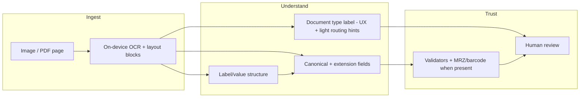

# TrustNest — Document type classification: gap analysis and Hugging Face model landscape

**Product:** TrustNest (DreamWork iOS + Rust core)  
**Use case:** Users upload or scan arbitrary documents; the app must infer a useful **document type label** and **extract structured fields** for profile/autofill — without per-issuer template parsers and without cloud egress.  
**Investigation date:** 2026-05-25  
**Related:** [trustnest-document-field-identification-investigation.md](trustnest-document-field-identification-investigation.md), [document-intelligence-deep-dive.md](document-intelligence-deep-dive.md), [layoutlmv3-layout-pairing-model.md](layoutlmv3-layout-pairing-model.md), [device-matrix.md](device-matrix.md)

---

## Executive summary

| Question | Answer |
|----------|--------|
| Is there a gap vs a **purpose-trained document image classifier**? | **Yes.** Production classification is **prompt-based Qwen2.5 GGUF over OCR/layout text**, not a vision model trained for document-type discrimination (e.g. RVL-CDIP / DiT). |
| Is Qwen2.5 the wrong model family? | **Wrong tool for the job if used alone as a “classifier.”** It is the **right family for open-vocabulary field extraction** when constrained JSON + validators are wired; reusing the same 3B instruct GGUF for **both** classify and extract is a **cost and calibration** tradeoff, not a dedicated classifier. |
| Is RVL-CDIP / DiT the right drop-in? | **Only for coarse office-document categories** (letter, invoice, form, …). It does **not** label passport, driver license, utility bill, or other TrustNest-high-value types — without **custom fine-tuning** on a new label set. |
| What should we ship? | **Tiered, task-specific models:** Vision OCR (Apple) → optional **small image classifier** (coarse gate or custom taxonomy) → **LayoutLMv3** (label/value geometry) → **Qwen GGUF** (schema JSON extraction). Do not expect one HF checkpoint to do all three. |

---

## 1. What TrustNest actually needs (and what it does not)

### 1.1 Primary jobs on upload/scan



| Job | Input | Output | Must be on-device |
|-----|--------|--------|-------------------|
| **Type label** | OCR text and/or page image | Open-vocabulary or mapped `document_type` + calibrated confidence | Yes |
| **Field extraction** | Layout-aware OCR (+ optional image) | JSON keyed to `ProfileSchema` + extensions | Yes |
| **Layout pairing** | OCR tokens + bounding boxes | `label \| value` pairs | Yes (LayoutLMv3 path) |

### 1.2 Product constraints (from ADRs and pipeline code)

- **Zero egress** — no cloud LLM or HF Inference API in production ([trustnest-zero-egress-design-constraint.md](trustnest-zero-egress-design-constraint.md)).
- **General-purpose ingest** — no growing keyword/template libraries per issuer ([document-intelligence-deep-dive.md](document-intelligence-deep-dive.md) §0).
- **Type label is cosmetic for routing** — must not select Texas-DL-style parsers; enum `ScannedDocumentType` is a **UI bucket**, not the source of truth ([DocumentTypePresentation.swift](../apps/ios/DreamWorkApp/Sources/Core/DocumentTypePresentation.swift)).
- **Fail-closed local ML** — `ClassificationAgent` returns explicit failure when GGUF is missing; no keyword fallback in the strict pipeline ([ClassificationAgent.swift](../apps/ios/DreamWorkApp/Sources/Intelligence/Agents/ClassificationAgent.swift)).

### 1.3 “Not too specific, not unsuitable”

| Avoid | Prefer |
|-------|--------|
| RVL-CDIP **out of the box** for “passport vs driver license” | Model trained or prompted on labels that match **user-facing identity/financial documents** |
| 1.9 GB Qwen inference **only** to guess `utility_bill` from OCR snippets | **Small vision classifier** (tens of MB) for coarse class, **or** merge type + fields in **one** LLM call |
| LayoutLMv3 for **document type** | LayoutLMv3 for **form entity / label-value roles** (already chosen in repo) |
| Donut/CORD parsers for **all** uploads without fine-tune | Donut-style models **only** if product commits to template-specific training data per format |

---

## 2. Current implementation (confirmed gap)

### 2.1 Document classifier artifact = general instruct LLM

`model-manifest.json` registers **`document.classifier.v1`** with the **same file** as schema extraction:

| Field | Value |
|-------|--------|
| Filename | `Qwen2.5-3B-Instruct-Q4_K_M.gguf` (~1.93 GB) |
| HF source | [bartowski/Qwen2.5-3B-Instruct-GGUF](https://huggingface.co/bartowski/Qwen2.5-3B-Instruct-GGUF) |
| Engine ID | `llm.document_classifier.v1` |

Rust classifier (`ml_document_classifier.rs`) calls `generate_constrained_json` with a **free-form prompt**:

```text
Classify this OCR/layout text into an open-vocabulary document type.
Return JSON: {"document_type":"snake_case_type","display_label":"...","confidence":0.0}
```

There is **no vision encoder**, **no RVL-CDIP head**, and **no fine-tuned classification weights** — only llama.cpp text generation on OCR concatenation.

### 2.2 Implications

| Property | Prompt-based Qwen | Purpose-trained image classifier (e.g. DiT-RVL-CDIP) |
|----------|-------------------|------------------------------------------------------|
| Input modality | Text (OCR errors propagate) | Pixels (layout, logos, seals visible) |
| Label space | Open vocabulary (unbounded, drift) | Fixed training set (calibrated softmax) |
| Identity docs | Relies on OCR reading “PASSPORT”, “DRIVER LICENSE” | RVL-CDIP has **no** passport/DL classes |
| Latency / RAM | Heavy (full 3B decode per classify) | Light (ViT-Tiny ~22 MB, DiT-base larger) |
| Suitability for TrustNest | Good for **arbitrary** types + same stack as extraction | Good for **coarse** archival classes; **bad OOTB** for PII document taxonomy |

**Conclusion:** The stated gap is real: we use a **general instruct LLM as a text classifier**, not a **document image classification model**. That is a deliberate tradeoff for open vocabulary, not an accidental misconfiguration — but it is **not** the same capability as RVL-CDIP-style models.

### 2.3 Adjacent code (do not confuse with classifier)

| Component | Role |
|-----------|------|
| `DocumentTypeClassifier.swift` | Legacy keyword bags — **deprecated** for strict pipeline; still in tree |
| `MachineReadableFieldExtractor` | MRZ / PDF417 — **payload decode**, not type classification |
| `layoutlmv3.v1` | **FUNSD** token roles → label/value pairs — **not** document category |
| `llm.schema.lite.v1` | Field JSON mapping — same Qwen weights as classifier today |

---

## 3. Task taxonomy on Hugging Face (what each model family is for)

| Task | Typical HF model families | TrustNest stage |
|------|---------------------------|-----------------|
| **Document image classification** | DiT, ViT, Donut-Swin head, CNNs on RVL-CDIP | Optional **coarse** type or custom fine-tune |
| **Document layout analysis** | LayoutLMv3, PP-DocLayout, DiT for layout | **LayoutLMv3** (paired fields) |
| **OCR** | PaddleOCR, TrOCR, LightOnOCR, Apple Vision | **Vision** (platform) |
| **OCR-free VDU / parsing** | Donut, Pix2Struct | Optional; needs format-specific fine-tune |
| **Schema / open field extraction** | Instruct LLMs (Qwen2.5), smaller JSON LLMs | **Qwen GGUF** + validators |
| **Binary gate** | MobileNet document vs photo | Optional pre-filter |

Mixing these causes the “unsuitable model” failure mode — e.g. using LayoutLM for passport vs bill, or RVL-CDIP for MRZ-heavy identity cards.

---

## 4. Hugging Face models — deep dive by fit

### 4.1 RVL-CDIP lineage (purpose-trained **document image** classification)

**Dataset:** [aharley/rvl_cdip](https://huggingface.co/datasets/aharley/rvl_cdip) — 400k grayscale images, **16 classes** (English office / tobacco-archive style):

| ID | Label |
|----|--------|
| 0 | letter |
| 1 | form |
| 2 | email |
| 3 | handwritten |
| 4 | advertisement |
| 5 | scientific report |
| 6 | scientific publication |
| 7 | specification |
| 8 | file folder |
| 9 | news article |
| 10 | budget |
| 11 | invoice |
| 12 | presentation |
| 13 | questionnaire |
| 14 | resume |
| 15 | memo |

**Representative checkpoints:**

| Model | Params / size | Task | HF link | TrustNest fit |
|-------|----------------|------|---------|----------------|
| **microsoft/dit-base-finetuned-rvlcdip** | DiT-base | 16-class image CLS | [link](https://huggingface.co/microsoft/dit-base-finetuned-rvlcdip) | **Medium** for “invoice vs letter vs form”; **unsuitable OOTB** for passport/DL/insurance |
| **microsoft/dit-large-finetuned-rvlcdip** | DiT-large | Same, higher accuracy | [link](https://huggingface.co/microsoft/dit-large-finetuned-rvlcdip) | Same; heavier for mobile |
| **HAMMALE/vit-tiny-classifier-rvlcdip** | ~5.5M (~22 MB) | Distilled from DiT-large, ~92% acc on RVL-CDIP | [link](https://huggingface.co/HAMMALE/vit-tiny-classifier-rvlcdip) | **Best HF candidate** for on-device **coarse** office class if converted to CoreML/ONNX |
| **naver-clova-ix/donut-base-finetuned-rvlcdip** | Donut | OCR-free CLS on RVL-CDIP | [link](https://huggingface.co/naver-clova-ix/donut-base-finetuned-rvlcdip) | Same 16 labels; end-to-end vision+decode — heavier than ViT-Tiny |
| **DunnBC22/dit-base-Document_Classification-RVL_CDIP** | DiT-base | Community re-finetune | [link](https://huggingface.co/DunnBC22/dit-base-Document_Classification-RVL_CDIP) | Reference only; verify license and eval before ship |

**Mapping RVL-CDIP → TrustNest user documents (OOTB):**

| User document | Nearest RVL-CDIP class | Problem |
|---------------|------------------------|---------|
| Passport | form / letter | No identity class; visual layout not in training distribution |
| Driver license | form / card-like photo | Same |
| Utility bill | invoice (weak) | Partial overlap; many bills classified wrong |
| Bank statement | letter / form | Weak |
| W-2 / 1099 | form | Coarse only |
| Insurance card | form | Coarse only |

**Verdict:** RVL-CDIP models are the **reference architecture** for “dedicated document image classifier,” but **not** a drop-in for TrustNest’s high-value taxonomy without **new labels + fine-tune** (synthetic scans, redacted real samples, issuer diversity).

**On-device path:** Export **ViT-Tiny RVL-CDIP** or a **custom 8–12 class head** (e.g. `identity_card`, `passport`, `tax_form`, `bank_statement`, `utility_bill`, `insurance_card`, `employment`, `invoice`, `letter_form`, `other`) via CoreML / ONNX Runtime Mobile; run on **downscaled page image** (224–384 px), not on OCR text.

---

### 4.2 Layout and form understanding (not document **type**)

| Model | HF link | Trained for | TrustNest fit |
|-------|---------|-------------|----------------|
| **HYPJUDY/layoutlmv3-base-finetuned-funsd** | [link](https://huggingface.co/HYPJUDY/layoutlmv3-base-finetuned-funsd) | FUNSD form entities (label/question/answer roles) | **Already selected** — [layoutlmv3-layout-pairing-model.md](layoutlmv3-layout-pairing-model.md) |
| **microsoft/layoutlmv3-base** | [link](https://huggingface.co/microsoft/layoutlmv3-base) | Pretrain | Base for custom fine-tune if FUNSD insufficient |
| **PP-DocLayoutV3** (Paddle) | [transformers docs](https://huggingface.co/docs/transformers/model_doc/pp_doclayout_v3) | Regions + reading order (titles, tables, text blocks) | **Layout regions**, not passport vs bill; useful for segmentation upstream of OCR |

**Verdict:** Keep LayoutLMv3 for **field pairing**, not for replacing `ClassificationAgent`.

---

### 4.3 OCR-free document understanding (Donut and variants)

| Model | HF link | Strength | Risk for TrustNest |
|-------|---------|----------|---------------------|
| **naver-clova-ix/donut-base** | [link](https://huggingface.co/naver-clova-ix/donut-base) | OCR-free VDU backbone | Needs task-specific fine-tune |
| **naver-clova-ix/donut-base-finetuned-cord-v2** | [link](https://huggingface.co/naver-clova-ix/donut-base-finetuned-cord-v2) | Receipt parsing | **Too specific** for general upload |
| **naver-clova-ix/donut-base-finetuned-rvlcdip** | [link](https://huggingface.co/naver-clova-ix/donut-base-finetuned-rvlcdip) | 16-class CLS | Same RVL-CDIP taxonomy gap |

Donut shines when product accepts **one JSON schema per document family** and curated training data. TrustNest’s “any upload” direction favors **OCR + instruct LLM** unless we invest in continuous fine-tune pipelines.

---

### 4.4 Generative / VLM (current Qwen path and alternatives)

| Model | HF link | Role | TrustNest fit |
|-------|---------|------|----------------|
| **Qwen/Qwen2.5-3B-Instruct** + GGUF | [base](https://huggingface.co/Qwen/Qwen2.5-3B-Instruct), [GGUF](https://huggingface.co/bartowski/Qwen2.5-3B-Instruct-GGUF) | Open-vocab JSON from text | **Shipped** for classify + extract prompts |
| **Qwen2.5-7B-Instruct** | [device-matrix](device-matrix.md) | Higher JSON fidelity | `ram_std` tier |
| **lightonai/LightOnOCR-1B-1025** | [link](https://huggingface.co/lightonai/LightOnOCR-1B-1025) | Document OCR VLM | Competes with Vision OCR; large for “type only” |
| **Smaller JSON LLMs** (e.g. SQL planner already in manifest) | — | Structured decisions | Pattern for **tiny** specialists, not 3B for every stage |

**Verdict:** Qwen is **suitable for extraction and open type strings**, **suboptimal as a standalone calibrated classifier** (cost, OCR-only input, confidence not softmax-calibrated).

**Optimization:** Single LLM call returning `{ document_type, fields }` instead of separate `dreamwork_classify_document_json` + `map_document_fields` when the same GGUF is loaded — saves latency; still not a visual classifier.

---

### 4.5 Lightweight gates (optional)

| Model | HF link | Classes | Fit |
|-------|---------|---------|-----|
| **vlad-m-dev/mobilenet_v3_small_onnx_photo_doc** | [link](https://huggingface.co/vlad-m-dev/mobilenet_v3_small_onnx_photo_doc) | document vs photo | **Pre-ingest gate** only — skip pipeline on non-documents |
| **HAMMALE/vit-tiny-classifier-rvlcdip** | [link](https://huggingface.co/HAMMALE/vit-tiny-classifier-rvlcdip) | 16 office classes | Coarse routing before LLM |

---

## 5. Gap matrix (stated concern vs repo state)

| Criterion | Purpose-trained visual classifier (RVL-CDIP / custom ViT) | Current Qwen prompt classifier |
|-----------|--------------------------------------------------------------|--------------------------------|
| Trained objective | Image-level softmax on fixed classes | Next-token prediction on JSON prompt |
| Uses page image | Yes | No (OCR text only) |
| Open vocabulary | No (unless fine-tuned + label fusion) | Yes |
| Passport / DL labels | Requires custom training | Prompt + MRZ hints |
| Calibrated confidence | Softmax / temperature scaling | Model-generated float — weak calibration |
| On-device size | 22 MB – 300 MB+ | ~1.93 GB (shared with extractor) |
| Zero egress | Yes after conversion | Yes (GGUF) |
| **Gap closed?** | **No — not integrated** | **Partial — different capability** |

---

## 6. Recommended architecture (balanced: not too specific, not wrong model)

### 6.1 Target stack

```
Page image ──┬──► [Optional] ViT-Tiny or custom CoreML doc-image classifier (~10–30 MB)
             │         └── coarse class OR "unknown" → confidence for UX only
             │
             ├──► Apple Vision OCR + blocks
             │         ├──► LayoutLMv3 → label/value pairs
             │         └──► MRZ / PDF417 (when detected)
             │
             └──► Qwen2.5 GGUF (lite/standard per device-matrix)
                       └── ONE structured JSON: document_type + fields + confidence
                           (grammar-constrained; validators; no per-state parsers)
```

### 6.2 Decision rules

| If the product need is… | Use |
|-------------------------|-----|
| “Is this a scan vs a selfie?” | MobileNet **document vs photo** ONNX |
| “Letter vs invoice vs generic form?” | **Fine-tuned small ViT** or RVL-CDIP-derived head — **not** Qwen alone |
| “Passport vs driver license vs utility bill?” | **Custom classifier** (8–12 classes) **or** merged Qwen JSON **with** MRZ/barcode overrides — **not** stock RVL-CDIP |
| “Map `Given Names` → `legal_first_name`” | LayoutLMv3 + Qwen + validators |
| “Unlimited document types over time” | Open-vocab `document_type` from Qwen + `DocumentTypePresentation` cosmetic enum |

### 6.3 What not to ship

- **Stock RVL-CDIP** as the sole type signal for identity uploads.
- **Second full Qwen pass** only for `document_type` when extraction already returns `document_type`.
- **Donut CORD** (or similar) as the global mapper without a maintenance budget for training data.
- **Keyword `DocumentTypeClassifier`** as fallback in the strict zero-egress pipeline (already removed from `ClassificationAgent`; keep it retired).

---

## 7. Implementation options (prioritized)

| Priority | Action | HF / repo touchpoint |
|----------|--------|----------------------|
| **P0** | Merge **classify + extract** into one constrained JSON generation per scan (one GGUF load) | `ml_document_classifier.rs` + `local_document_mapper.rs` |
| **P1** | Add **`document.image_classifier.v1`** artifact: fine-tune **ViT-Tiny** or **MobileViT** on TrustNest taxonomy (not raw 16 RVL labels) | New dataset card; export CoreML |
| **P1** | Keep **`layoutlmv3.v1`** on critical path for pairing; do not use for type | Already in [model-manifest.json](../apps/ios/DreamWorkApp/Resources/model-manifest.json) |
| **P2** | Evaluate **DiT-base** fine-tune on mixed identity + financial scans if ViT-Tiny accuracy insufficient | `microsoft/dit-base` + custom head |
| **P2** | Optional **document vs photo** gate before OCR | `vlad-m-dev/mobilenet_v3_small_onnx_photo_doc` |
| **P3** | Donut / CORD only for **receipt mode** product slice | `naver-clova-ix/donut-base-finetuned-cord-v2` |

### 7.1 Custom fine-tune sketch (recommended for “suitable classifier”)

1. **Label set (12–16 classes):** `passport`, `drivers_license`, `state_id`, `insurance_card`, `utility_bill`, `bank_statement`, `tax_form`, `pay_stub`, `invoice`, `letter`, `form`, `other` — align with `DocumentTypePresentation`, not RVL-CDIP verbatim.
2. **Data:** Synthetic renders + redacted real scans; augment skew/lighting; balance classes.
3. **Train:** Start from `HAMMALE/vit-tiny-classifier-rvlcdip` or `microsoft/dit-base` weights; replace head; train with class weights.
4. **Export:** CoreML `mlmodelc` + manifest `artifact_id` e.g. `document.image_classifier.v1`.
5. **Fusion policy:** If `image_classifier` confidence ≥ τ and MRZ agrees → use it; else fall back to Qwen open type; never silently keyword-guess.

---

## 8. Manifest and telemetry changes (when implemented)

Proposed artifact slots:

| `artifact_id` | Model source (HF) | Runtime | Role |
|---------------|-------------------|---------|------|
| `document.image_classifier.v1` | Custom fine-tune (ViT-Tiny / DiT) | CoreML | Purpose-trained **visual** type |
| `document.classifier.v1` | *Deprecate or alias* → text fallback only | llama.cpp | Open-vocab type from OCR |
| `llm.schema.lite.v1` | Qwen2.5-3B GGUF | llama.cpp | Field JSON |
| `layoutlmv3.v1` | HYPJUDY FUNSD | CoreML | Layout pairing |

Trace examples:

```text
classify:document.image_classifier.v1:active
classify:llm.document_classifier.v1:skipped_merged_into_extract
layout:layoutlmv3.v1:active
extract:llm.schema.lite.v1:gguf_metal_active
```

---

## 9. Summary for stakeholders

- The **gap is confirmed**: we do **not** ship a RVL-CDIP-style **visual document classifier**; we ship **Qwen2.5 instruct** doing **text-only open-vocabulary classification** via prompt.
- That is **not inherently wrong** for unlimited document types, but it is **misaligned** with the ask for a “most suitable ML document type classifier” if that means **small, calibrated, image-based** models.
- On Hugging Face, the **closest OOTB fit** for on-device **image** classification is **`HAMMALE/vit-tiny-classifier-rvlcdip`** (size) or **`microsoft/dit-base-finetuned-rvlcdip`** (accuracy), with the critical caveat that **labels must be redefined** for passport/DL/utility-style uploads.
- **LayoutLMv3 FUNSD** and **Qwen schema extraction** remain the right tools for **pairing** and **fields**, respectively — separate from the classifier gap.
- **Next engineering step:** either **merge** type into extraction (reduce Qwen misuse) or **add** a small CoreML image classifier trained on TrustNest labels — not both full Qwen and stock RVL-CDIP without fusion rules.

---

## 10. References

| Resource | URL |
|----------|-----|
| RVL-CDIP dataset | https://huggingface.co/datasets/aharley/rvl_cdip |
| DiT base RVL-CDIP | https://huggingface.co/microsoft/dit-base-finetuned-rvlcdip |
| ViT-Tiny distilled RVL-CDIP | https://huggingface.co/HAMMALE/vit-tiny-classifier-rvlcdip |
| Donut RVL-CDIP | https://huggingface.co/naver-clova-ix/donut-base-finetuned-rvlcdip |
| LayoutLMv3 FUNSD (repo choice) | https://huggingface.co/HYPJUDY/layoutlmv3-base-finetuned-funsd |
| Qwen2.5 3B GGUF (current) | https://huggingface.co/bartowski/Qwen2.5-3B-Instruct-GGUF |
| DiT paper | https://arxiv.org/abs/2203.02378 |
| RVL-CDIP paper (ICDAR 2015) | Harley et al., document image classification |
