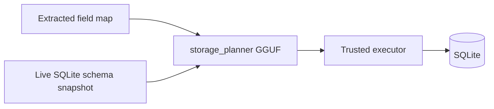

# TrustNest — ML storage planner (SQLite table fit + DDL)

**Status:** Implemented (2026-05-25)  
**ADR:** [0005-schema-inference-constrained-llm-and-transactional-ddl.md](adr/0005-schema-inference-constrained-llm-and-transactional-ddl.md)  
**Related:** [local-ml-only-pipeline-implementation.md](local-ml-only-pipeline-implementation.md)

---

## Goal

After document extraction, decide **where** scan data belongs in SQLite:

1. Reuse an existing table (typically `manual_field` for profile facts), or  
2. **Create a new table** with an ML-proposed schema, then insert rows.

The SQL-specialized GGUF (`sql.storage.planner.v1`) emits a **constrained JSON plan**; trusted Rust code validates and executes DDL/rows. The model never runs raw SQL.

---

## Pipeline (post-extraction)



| Step | Component | Notes |
|------|-----------|--------|
| 1 | `CoreIngestFFI.planStorage` | Rust loads `sqlite_schema` from the active repository if the host omits it |
| 2 | `ml.storage_planner.v1` | Prompt includes **live** `manual_entry`, `manual_field`, `extraction_run`, and user tables |
| 3 | `CoreIngestFFI.applyStoragePlan` | `dreamwork_apply_storage_plan_json` runs DDL + writes in one flow |
| 4 | `schema_change_log` | Each `create_table` batch logged via `apply_adhoc_ddl` (migration_id ≥ 10000) |

---

## Removed deterministic post-processing (extraction path)

These stages are **no longer** run after `ExtractionAgent` in `DocumentIntelligenceOrchestrator`:

| Removed stage | Was |
|---------------|-----|
| `NameFieldReconciler` | Rule-based name splitting/merge |
| `OcrGroundingValidator` | Substring grounding filter |
| `ConfidenceOrchestrator` | Heuristic confidence re-scoring |
| `FraudDetectionAgent` | Heuristic fraud stub |
| `GenAIFieldMapper.finalizeSuggestions` | `ScanFieldValidator` + synthetic `display_name` |

Trace markers are now: `validate:ml_only`, `confidence:model_output`, `fraud:disabled_ml_only_pipeline`.

Field confidence and labels come from **extraction models only** (on-device mapper / template / semantic paths).

---

## Planner JSON contract

```json
{
  "storage_target": {
    "decision": "use_existing_table",
    "table_name": "manual_field",
    "reason": "identity fields map to profile slots"
  },
  "schema_actions": [
    {
      "op": "create_table",
      "table_name": "utility_bill_facts",
      "columns": [
        { "name": "account_number", "sql_type": "TEXT", "nullable": false },
        { "name": "amount_due", "sql_type": "TEXT", "nullable": true }
      ],
      "reason": "tabular utility fields"
    }
  ],
  "operations": [
    {
      "op": "upsert_manual_field",
      "person_id": "person-uuid",
      "key": "legal_first_name",
      "value": "Jane",
      "reason": "profile fact"
    },
    {
      "op": "insert_row",
      "table_name": "utility_bill_facts",
      "row_values": { "account_number": "123", "amount_due": "$10" },
      "key": "row",
      "value": "",
      "reason": "persist bill row"
    }
  ]
}
```

### Allowed `op` values

| `op` | Executor behavior |
|------|-------------------|
| `upsert_manual_field` | `manual_entry` + `manual_field` upsert |
| `upsert_extension_field` | Same tables; extension keys |
| `insert_row` | Dynamic `INSERT` into model-named table (after DDL) |
| `create_table` / `add_column` | Only in `schema_actions`; validated DDL |

### Policy (code-enforced)

- Table/column names: `snake_case`, max 64 chars  
- SQL types: `TEXT`, `INTEGER`, `REAL` only  
- Protected tables: `schema_change_log`, `manual_entry`, `manual_field`, `extraction_run`  
- Max 32 columns per new table  

---

## Rust modules

| File | Role |
|------|------|
| `storage_schema.rs` | `PRAGMA table_info` snapshot |
| `storage_routing.rs` | GGUF prompt + plan parse |
| `storage_apply.rs` | Transactional DDL + row apply |
| `db/migrate.rs` | `apply_adhoc_ddl` + `schema_change_log` |

### FFI

| Symbol | Purpose |
|--------|---------|
| `dreamwork_sqlite_schema_json` | Live catalog for debugging/tools |
| `dreamwork_plan_storage_json` | Plan only |
| `dreamwork_apply_storage_plan_json` | Execute plan JSON |

---

## iOS integration

- `CoreBridgeService.enrichScanReview` plans storage, then **applies** when `planner_status == storage_planner_active`.
- `StoragePlanSuggestion` includes `storageTarget`, `schemaActions`, `operations`, and optional `applyResult`.
- Pipeline trace: `storage:llm.storage_planner.v1:storage_planner_active` then `storage_apply:storage_apply_active`.

---

## When to create a new table

| Situation | Typical planner choice |
|-----------|-------------------------|
| Passport/DL identity fields | `use_existing_table` → `manual_field` |
| Utility bill line items (account, amount, due date) | `create_table` + `insert_row` |
| One-off extension keys already in field map | `upsert_extension_field` on `manual_field` |

The model sees **live** column lists, so it can prefer `manual_field` when keys already fit `field_key` / `value` shape.

---

## Fail-closed behavior

| Condition | Result |
|-----------|--------|
| Storage planner GGUF missing | Empty plan; `storage_planner_model_missing` |
| Planner generation error | Empty plan; `storage_planner_generation_failed:*` |
| Apply on inactive plan | `storage_apply_skipped:*` |
| Invalid table/column names | `storage_apply_failed:*` (transaction rolled back for row phase) |

No rules-only routing fallback is used when the planner or apply step fails.
